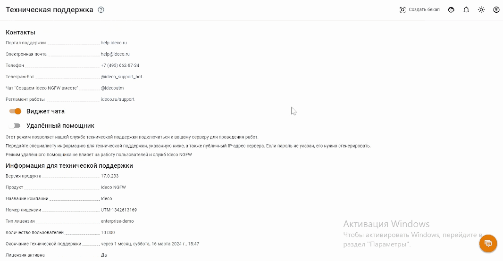
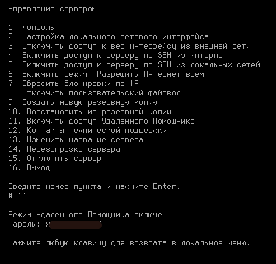

# Режим удаленного помощника

Чтобы служба технической поддержки могла подключиться к вашему серверу удаленно, необходимо включить режим удаленного помощника. Работа сервера в этом режиме не влияет на работу пользователей.

Для включения режима удаленного помощника нажмите на значок  в правом верхнем углу экрана и перетащите ползунок около пункта **Удаленный помощник** в статус **Включен**.

## Включение режима удаленного помощника из веб-интерфейса

Для подключения специалиста технической поддержки сообщите ему **Информацию для технической поддержки**, нажав кнопку **Скопировать информацию**, а так же нужно отдельно передать публичный IP-адрес сервера. Если сервер подключен не напрямую к Ideco UTM, то выполните проброс 33-го TCP порта на Ideco UTM ниже 7 версии с внешнего маршрутизатора или 22-го порта на UTM выше 8 версии.


Режим удаленного помощника остается включенным даже при перезагрузке сервера. Отключайте данный режим, когда использовать его нет необходимости. **Крайне не рекомендуется постоянная эксплуатация сервера Ideco UTM в данном режиме.**


## Включение режима удаленного помощника из локального меню сервера

Чтобы включить режим удаленного помощника в локальном меню Ideco UTM выберите пункт **Включить доступ Удаленного помощника**, введя пункт **11**, затем нажмите **Enter**.  
Сгенерируется пароль, который необходимо сообщить технической поддержке для подключения по SSH.

## Работа с сервером по протоколу SSH в режиме удаленного помощника

Чтобы организовать работу с локальной консолью сервера удаленно по протоколу SSH от пользователя **root** в режиме удаленного помощника необходимо выполнить следующие действия:

1. Подключитесь к серверу с помощью SSH-клиента **PuTTY**. Программа бесплатна и скачать её вы можете на сайте разработчиков \([https://www.putty.org/](https://www.putty.org/)\).
2. При подключении из локальной сети используйте адрес, который настроен на локальной сетевой карте Ideco. Введите необходимые параметры для подключения:
   * **порт** – 33;
   * **логин** – remsup;
   * **пароль, указанный при включении удаленного помощника.**

Символ «\#» свидетельствует о том, что вы работаете от имени суперпользователя.

