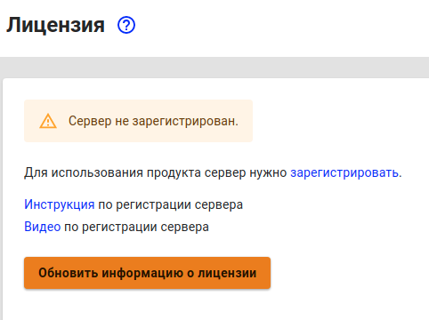

# Регистрация сервера


Для активации лицензии необходима обязательная регистрация сервера в [личном кабинете](https://my.ideco.ru/#/login/?next=/utm/license/).


Для полноценной работы Ideco UTM после установки необходима его регистрация.

Для регистрации сервера на нем должен быть доступен интернет \(обязательно настройте [подключение к провайдеру](../settings/connection-to-provider/ethernet-connection.md) перед регистрацией\).

Выполните для этого следующие действия:

1. [Зарегистрируйтесь](https://my.ideco.ru/#/login/?next=/utm/license/) в личном кабинете пользователя, если вы не делали этого ранее.

2. В веб-интерфейсе Ideco UTM перейдите в раздел **Управление сервером -&gt; Лицензия** и нажмите на ссылку **Зарегистрировать**.

3. В открывшемся окне личного кабинета перейдите по ссылке **Зарегистрировать новый сервер https://x.x.x.x/** \(зайдите в личный кабинет под своей учетной записью, если это не произошло автоматически\).

После регистрации сервер автоматически получит лицензию \(если он имеет доступ к интернету\). Нажмите на кнопку **Обновить информацию о лицензии**, после чего вы увидите состояние лицензии.


Привязать к серверу коммерческую или SMB—лицензию вы можете по инструкции в разделе [Управление лицензиями](license-management.md).


