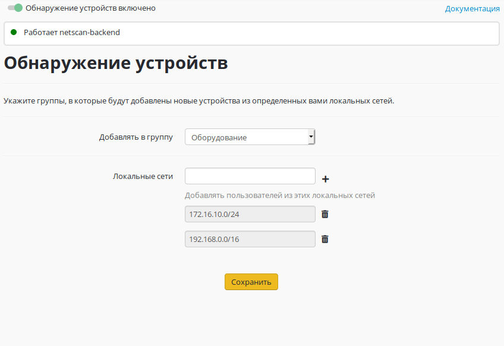

# Обнаружение устройств

Включение данного модуля предоставляет возможность автоматического создания пользователя с [авторизацией по IP-адресу](../authorization-types/ip-authorization.md) для устройства, пытающегося выйти в Интернет через Ideco UTM.\
Пользователь будет автоматически создан при попытке выхода в Интернет (данный модуль не осуществляет сканирования сети в поисках устройств, а работает в пассивном режиме).

Пользователи будут создаваться в указанной группе с именем, соответствующим IP-адресу или NetBIOS-имени компьютера.\
При необходимости можно ограничить локальные сети, пользователи из которых будут автоматически добавлены и авторизованы на Ideco UTM. Например, таким образом можно авторизовать пользователей, подключающихся по Wi-Fi или другой открытой сети.
