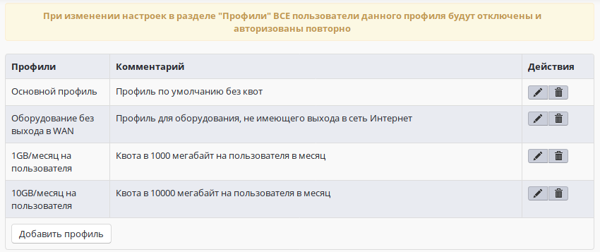
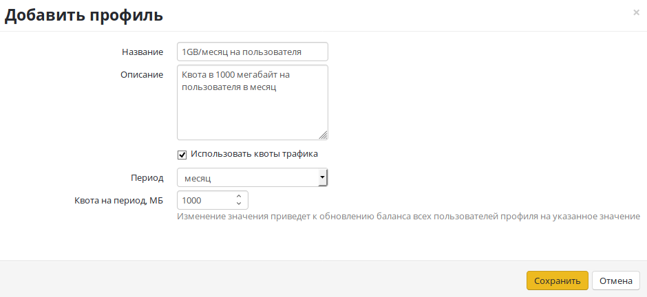

# Профили выхода в Интернет

**Профили** используются для настройки квот трафика для пользователей.\
Ниже предоставлен пример списка профилей с двумя созданными записями: 1GB/месяц на пользователя и 10GB/месяц на пользователя.

## Создание и редактирование профиля

Для создания нового профиля нажмите **Создать профиль**. Для редактирования существующего профиля выберите **Редактировать** в **Действиях**.

В открывшемся окне укажите:

* **Название** профиля.
* **Описание** - для вашего удобства.
* Установите флажок **Использовать квоты трафика**, если это необходимо.
* **Период**, на который лимитируется трафик.
*   **Квота на период** - количество мегабайт внешнего трафика,

    выделенного на период.

## Пример использования профиля для лимитирования трафика

В Ideco UTM возможна настройка лимитов трафика для пользователей. Подробнее о настройке в разделе [**Квоты**](../access-rules/quotas.md).
