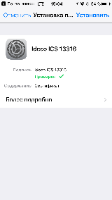
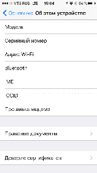
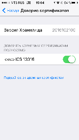
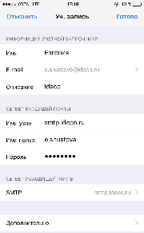
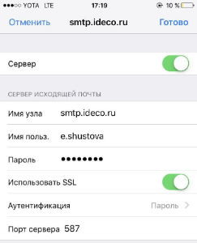
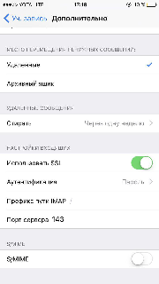
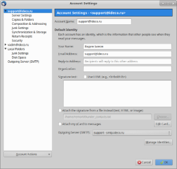
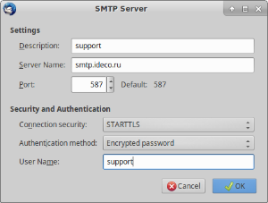

# Настройка почтовых клиентов

## Настройка почтового клиента для работы с сервером

Перед настройкой почтового клиента убедитесь, что у целевого пользователя отмечен чекбокс **Разрешить почту** на вкладке **Почта**:

.png)

Настройка почтового клиента при работе из локальной сети и из сети Интернет отличается, поэтому рассмотрим эти случаи отдельно:

### **Настройка почтового клиента при работе из локальной сети**

При подключении почтовым клиентом из локальной сети:

1\. Сервер входящей почты работает на 995 TCP порту (РОР3) и на 143 TCP порту (IMAP) с шифрованием STARTTLS/SSL.&#x20;

* В качестве логина прописывается логин от учётной записи пользователя **либо **полностью название почтового ящика, если тот прописан в поле **Почтовый ящик** на вкладке **Почта **у настраиваемого пользователя.&#x20;
* В качестве пароля всегда прописывается пароль от учётной записи пользователя (в том числе для пользователей, импортированных из дерева AD), задать отдельный пароль на почтовый ящик нельзя.&#x20;

2\. Сервер исходящей почты работает на 587 порту TCP с шифрованием STARTTLS. Если устройство (принтер, сканер и т.п.) не поддерживает шифрование или изменение порта, то возможна отправка почты с авторизацией по 25 TCP порту. Без авторизации возможна отправка почты только из доверенных сетей (их можно настроить в разделе **Безопасность **почтового сервера).

### Настройка почтового клиента при работе из сети Интернет&#x20;

При подключении почтовым клиентом из сети Интернет:&#x20;

1\. Убедитесь, что у целевого пользователя в веб-интерфейсе отмечен чекбокс **Доступ к почте из Интернет** на вкладке **Почта:**

.png)

2\. Сервер входящей почты работает на 995 TCP порту (POP3S) и на 143 TCP порту (IMAP-STARTTLS), шифрование обязательно. &#x20;

* В качестве логина прописывается логин от учётной записи пользователя либо полностью название почтового ящика, если тот прописан в поле** Почтовый ящик** пользователя на вкладке **Почта **у настраиваемого пользователя.&#x20;
* В качестве пароля всегда прописывается пароль от учётной записи пользователя, сделать отдельный пароль на почту нельзя.&#x20;

3\. Сервер исходящей почты работает только с авторизацией и шифрованием. Необходимо обязательно использовать **587 **порт для подключения (а не 25). Тип шифрования, логин и пароль указываются аналогично серверу входящей почты.&#x20;

Для любого почтового клиента, кроме веб-интерфейса почты в составе UTM, установите корневой сертификат сервера UTM, который можно скачать на странице входа в административный веб-интерфейс UTM. Это более правильное решение, которое позволяет избежать проблем с принятием деривативного сертификата для почтовых протоколов каждый раз после смены деривативного сертификата, например, вследствие изменения сетевых настроек сервера.&#x20;

.png)

## Примеры настроек популярных почтовых клиентов&#x20;

Пример настроек клиента Microsoft Outlook 2013 по протоколу IMAP:&#x20;

.jpg>)

&#x20;Пример настроек клиента Microsoft Outlook 2016 по протоколу IMAP:

 (1) (1) (1) (1) (2) (2) (2) (2) (1).jpg>)

Для отображения IMAP-папок снимите галочку **При просмотре дерева в Outlook показывать только подписанные папки** в свойствах IMAP-папок.&#x20;

 (2) (2) (2) (2) (2) (2).png>)

 (2) (1).png>)

### Настройка почтового клиента iphone&#x20;

Перед настройкой ящика надо установить корневой SSL сертификат UTM. Его можно скачать со страницы входа в административный веб-интерфейс UTM (под формой ввода логина и пароля). Например, прислав его себе на почту, открыть его на iphone. При открытии файла сертификата - система предложит его добавить.&#x20;

Нажать на кнопку **Добавить**. После надо зайти в **Настройки** и далее в раздел **Основные -> Об этом устройств -> Доверие сертификатов**.

Включить **Доверять корневым сертификатам полностью**.

После установки сертификата настройте доступ в почтовый ящик как показано на следующих фрагментах.

### Настройка почтового клиента Thunderbird


Начиная с версии UTM 7.0.0 подключиться из Интернет программой Outlook (любой версии) по протоколу POP3 **нельзя**. Outlook не поддерживает тип шифрования STARTTLS для POP3, а поддерживает только устаревшие и небезопасные SSL/TLS, которые в нашем почтовом сервере более не используются. Подключение без шифрования извне также запрещено на нашем почтовом сервере. Тем не менее, остается возможность подключаться по протоколу IMAP с использованием STARTTLS. Для этого выберите тип шифрования **Авто** в Outlook.

