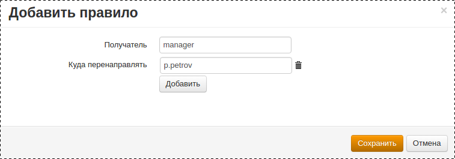
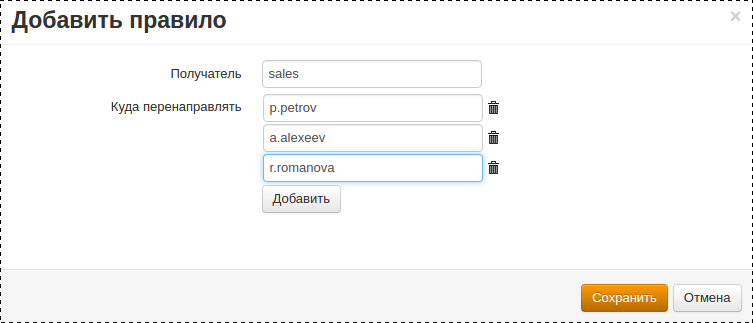
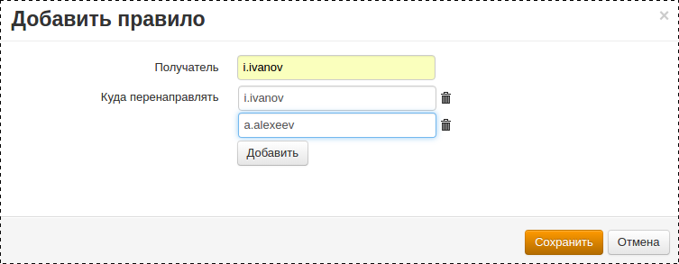
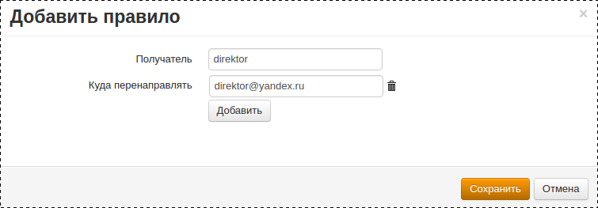
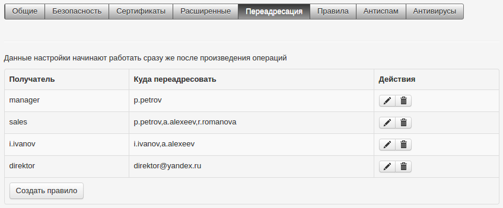

# Переадресация почты (почтовые алиасы)

Для того чтобы создавать и редактировать почтовые правила переадресации (алиасы) перейдите в раздел **Сервисы -> Почтовый сервер -> Правила -> Переадресация**.

Почтовые алиасы отличаются от почтовых ящиков тем, что не требуют логинов и паролей, они закрепляются за ящиком и служат его копией с другим именем, или, в случае назначения алиаса нескольким почтовым ящикам, можно сказать что алиас - это группа почтовых ящиков или группа рассылки. Поступающая на алиас почта автоматически пересылается на все реальные почтовые ящики, связанные с этим алиасом. Часть адреса @yourdomain.com можно не указывать при создании правил, если ящик расположен на почтовом сервере Ideco UTM. Если перенаправление делается на какой-либо ящик в другом домене в интернете, то ящик, прописываемый в графе **Получатель**, должен реально существовать.

**Примеры:**

*   Создать алиас [manager@yourdomain.ru](mailto:manager@yourdomain.ru) для ящика менеджера вашей

    компании для связи с клиентами и партнерами, у которого существующий почтовый ящик имеет имя [p.petrov@yourmaildomain.ru](mailto:yaremenko.s.v@yourmaildomain.ru): &#x20;

* Создать корпоративный алиас для отдела продаж [sales@yourmaildomail.ru](mailto:sales@yourmaildomail.ru), чтобы почта пересылалась на всех сотрудников этого отдела: &#x20;

* Создать временный алиас для переадресации почты сотрудника, который находится в отпуске [i.ivanov@yourmaildomail.ru](mailto:i.ivanov@yourmaildomail.ru) на ящик его коллеги [a.alexeev@yourmaildomain.ru](mailto:a.alexeev@yourmaildomain.ru) с сохранением почты на ящике [i.ivanov@yourmaildomail.ru](mailto:p.petrov@yourmaildomail.ru): &#x20;

* Создать алиас [director@yourmaildomain.ru](mailto:director@yourmaildomain.ru), который будет перенаправлять почту на реальный ящик [director@yandex.ru](mailto:director@yandex.ru): &#x20;

Сами алиасы создаются автоматически при создании правил. После создания всех правил у нас получился вот такой список:

Опишем, как будет работать почта при таких правилах переадресации:

Письма, приходящие на несуществующий ящик (алиас) [manager@yourdomain.ru](mailto:manager@yourdomain.ru), будут попадать на реальный [p.petrov@yourmaildomain.ru](mailto:yaremenko.s.v@yourmaildomain.ru). Также есть алиас для отдела продаж [sales@yourmaildomail.ru](mailto:sales@yourmaildomail.ru), который, по сути, служит алиасом для рассылки почты и сам писем не хранит. Это удобно, если есть информация для отдела продаж, которую надо распространить на каждого сотрудника. Всё то же самое можно сделать, если просто указать в письме всех получателей, но использовать алиас намного удобнее. Также сотрудник с почтой [i.ivanov@yourmaildomail.ru](mailto:i.ivanov@yourmaildomail.ru) сейчас находится в отпуске и вся приходящая к нему почта попадает на его ящик и дублируется на [a.alexeev@yourmaildomain.ru](mailto:a.alexeev@yourmaildomain.ru). Последнее правило позволяет директору получать почту не на корпоративный ящик, а на его личную почту на Яндексе.


**Имейте ввиду**:&#x20;

* Алиас не является действительным почтовым ящиком. К нему нельзя подключиться почтовым клиентом, используя логин и пароль, как в обычном почтовом аккаунте. Таким образом, создание алиасов не увеличивает максимально возможное количество реальных почтовых аккаунтов на Ideco UTM, которое равно количеству пользовательских аккаунтов в купленной вами лицензии.&#x20;
* Также если вам просто нужно, чтобы адрес ящика пользователя отличался от его логина, то не обязательно создавать алиас, можно просто прописать желаемое имя ящика в поле **Почтовый ящик пользователя** в свойствах пользователя. Запись должна иметь вид:, именно с доменной частью после символа "@".

