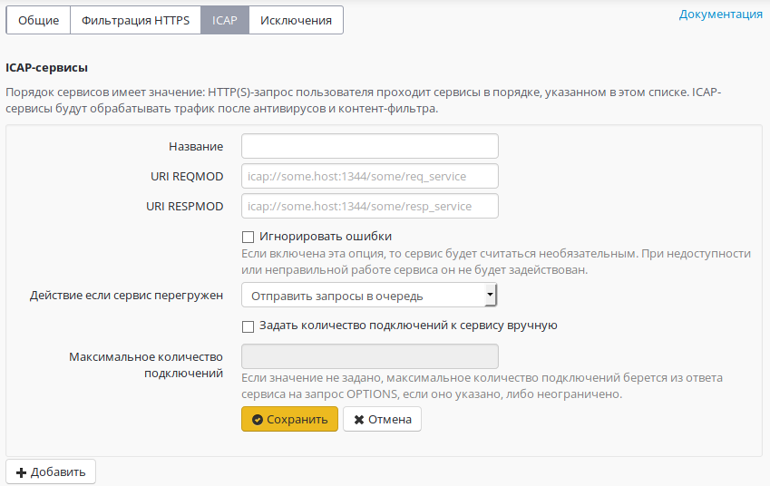

# Подключение к внешним ICAP-сервисам

Существует возможность отправки HTTP(S)-трафика на анализ сторонним серверам по протоколу ICAP.

При этом трафик этим серверам (в роли которых могут быть DLP-системы, антивирусы, веб-фильтры) передается в расшифрованном виде.\
Настройки подключения к серверам по ICAP находятся на вкладке **Сервисы -> Прокси -> ICAP**.

Возможно установление подключения к нескольким ICAP-сервисам одновременно.

