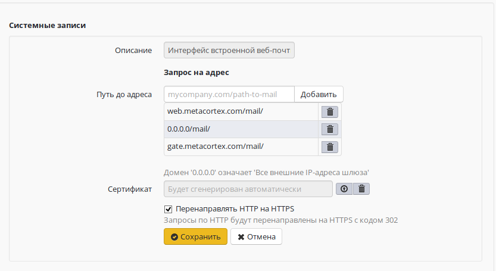
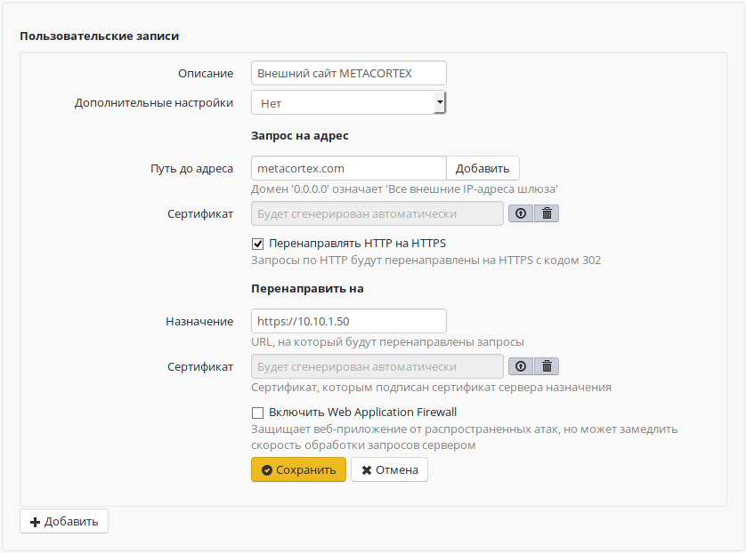
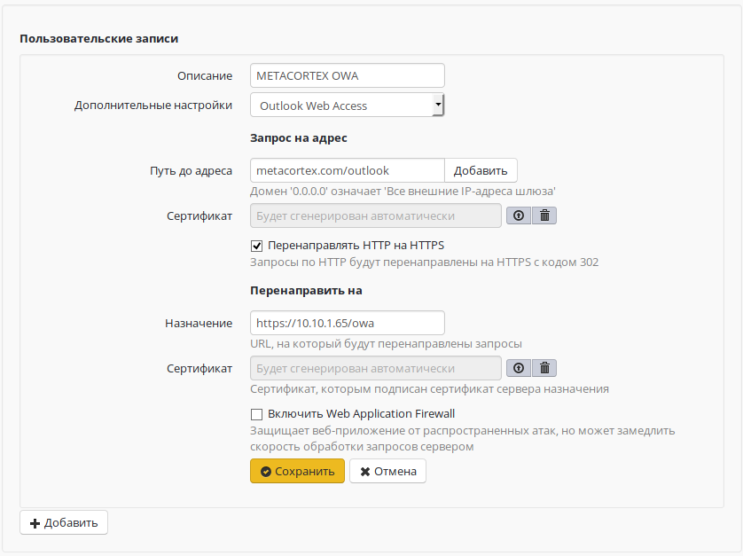

# Обратный прокси

Технология обратного прокси (реверс-прокси, reverse-proxy) позволяет проксировать веб-трафик в обратном направлении: из сети Интернет в локальную сеть, в отличие от наиболее часто используемого варианта — из локальной сети в Интернет.\
Обратное проксирование применяется для публикации веб-ресурсов, размещенных в локальной сети, таким образом, чтобы они стали доступны потребителям из сети Интернет. Такой подход заменил портмаппинг (DNAT) и расширил возможности по публикации **веб-ресурсов**.


Для публикации веб-ресурсов в локальной сети (по портам 80 и 443) всегда используйте обратный прокси. **Не используйте портмаппинг (DNAT) в файрволе.**


Обратный прокси отличается от DNAT тем, что работает на более высоком уровне (прикладной протокол HTTP вместо сетевого протокола IP) и позволяет более гибко реализовать публикацию ресурсов. Основным параметром при публикации веб-ресурса является «входящий URL». Из внешней сети по протоколу HTTP и данному URL будет произведено обращение на UTM. Обратный прокси позволяет «смаршрутизировать» (http-routing) такой запрос на HTTP-сервер в локальной сети. Таким образом, имея одну ресурсную A-запись для внешнего сетевого интерфейса UTM, можно опубликовать несколько ресурсов в локальной сети, распределив их по нескольким входящим URL. Если же с внешним IP-адресом UTM ассоциировано несколько A-записей, то маршрутизация становится еще более простой, а входящие URL - более удобными для посетителей ресурсов.

Также обратный прокси в составе UTM позволяет перенаправлять все HTTP-запросы на HTTPS-схему. Это нужно если, например, ваш сайт работает только по HTTPS (современная тенденция в веб-безопасности), но при этом вы не хотите терять посетителей, обратившихся к вашему сайту по HTTP-схеме.

Веб-интерфейс настройки модуля достаточно прост и состоит из двух частей:

## Системное правило для публикации веб-почты

Описывает доступ к встроенному веб-клиенту почтового сервера на UTM (на основе Roundcube). Так называемая **внешняя веб-почта**. Теперь при настройке веб-почты в разделе **Сервер -> Почтовый сервер** вам нужно также указать URL, с которого будет производиться роутинг на веб-сервер, обслуживающий почтовый веб-клиент в составе UTM.\
В примере ниже это **yourdomain.ru/mail**. Учтите, что у вас должна быть настроена A-запись для внешнего IP-адреса UTM, которая позволяет резолвить адрес в указанный домен, чтобы была возможность обратиться к шлюзу по этому доменному имени.\
_**/mail**_ - это URL, выделенный для сервиса веб-почты. Ниже мы рассмотрим пример выделения URL _**/owa**_ для публикации exchange-сервера в локальной сети при обращении на тот же домен _**yourdomain.ru**_.\
Запись вида _**0.0.0.0/URL**_ нужна, чтобы веб-почта отвечала при обращении на любой внешний IP UTM. 0.0.0.0, в данном конкретном случае, можно читать как "любой внешний адрес UTM". Может быть удобно при динамическом внешнем IP, выдаваемом UTM провайдером, или при множестве настроенных внешних IP-адресов на внешних интерфейсах UTM.\
Удалить системное правило для веб-почты нельзя.

## Блок пользовательских правил

Вы можете создать неограниченное количество правил публикации внутренних веб-ресурсов в этом блоке.\
Ниже на фрагменте экрана приведена типичная конфигурация: Публикация сайта в локальной сети по обращению к внешнему доменному имени (_**yourdomain.ru**_) и публикация веб-интерфейса управления почтовым сервером exchange по-дополнительному URL (_**website.local**_).\
Для сайта в примере дополнительно производится перенаправление всех обращений по схеме HTTP от посетителя на HTTPS.\
В верхнее поле **Сертификат** следует загружать [цепочку сертификатов](../../popular-recipes/install-ssl-certificate-on-the-server.md) для внешнего домена, доступного из Интернет. В нижнее, если локальный веб-сервер того требует, самоподписанный сертификат (цепочку сертификатов) для локального домена, доступного из внутренней сети. В большинстве случаев достаточно загрузить только внешнюю цепочку сертифкатов.

### Публикация Outlook Web Access

Для версий Microsoft Exchange 2007, 2010 возможна публикации OWA с помощью включения специальной дополнительной настройки - **Outlook Web Access** при создании пользовательской записи обратного прокси-сервера.

При этом в Exchange должна быть настроена аутентификация пользователей через форму.

### Публикация Outlook Web Access stream

Прямой способ публикации веб-ресурсов, практический аналогичный [DNAT](../../publishing-resources/portmapping.md), но с возможностью использования сертификатов обратного прокси-сервера для публикации HTTPS-ресурсов.\
Подходит для публикации Microsoft Exchange 2013 и других веб-приложений.

При создании пользовательских правил укажите в доп. настройках Outlook Web Access stream. В полях **Запрос на адрес** и **Перенаправить на** укажите только домены [https://youdomain/](https://youdomain/) без остальной части URL (она не используется при публикации этим способом).\
**При использовании данного метода возможна публикация только одного веб-ресурса. Все остальные правила обратного прокси-сервера одновременно с этим правилом работать не будут.**


При публикации Outlook Web Access не включайте Web Application Firewall. Их совместная работа будет возможна в следующих версиях.


Если у вас имеется доверенный SSL сертификат для домена, по которому будет идти обращение извне на публикуемый ресурс, подготовьте его как [связку сертификатов](../../popular-recipes/install-ssl-certificate-on-the-server.md) и поместите на UTM, загрузив в поле **Сертификат** под текстовым полем **Домен и путь**. Сертификаты нужно загружать в формате PEM.


Доменные имена, указываемые в **Домен и путь**, должны резолвиться во внешний IP сервера UTM. \
Доменные имена, указываемые в **Назначение**, должны резолвиться в IP-адреса публикуемых ресурсов самим сервером UTM.

