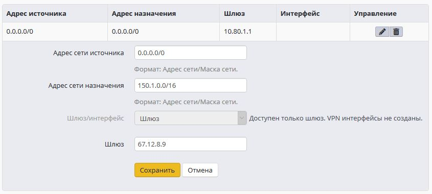

# Маршрутизация

## Общие принципы маршрутизации

Для перенаправления сетевого трафика, проходящего через Ideco UTM, используется система маршрутизации. Она имеет ряд преимуществ по сравнению с некоторыми другими традиционными системами маршрутизации. Среди них - возможность указывать сеть источника прямо в маршруте.

Создавать и редактировать маршруты можно через веб-интерфейс Ideco UTM в разделе **Сервисы -&gt; Маршрутизация**. Для добавления нового маршрута нажмите кнопку **Добавить**.  
На странице откроется конструктор маршрута:

Опишем назначение каждой опции:

* **Адрес сети источника** - Адрес источника с маской, маска может быть прописана как в классическом виде, так и в виде количества бит.
* **Адрес сети назначения** - Адрес назначения с маской. Маска может быть прописана как в классическом виде, так и в виде количества бит. 
* **Шлюз/интерфейс** - Куда перенаправить трафик.


Если маршрутизация осуществляется на Ethernet интерфейс, то всегда указывается адрес шлюза этого Ethernet-интерфейса. Для виртуальных интерфейсов \(РРТР, РРРоЕ, OpenVPN\) всегда указывается интерфейс.


После сохранения маршрута страница выглядит так:

Для применения параметров маршрутизации требуется нажать на ссылку **Применить** в верхней части страницы.  
Это приведёт к кратковременной разавторизации всех пользователей и быстрому перезапуску сетевой подсистемы для создания нужных записей в системной таблице маршрутизации.  
****

## Примеры популярных маршрутов:


При маршрутизации трафика на внешний интерфейс важно понимать, что чаще всего одного маршрута недостаточно, понадобится также переопределить адрес NAT, иначе такой маршрут просто не будет работать. NAT можно переопределить двумя способами: 

* через системный файрвол, 
* через профили пользователя.


**Задача**: любой трафик в подсеть 150.1.0.0/16 направлять на шлюз 67.12.8.9:

**Задача**: любой трафик из подсети 192.168.50.0/24 направлять на шлюз 66.77.88.1:


Если вы настраиваете маршрут в удаленную сеть, доступную через дополнительный роутер, расположенный в той же локальной сети, что и клиенты, то убедитесь, что вы избежали [ассиметричной маршрутизации](../popular-recipes/access-to-remote-networks-through-a-router-in-the-local-network.md) и вынесли роутер в DMZ.


