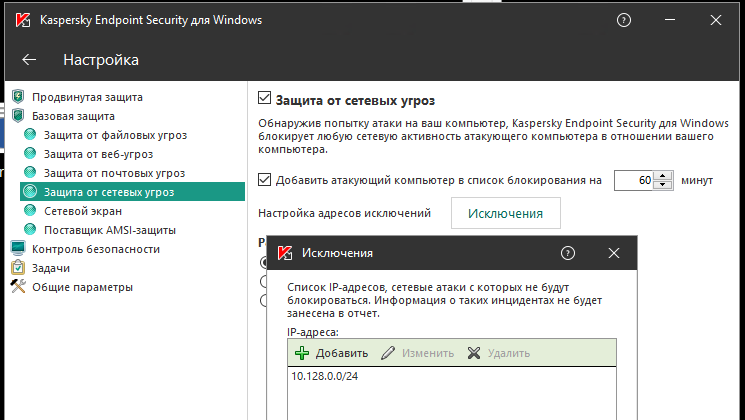

# Особенности маршрутизации и организации доступа

## Если по VPN необходим доступ только к ресурсам локальной сети

В случае, если в Интернет необходимо выходить напрямую через своего провайдера, а через VPN получать доступ только к ресурсам корпоративной сети, на компьютерах, подключающихся по VPN необходимо выполнить следующие настройки.

* В свойствах VPN-подключения убрать флажок **Использовать основной шлюз в удаленной сети**. Вкладка **Сеть -> IP версии 4 -> Дополнительно -> Параметры IP**.

* Прописать маршрут до корпоративной сети (**в Windows 7, 8, 8.1, 10 автоматически будут создан маршрут основанный на классе, в зависимости от адреса, который подключение получит по VPN. Например, маршрут будет добавлен для сети 10.0.0.0/8, если по VPN сервер получит адрес из сети 10.128.0.0/16**). Для [IKEv2](ipsec-ikev2/) вы можете настроить автоматическое получение маршрута.\
  Пример маршрута, если корпоративная сеть 172.16.0.0/16, а сеть для VPN-подключений настроенная на Ideco UTM 10.128.0.0/16 (и из этой же сети выдается IP-адрес VPN-подключению), то маршрут будет таким: `route -p add 172.16.0.0 mask 255.255.0.0 10.128.0.1`
*   В некоторых случаях маршрут может не работать, тогда есть пинг до защищённого интерфейса (10.128.0.1), но нет пинга до хостов в локальной сети. В этом случае при создании маршрута нужно указать номер интерфейса VPN-подключения. Итоговый маршрут будет таким:\
    `route -p add 172.16.0.0 mask 255.255.0.0 10.128.0.1 if nn`

    где, nn-номер интерфейса VPN-подключения, посмотреть который можно при активном VPN-подключении в выводе в консоли команды `route print` раздел **Список интерфейсов**.

## Если не удается получить доступ к компьютерам в локальной сети Ideco UTM

* Убедитесь, что локальная сеть (или адрес на сетевой карте) на удалённой машине не пересекается с локальной сетью вашей организации, если пересекается, то доступа к сети вашей организации не будет (трафик по таблице маршрутизации пойдёт в физический интерфейс, а не в VPN). **Адресацию надо менять.**
*   На компьютерах локальной сети в качестве основного шлюза должен быть прописан Ideco UTM. Если это не так, то необходимо прописать соответствующий маршрут вручную на устройствах, чтобы сетевые пакеты шли на Ideco UTM для VPN-сети. &#x20;

    Например: `route -p add 10.128.0.0 mask 255.255.0.0 10.1.1.1` &#x20;

    где: 10.128.0.0/16 - адрес VPN-сети Ideco UTM (настраивается в

    **Сервисы -> Авторизация пользователей**), а 10.1.1.1 - IP-адрес локального интерфейса Ideco UTM.
* Отключите RP-FILTER: **Сервисы -> Дополнительно -> Проверка обратного пути (RP\_FILTER).**
* Проверьте настройки файрвола (таблица FORWARD) на Ideco UTM на предмет запрещающих правил.
* Компьютеры и серверы на ОС Windows могут ограничивать доступ к сетевым папкам с помощью правил настроек профилей сети (причем как на стороне подключающегося по VPN компьютера, так и на стороне компьютеров и серверов локальной сети).

**Включите доступ к файлам и принтерам для профиля "Все сети" и "Частных сетей".**\
****Вы можете сделать это с помощью PowerShell (запущенного с повышением прав до администратора), выполнив команду:

```
Enable-NetFirewallRule -Group "@FirewallAPI.dll,-28502"
```

*   Брандмауэр Защитника Windows может блокировать доступ определенных программ или сервисов (включая RDP) до внешних сетей. &#x20;

    Проверьте это в настройках входящих и исходящих подключений

    (необходимо разрешить доступ из частых и локальных сетей). &#x20;

*   Антивирусное ПО на компьютере может блокировать доступ к нему из не локальных сетей. Либо блокировать доступ конкретных программ &#x20;

    Например, для Kaspersky Endpoint Security нужно добавить сеть для

    VPN-подключений (по умолчанию 10.128.0.0/16) в исключения: &#x20;


