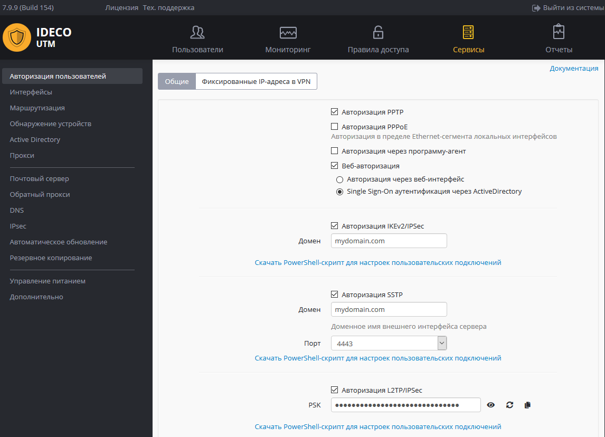

# Скрипт автоматического создания пользовательских подключений по IPSec IKEv2

Вы можете следующий скрипт PowerShell для автоматического создания подключения на компьютерах пользователей с Windows 8.1 и 10.

**Начиная с версии Ideco UTM 7.9.9 сборка 155, вы можете скачать готовые скрипты подключения вашего сервера из раздела: Сервисы -> Авторизация пользователей.**



Подключение с помощью скрипта будет создано со следующими параметрами:

1. Протокол IKEv2.
2.  Параметр **Использовать основной шлюз в удаленной сети** выключен. &#x20;

    Доступ к локальным сетям того же класса, что были получены для VPN-подключения по умолчанию в Windows 7 и 10 будет осуществляться через VPN-подключение, поэтому дополнительных маршрутов создавать не нужно (если вы не используете разные классы сетей в локальной сети офиса).

Создайте текстовый файл с именем **ideco\_utm\_ikev2.ps1** (в Блокноте или редакторе Windows PowerShell ISE) и скопируйте туда следующий текст:

```
### Ideco UTM IKEv2 connection ###
param([switch]$Elevated)
$currentUser = New-Object Security.Principal.WindowsPrincipal $([Security.Principal.WindowsIdentity]::GetCurrent())
if (!$currentUser.IsInRole([Security.Principal.WindowsBuiltinRole]::Administrator)) { 
    if (!$elevated) {
        Start-Process `
            powershell.exe `
            -Verb RunAs `
            -ArgumentList ('-noprofile -noexit -file "{0}" -elevated' -f ( $myinvocation.MyCommand.Definition ))
    }
    exit
}
Enable-NetFirewallRule -Group "@FirewallAPI.dll,-28502"
Add-VpnConnection `
    -Force ` -Name "Ideco UTM IKEv2 VPN" `
    -TunnelType IKEv2 `
    -ServerAddress my.domain.com `
    -EncryptionLevel "Required" `
    -AuthenticationMethod EAP `
    -SplitTunneling $False `
    -DnsSuffix activedirectory.domain `
    -RememberCredential
```

Поменяйте в нем необходимые параметры на соответствующие вашим настойкам:

1. **Ideco UTM IKEv2 VPN** - имя подключения в системе (может быть произвольным).
2. **my.domain.com** - домен внешнего интерфейса Ideco UTM (А-запись для домена должна совпадать с IP-адресом внешнего интерфейса Ideco UTM).
3. **activedirectory.domain** - ваш домен Active Directory (если есть, если нет нужно удалить эту строчку из скрипта).

**Запустить скрипт на компьютере пользователя можно из контекстного меню файла "Выполнить с помощью PowerShell". Нажмите "Ок" в диалоге повышения прав (они требуются для разрешения доступа к общим файлам и принтерам).** &#x20;

После этого подключение в системе будет создано, а также включен общий доступ к файлам и принтерам для всех сетей (иначе доступ к файловым ресурсам в локальной сети может быть невозможен).

Пользователю при первой авторизации необходимо ввести свой логин/пароль.

## Возможные ошибки при выполнении скрипта

*   При ошибке "выполнение сценариев отключено в этой системе", нужно включить выполнение сценарием, выполнив команду в PowerShell:

    ```
    Set-ExecutionPolicy Unrestricted
    ```
