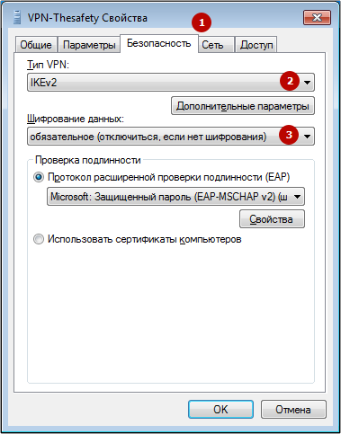
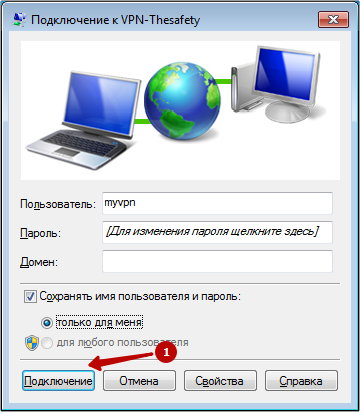

# Инструкция по созданию подключения в Windows 7

Вам потребуется доменное вашего сервера (можно получить у системного администратора) и учетные данные пользователя (логин/пароль).

1\. Откройте **Центр управления сетями и общим доступом**. &#x20;

2\. Выберите **Настройка нового подключения или сети**. &#x20;

3\. Выберите **Подключение к рабочему месту**. &#x20;

4\. Выберите **Использовать мое подключение к Интернету (VPN**). &#x20;

5\. Введите доменное имя сервера в качестве адреса подключений.\
Имя местоназначения может быть произвольным.

6\. Введите ваш логи и пароль.

7\. Нажмите **Закрыть.** &#x20;

8\. Выберите Подключение к IKEv2 VPN серверу в Windows 7. &#x20;

9\. Выберите **Свойства**. &#x20;

10\. Выберите протокол **IKEv2** и **обязательное шифрование**. &#x20;

11\. Подключитесь к IKEv2 VPN серверу в Windows 7. &#x20;

