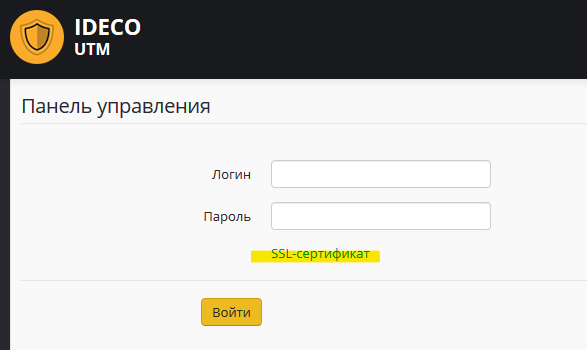
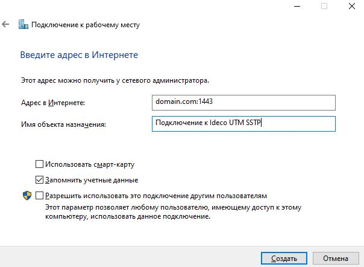
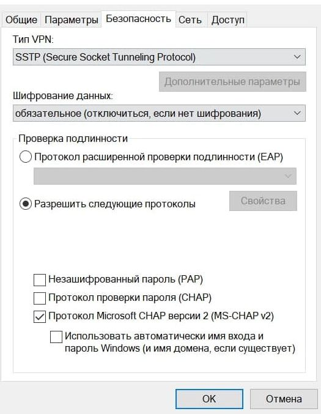

# SSTP

**SSTP** \(Secure Socket Tunneling Protocol - протокол безопасного туннелирования сокетов\) – VPN протокол, основанный на SSL 3.0. Поддерживается ОС Windows начиная с Vista, а также роутерами Mikrotik, Keenetic и рядом других.

## Настройка Ideco UTM

1. Для включения авторизации по SSTP установите соответствующий флажок в веб-интерфейсе в разделе **Сервисы -&gt; Авторизация пользователей -&gt; Общие -&gt; Авторизация SSTP**.
2. Подключение возможно только по DNS-имени, поэтому IP-адрес внешнего интерфейса Ideco UTM должен резолвится в одно из имен вашей внешней доменной зоны.  

   Поэтому на этом шаге в поле **Домен** необходимо указать данное

   DNS-имя \(используйте реальное имя с правильной А-записью, т.к. оно необходимо для выписки сертификата Let’s Encrypt\).

3. Порт - выберите предлагаемый порт \(из вариантов 1443, 2443, 3443,

   4443\).

4. У пользователей, которым необходимо подключаться из вне по VPN, установите флажок **Удалённый доступ через VPN** в дереве пользователей.  

   Указанный там логин и пароль будут использоваться для подключения.

## Настройка VPN в Windows


В пунктах 1-2 инструкции, нет необходимости начиная с версии 7.9.9 build 155.


1. Скачайте корневой сертификат Ideco UTM из страницы логина в веб-интерфейс.

2. Установите сертификат в ОС Windows в хранилище **Локальный компьютер** в **Доверенные корневые центры сертификации**.  
**Необходимо сделать это на все устройства, которые будут подключаться к Ideco UTM из вне по VPN SSTP**_._

* _Устанавливать нужно так:_  
  * открываете окно **Выполнить** нажатием **Win + R**;  
  * вписываете `certmgr.msc` нажатием клавиши **Enter**, запускаете certmgr;  
  * в certmgr **Вид -&gt; Параметры -&gt; устанавливаете галочку Физические хранилища -&gt; OK**;  
  * в дереве **Доверенные корневые центры сертификации -&gt; Локальный компьютер -&gt; Сертификаты**;  
  * в меню вызываемому правой кнопкой мыши по **Сертификаты -&gt; Все задачи -&gt; Импорт -&gt; выбираете скачанный сертификат из первого шага -&gt; Далее -&gt; Далее -&gt; Готово**, менять какие-либо настройки не нужно.  

3. Для создания VPN вы можете использовать [скрипт](skript_avtomaticheskogo_sozdaniya_polzovatelskikh_podklyuchenii_po_sstp.md). Либо создать его вручную: откройте **Цент управления сетями и общим доступом** и выберите пункт **Создание и настройка нового подключения или сети.**  

4. Выберите пункт **Подключение к рабочему месту.**

5. На вопрос об использовании существующего подключения ответьте **Нет, создать новое подключение**.

6. Далее выберите пункт **Использовать мое подключение к Интернету \(VPN\)**.

7. В качестве адреса подключения используйте **только** **домен** \(если пропишите IP-адрес, то подключение работать не будет, выдавая ошибку "CN имя сертификата не совпадает с полученным значением"\) и нажмите кнопку **Создать**.  
**После домена через двоеточие укажите порт, на котором вы настроили SSTP в Ideco UTM.**

8. Подключение будет создано и необходимо будет зайти в его свойства \(доступны в контекстном меню объекта\) в **Сетевых подключениях**.  
На вкладке **Безопасность** выберите тип VPN - **SSTP \(Secure Socket Tunneling Protocol\)**.

9. Настройка закончена. При подключении пользователю необходимо будет ввести свой логин/пароль заданный в Ideco UTM \(или использующийся в Active Directory, если пользователь импортирован из каталога\).

## Если VPN-соединение установлено, но не получается получить доступ к ресурсам локальной сети

Выполните рекомендации специальной статьи: [особенности маршрутизации и организации доступа](../features.md).

