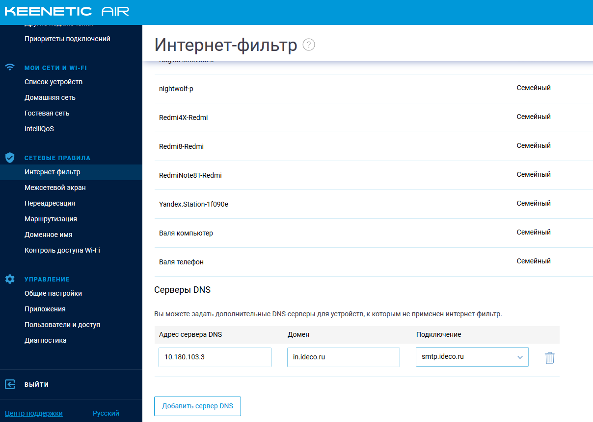

# Подключение Wi-Fi роутеров Keenetic

Вы можете подключить домашнюю сеть пользователя к VPN рабочей сети непосредственно на роутере Keenetic \(если вы хотите подключить офис с Keenetic, действуйте по [инструкции](../../site-to-site/sstp-connection-keenetic.md)\).

Поддерживаются все роутеры на базе KeeneticOS 3.х.х.



1. Выполните настройку пользователей в Ideco UTM и включите SSTP в разделе **Сервисы -&gt; Авторизация пользователей**.

2. Зайдите в веб-интерфейс управления Keenetic: [http://my.keenetic.net](http://my.keenetic.net).

3. Установите компонент системы **Клиент SSTP**: на странице **Общие настройки** в разделе **Обновления и компоненты**, нажмите **Изменить набор компонентов**.  

Подробнее о настройках в [документации Keenetic](https://help.keenetic.com/hc/ru/articles/360000599979-%D0%9A%D0%BB%D0%B8%D0%B5%D0%BD%D1%82-SSTP).

4. Создайте подключение: в разделе **Интернет -&gt; Другие подключения** и ****нажмите кнопку **Добавить подключение.**

Не устанавливайте флажок **Использовать для выхода в Интернет**.  Введите имя подключения, протокол SSTP, адрес сервера \(**обязательно укажите в адресе порт через двоеточие**\), имя пользователя и пароль.

5. В разделе **Сетевые правила -&gt; Маршруты** добавьте маршруты в вашу рабочую сеть. Например, если сеть офиса 10.0.0.0/8, добавьте следующий маршрут:  

Выберите в качестве **Интерфейса** созданное вами VPN-подключение и установите флажок **Добавлять автоматически**, чтобы маршрут действовал только при активном VPN-подключении.

6. Настройте DNS для вашего локального домена \(например Active Directory\), чтобы вы могли обращаться к ресурсам \(файловым и иным серверам\) по DNS-именам. В разделе **Сетевые правила -&gt; Интернет-фильтр -&gt; Серверы DNS** укажите DNS-сервер вашего контроллера домена и имя домена.  

7. Настойка закончена.   
Используйте утилиту `ping` в командной строке для проверки связи и маршрутизации.    
`nslookup` - для проверки резолвинга локальных имен рабочей сети.  

В случае, если VPN работает, но до некоторых ресурсов \(например файловых или RDP\) нет связи, воспользуйтесь [инструкцией](../features.md) для диагностики проблем.  

