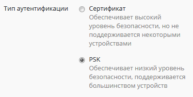
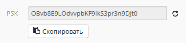
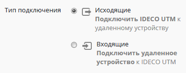
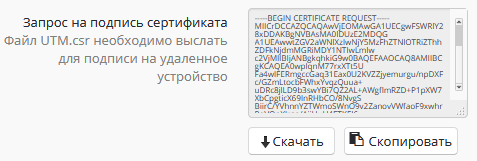
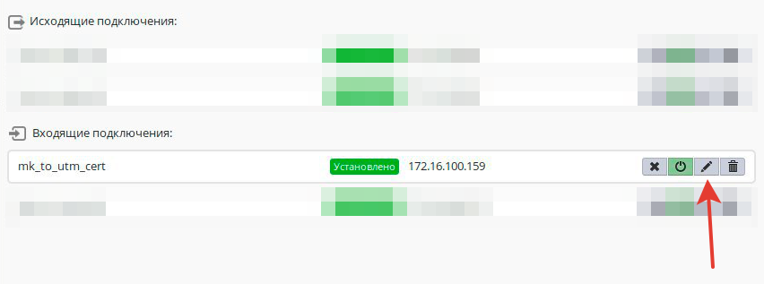

# Подключение устройств

Не описанные в данной инструкции устройства, как правило, можно подключить с использованием аналогичных настроек.


При объединении сетей с помощью VPN локальные сети в разных офисов не должны пересекаться.


## Список допустимых алгоритмов шифрования и хеширования, используемых в Ideco UTM

* aes128 \(aes-128-cbc\)
* aes256 \(aes-256-cbc\)
* sha256
* sha384
* modp1536 \(DH группа: 5\)
* modp2048 \(DH группа: 14\)
* modp4096 \(DH группа: 16\)

## Подключение Ideco UTM к MikroTik с использованием PSK

По данным шагам можно настроить подключение Ideco UTM к MikroTik, при наличии на MikroTik "белого" IP-адреса.

### Настройка Ideco UTM

1. В Ideco UTM откройте вкладку **Сервисы -&gt; IPSec -&gt; Устройства** и нажмите кнопку **Добавить подключение**.

2. В поле **Название подключения** укажите **произвольное имя** для подключения. Например, "_Подключение к Офиса в Калининграде_".

3. В поле **Тип подключения** необходимо выбрать **Исходящее**, поскольку осуществляется подключение от _UTM_.

4. В поле **Тип аутентификации** необходимо указать **PSK**.

5. В поле **Адрес удаленного устройства** необходимо указать **внешний IP-адрес** MikroTik.

6. В поле **PSK** будет сгенерирован случайный **PSK-ключ**. Он потребуется, чтобы настроить подключение в _MikroTik_.

7. В поле **Домашние локальные сети** необходимо перечислить все **локальные сети UTM**, которые будут доступны в _IPSec_-подключении, т.е. будут видны противоположной стороне.  
Все локальные сети UTM, которые у вас установлены по умолчанию, уже перечислены в этом поле. Вам нужно выбрать, стоит ли включать эти сети, или нет.

8. В поле **Удаленные локальные сети** необходимо перечислить все **локальные сети MikroTik**, которые будут доступны в _IPSec_-подключении, т.е. будут видны противоположной стороне.

9. После настроек нажмите кнопку **Сохранить**.

10. В списке подключений появится ваше новое подключение.

### Настройка Mikrotik

Настройку _MikroTik_ можно осуществить стандартным способом, через _GUI_ либо консоль устройства.

Либо воспользовавшись нашими конфигурационными скриптами, сгенерированными по адресу: [https://mikrotik.ideco.ru/](https://mikrotik.ideco.ru/).

После генерации скрипта необходимо открыть раздел **System -&gt; Scripts**, создать скрипт, вставить в него код, сгенерированный конфигуратором и запустить его.

После того как скрипт закончит свою работу, никаких дополнительных действий по настройке осуществлять не требуется.

## Подключение MikroTik к Ideco UTM с использованием PSK

По данным шагам можно настроить подключение MikroTik к Ideco UTM, при наличии на UTM "белого" IP-адреса.

### Настройка MikroTik

Настройку _MikroTik_ можно осуществить стандартным способом, через _GUI_ либо консоль устройства.

Либо воспользовавшись нашими конфигурационными скриптами, сгенерированными по адресу: [https://mikrotik.ideco.ru/](https://mikrotik.ideco.ru/).

После генерации скрипта необходимо открыть раздел **System -&gt; Scripts**, создать скрипт, вставить в него код, сгенерированный конфигуратором и запустить его.

После того как скрипт закончит свою работу, никаких дополнительных действий по настройке осуществлять не требуется.

### Настройка Ideco UTM

1. В Ideco UTM откройте вкладку **Сервисы -&gt; IPSec -&gt; Устройства** и нажмите кнопку **Добавить подключение**.

2. В поле **Название подключения** укажите **произвольное имя** для подключения. Например, "_Подключение к Офиса в Волгограде_".

3. В поле **Тип подключения** необходимо выбрать **Входящее**, поскольку осуществляется подключение к _UTM_.

4. В поле **Тип аутентификации** необходимо указать **PSK**.

5. В поле **PSK** необходимо вставить **PSK-ключ**, полученный от _MikroTik_.

6. В поле **Ключ идентификации** необходимо вставить **идентификатор MikroTik** \(параметр **Key ID** в `/ip ipsec peers`\).

7. В поле **Домашние локальные сети** необходимо перечислить все **локальные сети UTM**, которые будут доступны в _IPSec_-подключении, т.е. будут видны противоположной стороне.  
Все локальные сети UTM, которые у вас установлены по умолчанию, уже перечислены в этом поле. Вам нужно всего-лишь выбрать, стоит ли включать эти сети, или нет.

8. В поле **Удаленные локальные сети** необходимо перечислить все **локальные сети MikroTik**, которые будут доступны в _IPSec_-подключении, т.е. будут видны противоположной стороне.

9. После настроек нажмите кнопку **Сохранить**.

10. В списке подключений появится ваше новое подключение.

## Подключение Ideco UTM к MikroTik с использованием сертификатов

Подключение по сертификатам используется, как более безопасное, чем подключение по PSK, либо в случаях, когда устройство не поддерживает PSK.

### Настройка Ideco UTM \(начало настройки\)

1. Откройте вкладку **Сервисы -&gt; IPSec -&gt; Устройства**.

2. В поле **Название подключения** укажите **произвольное имя** для подключения. Например, "_Подключение к Офиса в Екатеринбурге_".

3. В поле **Тип подключения** необходимо выбрать **Исходящее**, поскольку осуществляется подключение от _UTM_.

4. В поле **Тип аутентификации** необходимо указать **Сертификат**.

5. В поле **Адрес** необходимо указать **внешний IP-адрес** MikroTik.

6. В поле **Запрос на подпись сертификата** будет сгенерирован **запрос, который необходимо выслать для подписи** на _MikroTik_.

7. После того, как запрос будет подписан, необходимо будет продолжить настройку подключения в Ideco UTM. 

_**Не закрывайте вкладку с настройками!**_

### Настройка MikroTik

На данном этапе следует настроить MikroTik, чтобы продолжить настройку UTM.

Файл **UTM.csr**, полученный из _Ideco UTM_~~-~~а необходимо загрузить в файловое хранилище MikroTik.

Для этого нужно открыть раздел **File** и нажать на кнопку **Browse**, выбрать файл и загрузить его..

После чего настройку IPsec в _MikroTik_ можно осуществить стандартным способом, через _GUI_ или консоль.

Либо воспользовавшись нашими конфигурационными скриптами, сгенерированными по адресу: [https://mikrotik.ideco.ru/](https://mikrotik.ideco.ru/).

После генерации скрипта необходимо открыть раздел **System -&gt; Scripts**, создать скрипт, вставить в него код, сгенерированный конфигуратором и запустить его.

После того как скрипт закончит свою работу, в файловой системе MikroTik-а появятся два файла:

Их необходимо скачать, чтобы впоследствии загрузить на UTM.

Файл вида "_cert\_export\_device\_\&lt;случайный набор символов&gt;.ipsec.crt_" - это **подписанный сертификат UTM-а**.

Файл вида "_cert\_export\_mk\_ca.crt_" - это **корневой сертификат MikroTik-а**.

На этом настройку MikroTik можно считать завершенной.

### Настройка Ideco UTM \(завершение настройки\)

8. В поле **Подписанный сертификат UTM...** вставляется подписанный в MikroTik **сертификат UTM-a**.  
9. В поле **Корневой сертификат, ...** вставляется **корневой сертификат MikroTik**.  
10. В поле **Домашние локальные сети** необходимо перечислить все **локальные сети UTM**, которые будут доступны в _IPSec_-подключении, т.е. будут видны противоположной стороне.  
Все локальные сети UTM, которые у вас установлены по умолчанию, уже перечислены в этом поле. Вам нужно всего-лишь выбрать \(путем нажатия на \), стоит ли включать эти сети, или нет.

11. В поле **Удаленные локальные сети** необходимо перечислить все **локальные сети MikroTik**, которые будут доступны в _IPSec_-подключении, т.е. будут видны противоположной стороне.  
12. После настроек нажмите кнопку **Сохранить**.  
13. В списке подключений появится ваше новое подключение.

## Подключение MikroTik к Ideco UTM по сертификатам

Подключение по сертификатам используется, как более безопасное, чем подключение по PSK, либо в случаях, когда устройство не поддерживает PSK.

### Настройка MikroTik \(начало настройки\)

Настройку _MikroTik_ можно осуществить стандартным способом, через _GUI_ или консоль устройства.

Либо воспользовавшись нашими конфигурационными скриптами, сгенерированными по адресу: [https://mikrotik.ideco.ru/](https://mikrotik.ideco.ru/)

После генерации скрипта необходимо открыть раздел **System -&gt; Scripts**, создать скрипт, вставить в него код, сгенерированный конфигуратором и запустить его.

Поскольку скриптов конфигуратором генерируется два, то и в _MikroTik_ также нужно создать два скрипта.

Для начала настройки необходимо запустить первый скрипт. После того, как он завершит работу, в файловом хранилище _MikroTik_ появятся два файла:

Необходимо их оба скачать, поскольку они требуются для дальнейшей настройки.

Файл "_certificate-request.pem_" - **запрос на подпись сертификата**.  
Файл "_certificate-request\_key.pem_" - **приватный ключ**.

После чего потребуется подписать _запрос на подпись_ в Ideco UTM, поэтому перейдем к его настройке.

### Настройка Ideco UTM

1. Откройте вкладку **Сервисы -&gt; IPSec -&gt; Устройства**.

2. В поле **Название подключения** укажите **произвольное имя** для подключения. Например, "_Подключение к Офиса в Москве_".

3. В поле **Тип подключения** необходимо выбрать **Входящее**, поскольку осуществляется подключение к _UTM_.

4. В поле **Тип аутентификации** необходимо указать **Сертификат**.

5. В поле **Запрос на подпись сертификата** необходимо вставить **запрос на подпись, полученный от MikroTik**.

6. В поле **Домашние локальные сети** необходимо перечислить все **локальные сети UTM**, которые будут доступны в _IPSec_-подключении, т.е. будут видны противоположной стороне.  
Все локальные сети UTM, которые у вас установлены по умолчанию, уже перечислены в этом поле. Вам нужно всего-лишь выбрать, стоит ли включать эти сети, или нет.

7. После настроек нажмите кнопку **Сохранить**.

8. В списке подключений появится ваше новое подключение.

9. Нажмите на кнопку редактирования соединения, чтобы продолжить настройку.

10. После нажатия кнопки появится область редактирования настроек подключения.  
Необходимо скачать файлы, которые находятся в полях **Сертификат UTM** и **Сертификат устройства**, для их последующего использования в MikroTik.

### Настройка MikroTik \(завершение настройки\)

Файл **device.crt**, полученный от UTM, необходимо открыть в текстовом редакторе \(например – блокноте\). В конец файла необходимо вставить содержимое файла _certificate-request\_key.pem_, полученного от MikroTik и сохранить изменения.

В результате файл **device.crt** должен иметь такую структуру:

Т.е. блок с сертификатом сверху, блок с приватным ключом - снизу.

Следующим шагом в файловую систему MikroTik-а необходимо загрузить файлы **utm.crt** и **device.crt** \(измененный\), полученные из Ideco UTM.

Для этого нужно открыть раздел **File** и нажать на кнопку **Browse**, выбрать один из файлов и загрузить его. А затем также загрузить и второй.

После чего, перейдя в раздел со скриптами \(**System -&gt; Scripts**\), запустить второй скрипт настройки.

После того как скрипт закончит свою работу, никаких дополнительных действий по настройке осуществлять не требуется.

На этом настройку IPSec-соединения можно считать завершенной.

