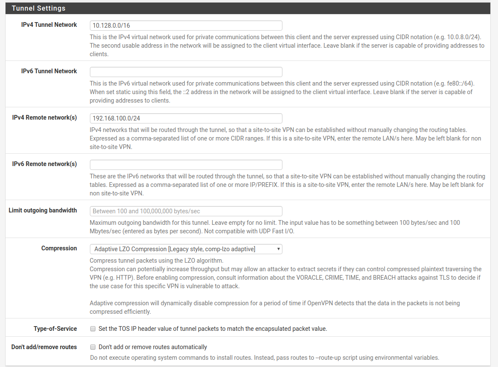

# Подключение pfSense к Ideco UTM с использованием OpenVPN

По шагам ниже можно настроить peer-to-peer туннель между pfSense и Ideco UTM с использованием OpenVPN.

**Объединяемые локальные сети не должны пересекаться!**

## Создание подключения на Ideco UTM

1. В веб-интерфейсе Ideco UTM откройте вкладку **Сервисы -> Интерфейсы** и нажмите на кнопку **Добавить**.
2. В поле **Тип** выберите **OpenVPN.**
3. Заполните поля:
   * Название интерфейса – _любое;_
   *   Внешний IP-адрес этого филиала – _IP-адрес внешнего интерфейса_

       _Ideco UTM;_
   *   Порт на стороне интерфейса – _по умолчанию 1194, можно указать_

       _любой другой свободный;_
   * Удалённая локальная сеть – _здесь укажите адрес локальной подсети pfSense с маской (например, 192.168.105.0/24);_
   * Удалённый внешний IP-адрес – _IP-адрес внешнего интерфейса pfSense_;
   * Удалённый порт – _порт, который будет использован на pfSense при создании там OpenVPN-подключения._
4. Сгенерируйте ключ OpenVPN и скопируйте его для дальнейшей отправки на pfSense.
5. Нажмите на **Сохранить**, а затем на **Применить конфигурацию.**
6. Дождитесь окончания перезагрузки сервера.

## Создание подключения на pfSense

На стороне pfSense необходимо установить клиентское OpenVPN-подключение к серверу Ideco UTM.

В веб-интерфейсе pfSense перейдите на вкладку **VPN -> OpenVPN -> Clients** и нажмите на **Add**, откроется форма добавления нового подключения.

Заполните поля в разделе General Information:

* Server mode – _Peer to Peer (Shared Key);_
* Protocol – _UDP IPv4 and IPv6 on all interfaces (multihome);_
* Device mode – _tun - Layer 3 Tunnel Mode;_
* Interface – _WAN;_
*   Local port – _номер порта, который указали при создании подключения_

    _на Ideco UTM в поле **Удалённый порт;**_
* Server host or address – _IP-адрес внешнего интерфейса Ideco UTM;_
* Server port – _номер порта, который указали при создании подключения на Ideco UTM в поле **Порт на стороне интерфейса.**_

Остальные поля можно оставить пустыми. Ниже приведён скриншот с примером настроек.

Перейдите в раздел **Cryptographic Settings**. Здесь необходимо снять флажок с **Auto generate** и **Enable NCP**, а затем вставить сгенерированный на Ideco UTM ключ OpenVPN в появившееся поле **Shared Key**.

Далее выберите алгоритмы шифрования:

* Encryption Algorithm – BF-CBC (128 bit key by default, 64 bit block);
* Auth digest algorithm – _SHA1 (160 bit)._


На текущий момент установить связь возможно только с использованием указанных здесь алгоритмов.


Пример настроек данного раздела на скриншоте.

Осталось настроить раздел **Tunnel Settings**. Заполняем в нём поля следующим образом:

*   IPv4 Tunnel Network – здесь нужно указать ту сеть, которая на Ideco

    UTM выделена для VPN-подключений (посмотреть можно, перейдя в

    веб-интерфейсе Ideco UTM на вкладку **Сервисы -> Авторизация пользователей**);
*   IPv4 Remote network(s) – адрес локальной подсети Ideco UTM с маской

    (например, 192.168.100.0/24);
*   Compression – Adaptive LZO Compression \[Legasy style, comp-lzo

    adaptive].

После завершения подключения, клиент pfSense, подключающийся к OpenVPN-серверу Ideco UTM, получит второй адрес из подсети для VPN-подключений (например, 10.128.0.2 из подсети 10.128.0.0/16).


Если в вашей сети такой адрес уже используется, как фиксированный для подключения какого-либо пользователя по VPN, либо вы хотите подключить несколько устройств, то нужно сменить туннельный IP на pfSense на любой свободный. Для этого в разделе **Advanced Configuration** нужно прописать: `ifconfig 10.128.0.3 10.128.0.1` \
Здесь `10.128.0.3` – новый адрес для pfSense, а `10.128.0.1` – адрес OpenVPN-сервера Ideco UTM (первый адрес в выделенной подсети).


Пример итоговых настроек:

На этом настройка подключения завершена. Нажмите на **Save**, а затем перейдите на вкладку **Status -> OpenVPN**. Если подключение прошло успешно, то соединение будет выглядеть так:


Помните, что файрвол в pfSense по умолчанию запрещает весь трафик. Поэтому после создания подключения добавьте в него правило, разрешающее подключение на порт, выбранный для OpenVPN.


Теперь устройства из локальной сети Ideco UTM будут иметь доступ до локальной сети pfSense и наоборот. Таким способом можно подключить к Ideco UTM несколько устройств, однако необходимо:

* для каждого нового подключения указывать отдельный порт;
* на каждом новом устройстве pfSense прописывать свой туннельный IP из выделенной подсети.
