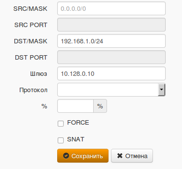
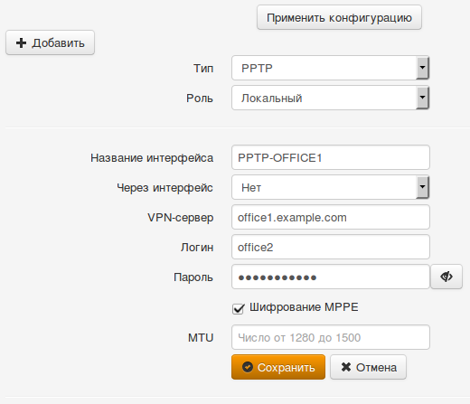
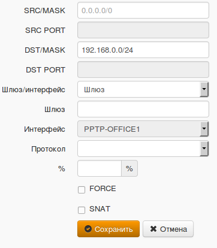

# PPTP VPN

**По возможности используйте более надежный и безопасный протокол для подключения филиалов - IPsec. Подробности по настройке:** [**подключение устройств по IPsec**](ipsec/)**.**

**Для связи Ideco UTM с Ideco UTM также используйте** [**IPSec**](ipsec/)**.**  \
****

По протоколу PPTP вы можете подключить к вашему главному офису филиалы, использующие устаревшие роутеры, поддерживающие только протокол PPTP (если устройство поддерживает IPsec, рекомендуется использовать этот протокол).

Процесс настройки состоит из двух этапов:

* Подготовка сервера и конфигурирование локальных сетей.
* Создание VPN-туннелей и настройка маршрутизации.

## Подготовка интернет-шлюза и конфигурирование локальных сетей

Для объединения локальных сетей офисов вам необходимо обеспечить в них уникальность пространства IP-адресов. В каждом офисе должна быть своя уникальная сеть. В противном случае при создании VPN-туннеля вы можете столкнуться с некорректной работой маршрутизации.

В нашем примере мы рассмотрим объединение сетей двух офисов. Настройте вашу сеть и шлюз безопасности Ideco UTM в соответствии с данными, описанными в таблице ниже.

| Параметр                | Офис №1. Ideco UTM                                         | Офис №2. Роутер.                                           |
| ----------------------- | ---------------------------------------------------------- | ---------------------------------------------------------- |
| Пространство IP-адресов | 
IP-адрес: 192.168.0.0  Маска сети: 255.255.255.0
 | 
IP-адрес: 192.168.1.0  Маска сети: 255.255.255.0
 |
| Локальный IP-адрес      | 
IP-адрес: 192.168.0.1  Маска сети: 255.255.255.0
 | 
IP-адрес: 192.168.1.1  Маска сети: 255.255.255.0
 |

Для корректного функционирования VPN-соединения в Ideco UTM необходимо в разделе **Сервисы** **-> Дополнительно**:

* Отключите проверку обратного пути (RP\_FILTER).

## Создание VPN-туннелей и настройка маршрутизации

### Настройка интернет-шлюза Ideco UTM в офисе №1

Необходимо выполнить следующие действия:

* Создать учетную запись пользователя, например **office2**, от имени которой сервер Ideco UTM в офисе №2 будет осуществлять подключение к серверу Ideco UTM в офисе №1.
* Разрешить созданной учетной записи **Удаленный доступ через VPN**.
* Создайте фиксированную привязку выдаваемого по VPN IP-адреса для данного пользователя (она нужна будет для работы маршрутов).\
  В разделе **Сервисы -> Авторизация пользователей -> Фиксированные IP-адреса в VPN**.
* Добавить маршруты в таблицу маршрутизации. Для этого в web-интерфейсе перейдите в меню **Сервер -> Сетевые параметры -> Маршруты** и нажмите кнопку **Добавить**. На экране появится форма добавления маршрута, которая приведена на фрагменте ниже. Укажите необходимые значения и нажмите кнопку **Сохранить**. Нам необходимо добавить следующие маршруты:
  * 192.168.1.0/255.255.255.0 10.128.0.10
  * 10.129.0.0/255.255.0.0 10.128.0.10

### Настройка роутера в офисе №2

В примере настройки приводятся для Ideco UTM, выступающего в качестве роутера, как правила роутеры различных производителей настраиваются аналогично. Нужно создать VPN-подключение к удаленному серверу и прописать маршрут до удаленной сети через VPN-подключение.

Необходимо выполнить следующие действия:

*   Создать новый интерфейс типа PPTP. В качестве роли используйте

    Local, а в качестве внешнего IP-адреса – внешний адрес интернет-шлюза Ideco UTM в офисе №1. В качестве логина используйте имя учетной записи, которая была создана на сервере в офисе №1 (в нашем примере – office2). Обязательно установите чекбокс **Шифрование MPPE**.

*   Добавить маршруты в таблицу маршрутизации. Для этого в web-интерфейсе перейдите в меню **Сервисы -> Маршруты** и нажмите кнопку **Добавить**. На экране появится форма добавления маршрута, которая показана на фрагменте ниже.

    Укажите необходимые значения и нажмите кнопку **Сохранить**.

    Нам необходимо добавить следующие маршруты: &#x20;

    * 192.168.0.0/255.255.255.0 4;
    *   10.128.0.0/255.255.0.0 4.

        Где 4 – идентификатор созданного PPTP-интерфейса (в вашем случае он может быть другим).

После добавления маршрутов необходимо применить их, нажав кнопку **Применить** вверху страницы с маршрутами.
