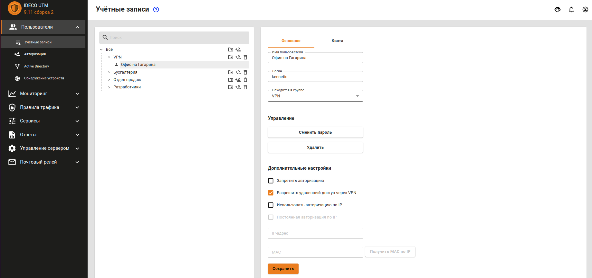
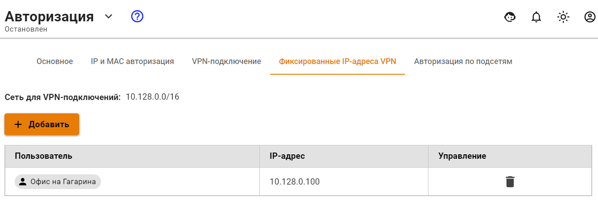

# Подключение Keenetic по SSTP

Если доступ из центрального офиса в сеть за Keenetic не нужен, то воспользуйтесь статьей [Подключение по SSTP Wi-Fi роутеров Keenetic](../client-to-site/sstp-connecting-keenetic-wi-fi-routers.md) по cline-to-site подключению.

## Настройка Ideco UTM

1. Включите и настройте порт и домен для SSTP в разделе **Пользователи -&gt; Авторизация -&gt; VPN-авторизация**.

2. В разделе **Пользователи -&gt; Учетные записи** создайте специального пользователя, для удаленного роутера. Установите флажок **Разрешить удаленный доступ через VPN**. Логин/пароль пользователя будут использоваться на роутере, сохраните или запишите их.

3. Создайте фиксированную привязку выдаваемого по VPN IP-адреса для данного пользователя \(нужна для работы маршрутов\). Для этого перейдите в раздел **Пользователи -&gt; Авторизация -&gt; Фиксированные IP-адреса VPN**.

4. Пропишите маршруты в удаленную сеть. Например, если сеть за роутером `192.168.10.0/24`, а фиксированный IP-адрес роутера в VPN `10.128.0.100`, необходимо добавить следующий маршрут в раздел **Сервисы -&gt; Маршрутизация**:

В поле **Источник** оставьте объект **Любой** эквивалентно 0.0.0.0/0 \(все сети\).

## Настройка роутера Keenetic

Настройте VPN-подключение роутера Keenetic по инструкции для client-to-site подключений.

Не забудьте выполнить все три пункта:

1. Настроить VPN-подключение.
2. Настроить маршруты.
3. Настроить DNS для резолвинга локального домена \(если используете Active Directory\).

## Проверка и возможные проблемы

Для проверки связи используйте утилиты ping и traceroute.

В случае, если VPN-соединение установлено, но нет доступа до ресурсов одной локальной сети из другой, воспользуйтесь инструкциями из статьи по поиску возможных проблем.

Чаще всего доступ блокируется в Windows из-за настроек сетевых профилей.

Вы можете разрешить доступ до «не локальных» сетей во всех профилях, выполнив команду в PowerShell \(запущенного с повышением прав до администратора\): `Enable-NetFirewallRule -Group "@FirewallAPI.dll,-28502"`

