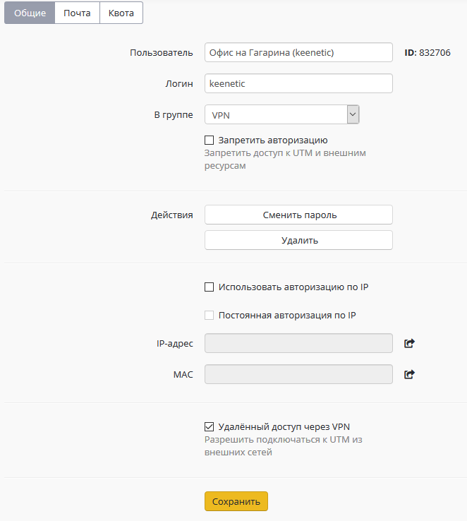
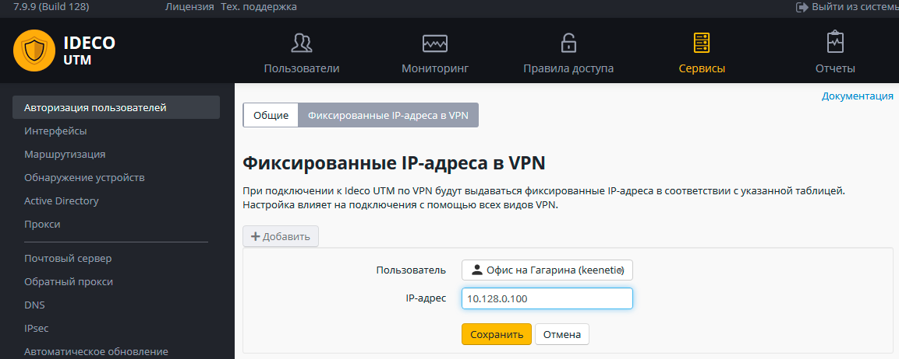
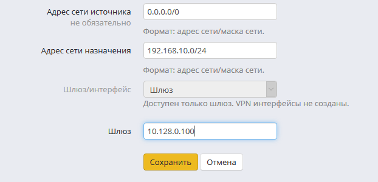

# Подключение Keenetic по SSTP

Вы можете подключить роутеры с поддержкой протокола SSTP в режиме site-to-site VPN (если доступ из центрального офиса в сеть за Keenetic не нужен, то воспользуйтесь [инструкцией](../client-to-site/sstp/podklyuchenie_wi-fi_routerov_keenetic.md) по cline-to-site подключению).

## Настройка Ideco UTM

1\. Включите и настройте порт и домен для SSTP в разделе **Сервисы -> Авторизация пользователей**.

2\. В разделе **Пользователи** создайте специального пользователя, для удаленного роутера.  \
Установите флажок **Удаленный доступ через VPN**.  \
Логин/пароль пользователя будут использоваться на роутере, сохраните или запишите их. &#x20;



3\. Создайте фиксированную привязку выдаваемого по VPN IP-адреса для данного пользователя (она нужна будет для работы маршрутов).  \
В разделе **Сервисы -> Авторизация пользователей -> Фиксированные IP-адреса в VPN**.



4\. Пропишите маршруты в удаленную сеть.  \
Например, если сеть за роутером 192.168.10.0/24, а фиксированный IP-адрес роутера в VPN 10.128.0.100, необходимо добавить следующий маршрут в раздел **Сервисы -> Маршрутизация**: &#x20;



В адресе сети источника оставьте 0.0.0.0/0 (все сети).

## Настройка роутера Keenetic

Настройте VPN-подключение роутера Keenetic по [инструкции](../client-to-site/sstp/podklyuchenie_wi-fi_routerov_keenetic.md) для client-to-site подключений.

Не забудьте выполнить все три пункта:

1. Настроить VPN-подключение.
2. Настроить маршруты.
3.  Настроить DNS для резолвинга локального домена (если используете

    Active Directory).



## Проверка и возможные проблемы

Для проверки связи используйте утилиты **ping** и **traceroute**.

В случае, если VPN-соединение установлено, но нет доступа до ресурсов одной локальной сети из другой, воспользуйтесь инструкциями из [статьи](../client-to-site/features.md) по поиску возможных проблем.

Чаще всего доступ блокируется в Windows из-за настроек сетевых профилей.

Вы можете разрешить доступ до "не локальных" сетей во всех профилях выполнив команду в PowerShell (запущенного с повышением прав до администратора):

```
Enable-NetFirewallRule -Group "@FirewallAPI.dll,-28502"
```
