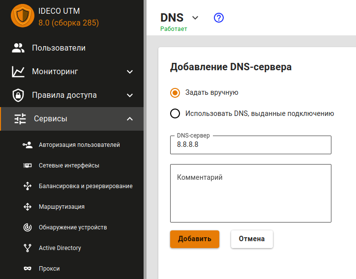
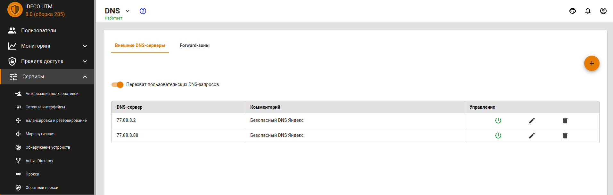
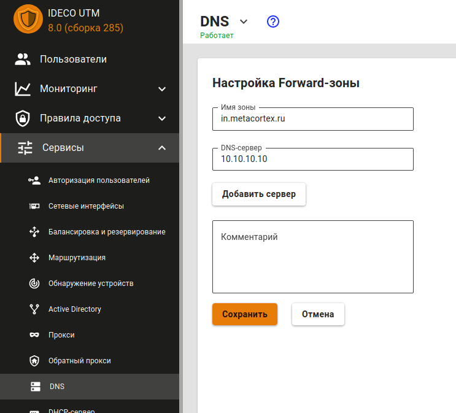

# DNS

Служба DNS на сервере Ideco UTM служит для нескольких целей и настраивается в одном разделе веб-интерфейса: **Сервер -&gt; DNS**. Служба DNS позволяет указать DNS-серверы во внешних сетях, через которые будут разрешаться доменные имена \(Вкладка **Внешние DNS-серверы**\), запрашиваемые из локальных сетей, обслуживаемых Ideco UTM. Есть возможность указывать сторонние DNS-серверы \(в локальных или внешних сетях относительно UTM\) с указанием конкретных DNS-зон, которые эти сервера обслуживают \(Вкладка **Forward-зоны**\). Перечисленные возможности DNS-сервера могут использоваться одновременно.

## Внешние DNS-серверы

Для нормальной работы резолвинга имён в сети Интернет через Ideco UTM указывать DNS-серверы в этом разделе не требуется, однако по умолчанию указаны безопасные DNS-сервера [Яндекс.DNS](https://dns.yandex.ru/). Если DNS-сервера не указаны, то сервер будет разрешать имена в сети Интернет, используя [корневые DNS-серверы](https://ru.wikipedia.org/wiki/%D0%9A%D0%BE%D1%80%D0%BD%D0%B5%D0%B2%D1%8B%D0%B5_%D1%81%D0%B5%D1%80%D0%B2%D0%B5%D1%80%D1%8B_DNS) в интернете. Администратор может указать DNS-серверы провайдера, выбрав в форме добавления **Использовать DNS, выданные подключению** и указав нужное подключение. Для указания DNS-серверов вручную, выберите в форме добавления **Задать вручную** и вручную укажите IP-адрес DNS-сервера.

**Рекомендации:** 

1. DNS-сервер встроенный в Ideco UTM — кеширующий. Крайне рекомендуется использовать его в качестве DNS-сервера для вашей локальной сети. 
2. Не указывайте `8.8.8.8`, `1.1.1.1` или подобные без особой необходимости. Ideco UTM справится с резолвингом самостоятельно без каких-либо посредников. 
3. Не указывайте DNS-сервера от вашего внутреннего сервера Active Directory, даже если он может самостоятельно резольвить доменные имена в интернете. В этом, как правило, нет смысла. При интеграции с AD Ideco UTM автоматически настроит всё необходимое \(forward-зону\) для работы AD и резолвинга внутренних имён вашего домена. Для резолвинга каких-то особых зон не связанных с AD создавайте forward-зону. 
4. Не используйте без крайней необходимости DNS, предоставляемые вашим интернет-провайдером \(не указывайте ни вручную, ни через опцию выбор интерфейса\). Всё что необходимо для подключения к PPTP/L2TP через доменное имя, Ideco UTM настроит автоматически. На практике, провайдерские DNS превышают TTL, а также долго отвечают. Единственный случай когда это нужно — особые внутренние доменные зоны провайдера. В этом случае создавайте forward-зону. 
5. Можно указывать DNS-сервера занимающиеся фильтрацией, если это необходимо \(SkyDNS или Яндекс-DNS\). 
6. В случае, если все DNS-сервера отключены или удалены, DNS будет работать нормально — Ideco UTM будет резолвить имена самостоятельно.

**Форма добавления:** 

**Управление DNS-серверами**: вы можете выключить или включать, редактировать и удалять DNS-сервера.

В продукте есть возможность перехватывать запросы производимые через сторонние DNS-серверы, указанные пользователями на рабочих станциях \(с целью обхода блокировок, либо из-за неверной настройки\). Для этого необходимо включить признак **Перехват пользовательских DNS-запросов** \(см. окончание данной статьи\).

## Forward-зоны

В этом разделе можно явно задать DNS-сервер для разрешения имен конкретной DNS-зоны. Указав DNS-сервер, доступный в сети и зону, которую он обслуживает, клиенты сети Ideco UTM получают возможность обращаться к ресурсам этой зоны по именам домена, обслуживаемого ей. Например, IT-отдел предприятия предоставляет ресурсы для сотрудников в зоне `in.metacortex.com` под именами `realm1.in.metacortex.com`, `sandbox.metacortex.com` и использует для этого DNS-сервер 10.10.10.10. Для возможности доступа к этим ресурсам по доменным именам укажите forward-зону провайдера как isp и далее задайте DNS-сервер 10.10.10.10 в форме добавления Forward-зоны.

## Перехват DNS-запросов

В разделе **Внешние DNS-серверы** вы можете включить опцию **Перехват пользовательских DNS-запросов** в Интернет на сторонние DNS-серверы. Опция включается глобально для всех хостов в локальной сети, выходящих в Интернет через сервер UTM. Это позволяет избежать возможной подмены адреса ресурса при резолвинге его домена в целях обхода блокировок ресурсов в Интернет. Также перехват всех DNS-запросов пользователей позволит контролировать процесс резолвинга доменных имен в Интернет исключительно средствами UTM.

Перехваченный запрос будет перенаправлен на DNS-сервер UTM, и ответ будет сформирован DNS-сервером UTM, а не исходным DNS-сервером. Перехват DNS-запросов, в том числе, блокирует возможность туннелирования через DNS \(DNS-tunneling\).

Вы можете использовать следующие сторонние DNS-сервера, для дополнительной фильтрации трафика:

* [SkyDNS](https://www.skydns.ru/) `193.58.251.251;`
* [Yandex DNS](https://dns.yandex.ru/) `77.88.8.88, 77.88.8.2;`
* Google DNS `8.8.8.8, 8.8.4.4;`
* Open DNS `208.67.222.222, 208.67.220.220, 208.67.222.220, 208.67.220.222;`
* Cloudflare DNS `1.1.1.1, 1.0.0.1.`

