# Настройка почтового сервера

Для настройки почтового сервера в web-интерфейсе необходимо перейти в меню **Сервисы -&gt; Почтовый сервер**. В этом разделе находятся все ключевые параметры, влияющие на работу почтовой службы.  
Все настраиваемые параметры разделены по нескольким категориям, которые описаны ниже.

Наименования разделов в расположенной ниже таблице кликабельны и являются быстрыми ссылками на документацию по соответствующему разделу.

| Категория | Описание |
| :--- | :--- |
| [Общие](nastroika_pochtovogo_servera.md) | Основные параметры |
| [Доставка](nastroika_pochtovogo_servera.md#dostavka) | Параметры, отвечающие за доступ пользователей к почтовому серверу и задающие лимиты почтовых ящиков. Также в разделе настраивается логика сортировки спама |
| [Безопасность](nastroika_pochtovogo_servera.md#bezopasnost) | Параметры, отвечающие за обеспечение безопасности почтового сервера |
| [Расширенные](nastroika_pochtovogo_servera.md#rasshirennye-nastroiki) | Расширенные параметры, такие, как копирование всей входящей/исходящей корреспонденции на ящик, загрузка почты с удаленных серверов и общие IMAP-папки |
| [Антиспам](nastroika_pochtovogo_servera.md#antispam) | Антиспам на основе технологий Лаборатории Касперского с функцией машинного обучения и искусственного интеллекта |
| [Антивирусы](nastroika_pochtovogo_servera.md#antivirusy) | Антивирус на основе технологий Лаборатории Касперского, а также свободный антивирус ClamAV с открытым исходным кодом |
| [Правила](nastroika_pochtovogo_servera.md#pravila) | Белый и черный списки доверенных адресов и доменов, правила анализа писем на основе регулярных выражений, а также почтовые алиасы |

### Общие настройки

Раздел общих настроек включает в себя множество базовых параметров, необходимых для работы почтового сервера в сети Интернет. Параметры представлены в перечне ниже.

| Параметр | Описание |
| :--- | :--- |
| Основной почтовый домен | Указывает серверу на его почтовый домен, для которого он должен принимать и обрабатывать письма. Все ящики пользователей будут принадлежать этому домену. От имени этого домена вы будете вести переписку с корреспондентами |
| Имя хоста почтового сервера | Как правило, совпадает с MX-записью для вашего домена. Это имя должно разрешаться из сети Интернет во внешний IP-адрес UTMИспользуется почтовым сервером в диалоге при транспорте почты между другими почтовыми серверами как уникальный идентификатор. Необходимо для корректной работы почтового сервера в сети Интернет |
| Дополнительные почтовые домены | Дополнительные домены, которые почтовый сервер будет считать своими. Корреспонденция, отправляемая с ящиков в этих почтовых доменах также будет обрабатываться сервером при условии правильной установки MX-записей |
| Relay-домены | Почтовые домены в локальной сети, для которых будут пересылаться письма извне |
| SSL-сертификат для SMTP, IMAP, POP3 | Загрузка бандла SSL-сертификатов, использующихся на почтовом сервере. При первом запуске службы автоматически генерируется и подписываются корневым сертификатом Ideco ICS. Есть возможность установки доверенного сертификата, заверенного удостоверяющим центром, см. инструкцию |

Форма общих настроек показана на фрагменте ниже.

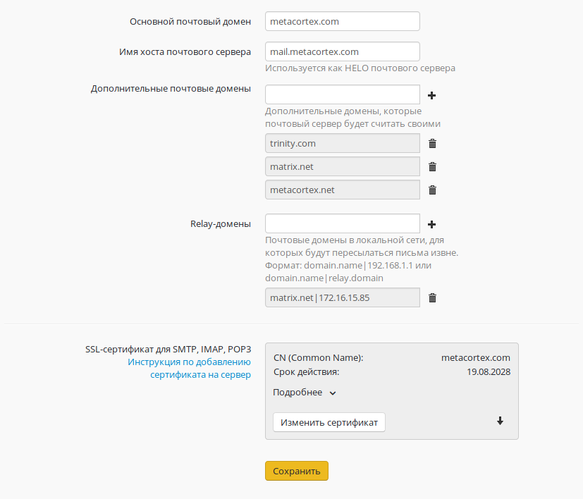

### Доставка

В этом разделе перечислены параметры доступа к почтовому серверу и доставки отправлений адресатам.

<table>
  <thead>
    <tr>
      <th style="text-align:left">&#x41F;&#x430;&#x440;&#x430;&#x43C;&#x435;&#x442;&#x440;</th>
      <th style="text-align:left">&#x41E;&#x43F;&#x438;&#x441;&#x430;&#x43D;&#x438;&#x435;</th>
    </tr>
  </thead>
  <tbody>
    <tr>
      <td style="text-align:left">&#x414;&#x43E;&#x441;&#x442;&#x443;&#x43F; &#x43F;&#x43E; IMAP
         (143, STARTTLS)</td>
      <td style="text-align:left">&#x417;&#x430;&#x434;&#x435;&#x439;&#x441;&#x442;&#x432;&#x43E;&#x432;&#x430;&#x43D;&#x438;&#x435;
        &#x432;&#x43E;&#x437;&#x43C;&#x43E;&#x436;&#x43D;&#x43E;&#x441;&#x442;&#x438;
        &#x440;&#x430;&#x431;&#x43E;&#x442;&#x44B; &#x441; &#x43F;&#x43E;&#x447;&#x442;&#x43E;&#x432;&#x44B;&#x43C;&#x438;
        &#x44F;&#x449;&#x438;&#x43A;&#x430;&#x43C;&#x438; &#x441;&#x435;&#x440;&#x432;&#x435;&#x440;&#x430;
        &#x43F;&#x43E; &#x43F;&#x440;&#x43E;&#x442;&#x43E;&#x43A;&#x43E;&#x43B;&#x443;
        IMAP (&#x441; &#x448;&#x438;&#x444;&#x440;&#x43E;&#x432;&#x430;&#x43D;&#x438;&#x435;&#x43C;
        STARTTLS) &#x438;&#x437; &#x43B;&#x43E;&#x43A;&#x430;&#x43B;&#x44C;&#x43D;&#x43E;&#x439;
        &#x441;&#x435;&#x442;&#x438; &#x438; &#x418;&#x43D;&#x442;&#x435;&#x440;&#x43D;&#x435;&#x442;</td>
    </tr>
    <tr>
      <td style="text-align:left">&#x414;&#x43E;&#x441;&#x442;&#x443;&#x43F; &#x43F;&#x43E; POP3(S)
         (110 STARTTLS, 995)</td>
      <td style="text-align:left">&#x417;&#x430;&#x434;&#x435;&#x439;&#x441;&#x442;&#x432;&#x43E;&#x432;&#x430;&#x43D;&#x438;&#x435;
        &#x432;&#x43E;&#x437;&#x43C;&#x43E;&#x436;&#x43D;&#x43E;&#x441;&#x442;&#x438;
        &#x440;&#x430;&#x431;&#x43E;&#x442;&#x44B; &#x441; &#x43F;&#x43E;&#x447;&#x442;&#x43E;&#x432;&#x44B;&#x43C;&#x438;
        &#x44F;&#x449;&#x438;&#x43A;&#x430;&#x43C;&#x438; &#x441;&#x435;&#x440;&#x432;&#x435;&#x440;&#x430;
        &#x43F;&#x43E; &#x43F;&#x440;&#x43E;&#x442;&#x43E;&#x43A;&#x43E;&#x43B;&#x443;
        POP3 (&#x441; &#x448;&#x438;&#x444;&#x440;&#x43E;&#x432;&#x430;&#x43D;&#x438;&#x435;&#x43C;
        STARTTLS) &#x438;&#x437; &#x43B;&#x43E;&#x43A;&#x430;&#x43B;&#x44C;&#x43D;&#x43E;&#x439;
        &#x441;&#x435;&#x442;&#x438; &#x438; &#x418;&#x43D;&#x442;&#x435;&#x440;&#x43D;&#x435;&#x442;</td>
    </tr>
    <tr>
      <td style="text-align:left">&#x418;&#x441;&#x43F;&#x43E;&#x43B;&#x44C;&#x437;&#x43E;&#x432;&#x430;&#x442;&#x44C;
         web-&#x43F;&#x43E;&#x447;&#x442;&#x443;</td>
      <td style="text-align:left">&#x412;&#x43A;&#x43B;&#x44E;&#x447;&#x435;&#x43D;&#x438;&#x435; &#x432;&#x435;&#x431;-&#x438;&#x43D;&#x442;&#x435;&#x440;&#x444;&#x435;&#x439;&#x441;&#x430;
        &#x43F;&#x43E;&#x447;&#x442;&#x43E;&#x432;&#x43E;&#x433;&#x43E; &#x43A;&#x43B;&#x438;&#x435;&#x43D;&#x442;&#x430;
        &#x434;&#x43B;&#x44F; &#x434;&#x43E;&#x441;&#x442;&#x443;&#x43F;&#x430;
        &#x43A; &#x43F;&#x43E;&#x447;&#x442;&#x435; &#x43D;&#x430; &#x441;&#x435;&#x440;&#x432;&#x435;&#x440;&#x435;.
        &#x417;&#x430;&#x434;&#x435;&#x439;&#x441;&#x442;&#x432;&#x443;&#x435;&#x442;
        &#x432;&#x43E;&#x437;&#x43C;&#x43E;&#x436;&#x43D;&#x43E;&#x441;&#x442;&#x44C;
        &#x43F;&#x43E;&#x434;&#x43A;&#x43B;&#x44E;&#x447;&#x435;&#x43D;&#x438;&#x44F;
        &#x43D;&#x430; &#x43B;&#x43E;&#x43A;&#x430;&#x43B;&#x44C;&#x43D;&#x44B;&#x439;
        &#x430;&#x434;&#x440;&#x435;&#x441; &#x441;&#x435;&#x440;&#x432;&#x435;&#x440;&#x430;
        &#x434;&#x43B;&#x44F; &#x43A;&#x43B;&#x438;&#x435;&#x43D;&#x442;&#x43E;&#x432;,
        &#x43D;&#x430;&#x445;&#x43E;&#x434;&#x44F;&#x449;&#x438;&#x445;&#x441;&#x44F;
        &#x432; &#x43B;&#x43E;&#x43A;&#x430;&#x43B;&#x44C;&#x43D;&#x43E;&#x439;
        &#x441;&#x435;&#x442;&#x438;</td>
    </tr>
    <tr>
      <td style="text-align:left">&#x41C;&#x430;&#x43A;&#x441;&#x438;&#x43C;&#x430;&#x43B;&#x44C;&#x43D;&#x44B;&#x439;
        &#x440;&#x430;&#x437;&#x43C;&#x435;&#x440;
         &#x44F;&#x449;&#x438;&#x43A;&#x430;, (&#x41C;&#x411;)</td>
      <td style="text-align:left">&#x41E;&#x433;&#x440;&#x430;&#x43D;&#x438;&#x447;&#x435;&#x43D;&#x438;&#x435;
        &#x43D;&#x430; &#x43C;&#x430;&#x43A;&#x441;&#x438;&#x43C;&#x430;&#x43B;&#x44C;&#x43D;&#x44B;&#x439;
        &#x440;&#x430;&#x437;&#x43C;&#x435;&#x440; &#x43F;&#x43E;&#x447;&#x442;&#x43E;&#x432;&#x43E;&#x433;&#x43E;
        &#x44F;&#x449;&#x438;&#x43A;&#x430; &#x432; &#x43C;&#x435;&#x433;&#x430;&#x431;&#x430;&#x439;&#x442;&#x430;&#x445;</td>
    </tr>
    <tr>
      <td style="text-align:left">&#x41C;&#x430;&#x43A;&#x441;&#x438;&#x43C;&#x430;&#x43B;&#x44C;&#x43D;&#x44B;&#x439;
        &#x440;&#x430;&#x437;&#x43C;&#x435;&#x440;
         &#x43F;&#x438;&#x441;&#x44C;&#x43C;&#x430;, (&#x41C;&#x411;)</td>
      <td style="text-align:left">&#x41E;&#x433;&#x440;&#x430;&#x43D;&#x438;&#x447;&#x435;&#x43D;&#x438;&#x435;
        &#x43D;&#x430; &#x43C;&#x430;&#x43A;&#x441;&#x438;&#x43C;&#x430;&#x43B;&#x44C;&#x43D;&#x44B;&#x439;
        &#x440;&#x430;&#x437;&#x43C;&#x435;&#x440; &#x444;&#x43E;&#x440;&#x43C;&#x438;&#x440;&#x443;&#x435;&#x43C;&#x43E;&#x433;&#x43E;
        &#x441;&#x435;&#x440;&#x432;&#x435;&#x440;&#x43E;&#x43C; &#x43F;&#x438;&#x441;&#x44C;&#x43C;&#x430;
        &#x432; &#x43C;&#x435;&#x433;&#x430;&#x431;&#x430;&#x439;&#x442;&#x430;&#x445;</td>
    </tr>
    <tr>
      <td style="text-align:left">&#x423;&#x434;&#x430;&#x43B;&#x44F;&#x442;&#x44C; &#x438;&#x437; &#x43A;&#x43E;&#x440;&#x437;&#x438;&#x43D;&#x44B;
        &#x43F;&#x438;&#x441;&#x44C;&#x43C;&#x430;
         &#x441;&#x442;&#x430;&#x440;&#x435;&#x435;, (&#x434;&#x43D;&#x435;&#x439;)</td>
      <td
      style="text-align:left">&#x423;&#x43A;&#x430;&#x437;&#x430;&#x43D;&#x438;&#x435; &#x438;&#x43D;&#x442;&#x435;&#x440;&#x432;&#x430;&#x43B;&#x430;
        &#x43E;&#x447;&#x438;&#x441;&#x442;&#x43A;&#x438; &#x43F;&#x430;&#x43F;&#x43A;&#x438;
        Trash (&#x43A;&#x43E;&#x440;&#x437;&#x438;&#x43D;&#x430;) &#x441; &#x443;&#x434;&#x430;&#x43B;&#x435;&#x43D;&#x43D;&#x43E;&#x439;
        &#x43A;&#x43E;&#x440;&#x440;&#x435;&#x441;&#x43F;&#x43E;&#x43D;&#x434;&#x435;&#x43D;&#x446;&#x438;&#x435;&#x439;</td>
    </tr>
    <tr>
      <td style="text-align:left">&#x421;&#x43E;&#x440;&#x442;&#x438;&#x440;&#x43E;&#x432;&#x43A;&#x430;
        &#x441;&#x43F;&#x430;&#x43C;&#x430;</td>
      <td style="text-align:left">
        

        
&#x417;&#x430;&#x434;&#x430;&#x43D;&#x438;&#x435; &#x43B;&#x43E;&#x433;&#x438;&#x43A;&#x438;
          &#x441;&#x43E;&#x440;&#x442;&#x438;&#x440;&#x43E;&#x432;&#x430;&#x43D;&#x438;&#x44F;
          &#x43D;&#x435;&#x436;&#x435;&#x43B;&#x430;&#x442;&#x435;&#x43B;&#x44C;&#x43D;&#x43E;&#x439;
          &#x43A;&#x43E;&#x440;&#x440;&#x435;&#x441;&#x43F;&#x43E;&#x43D;&#x434;&#x435;&#x43D;&#x446;&#x438;&#x438;
          (&#x441;&#x43F;&#x430;&#x43C;&#x430;).
           &#x41D;&#x430; &#x432;&#x44B;&#x431;&#x43E;&#x440; &#x43F;&#x440;&#x435;&#x434;&#x43E;&#x441;&#x442;&#x430;&#x432;&#x43B;&#x44F;&#x44E;&#x442;&#x441;&#x44F;
          &#x441;&#x43B;&#x435;&#x434;&#x443;&#x44E;&#x449;&#x438;&#x435; &#x43E;&#x43F;&#x446;&#x438;&#x438;:

        <ul>
          <li>&#x43E;&#x442;&#x43A;&#x43B;&#x44E;&#x447;&#x435;&#x43D;&#x438;&#x435;
            &#x441;&#x43E;&#x440;&#x442;&#x438;&#x440;&#x43E;&#x432;&#x43A;&#x438;,</li>
          <li>&#x43F;&#x435;&#x440;&#x435;&#x43C;&#x435;&#x449;&#x435;&#x43D;&#x438;&#x435;
            &#x43D;&#x435;&#x436;&#x435;&#x43B;&#x430;&#x442;&#x435;&#x43B;&#x44C;&#x43D;&#x44B;&#x445;
            &#x43E;&#x442;&#x43F;&#x440;&#x430;&#x432;&#x43B;&#x435;&#x43D;&#x438;&#x439;
            &#x432; &#x43F;&#x430;&#x43F;&#x43A;&#x443; Spam,</li>
          <li>&#x443;&#x434;&#x430;&#x43B;&#x435;&#x43D;&#x438;&#x435; &#x442;&#x430;&#x43A;&#x438;&#x445;
            &#x43F;&#x438;&#x441;&#x435;&#x43C; &#x441; &#x441;&#x435;&#x440;&#x432;&#x435;&#x440;&#x430;.</li>
        </ul>
      </td>
    </tr>
    <tr>
      <td style="text-align:left">&#x42F;&#x449;&#x438;&#x43A;&#x438;, &#x438;&#x441;&#x43A;&#x43B;&#x44E;&#x447;&#x435;&#x43D;&#x43D;&#x44B;&#x435;
        &#x438;&#x437;
         &#x441;&#x43E;&#x440;&#x442;&#x438;&#x440;&#x43E;&#x432;&#x43A;&#x438;
        &#x438; &#x443;&#x434;&#x430;&#x43B;&#x435;&#x43D;&#x438;&#x44F;
         &#x441;&#x43F;&#x430;&#x43C;&#x430;</td>
      <td style="text-align:left">&#x41F;&#x43E;&#x437;&#x432;&#x43E;&#x43B;&#x44F;&#x435;&#x442; &#x437;&#x430;&#x434;&#x430;&#x442;&#x44C;
        &#x43F;&#x43E;&#x447;&#x442;&#x43E;&#x432;&#x44B;&#x435; &#x44F;&#x449;&#x438;&#x43A;&#x438;,
        &#x43F;&#x440;&#x438; &#x43E;&#x442;&#x43F;&#x440;&#x430;&#x432;&#x43B;&#x435;&#x43D;&#x438;&#x438;
        &#x43D;&#x430; &#x43A;&#x43E;&#x442;&#x43E;&#x440;&#x44B;&#x435; &#x43A;&#x43E;&#x440;&#x440;&#x435;&#x441;&#x43F;&#x43E;&#x43D;&#x434;&#x435;&#x43D;&#x446;&#x438;&#x44F;
        &#x43D;&#x435; &#x431;&#x443;&#x434;&#x435;&#x442; &#x43F;&#x440;&#x43E;&#x432;&#x435;&#x440;&#x44F;&#x442;&#x44C;&#x441;&#x44F;
        &#x43D;&#x430; &#x441;&#x43F;&#x430;&#x43C;</td>
    </tr>
  </tbody>
</table>

Форма настроек доставки корреспонденции и доступа к почтовому серверу показана на фрагменте ниже:

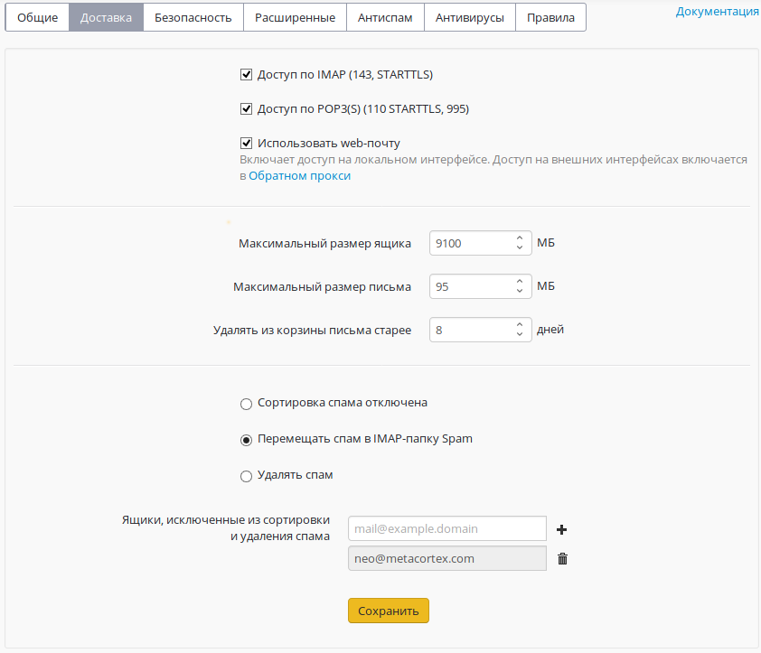

### Безопасность

Настройки безопасности не только определяют защиту самого почтового сервера, но и позволяют выполнять некоторые требования внутренней политики безопасности предприятия.  
Настройки безопасности приведены в перечне ниже.

| Параметр | Описание |
| :--- | :--- |
| Принимать почту от других SMTP-серверов по шифрованному соединению | Рекомендуется выбрать параметр "По возможности". При этом письма, передаваемые между почтовыми серверами, поддерживающими шифрование, будут зашифрованы |
| Включить поддержку SASL для аутентификации SMTP-клиентов | Подключившись к почтовому ящику из интернета, отправить письмо, используя SMTP сервер Ideco,можно будет только пройдя авторизацию по логину и паролю, заданному для этой учетной записи пользователя на сервере. Не включайте данный параметр, если используете ICS в качестве почтового релея |
| Разрешить аутентификацию только через TLS | Запрещает незащищенную передачу учетных данных клиента при аутентификации на SMTP сервере |
| Фильтрация по серым спискам | Включает фильтрацию по серым спискам \(greylisting\) для входящей почты. При этом почта от неизвестных доменов отправителей может приходить с небольшой задержкой |
| Фильтрация по DNSBL | Включает фильтрацию по DNSBL для входящей почты |
| Доверенные сети | Авторизация на сервере для доступа к почтовому ящику не требуется при попытке доступа из этих сетей. Указываются IP-сети и хосты в нотации CIDR или с префиксом сети, например: 10.0.0.5/255.255.255.255 или 192.168.0.0/16 |

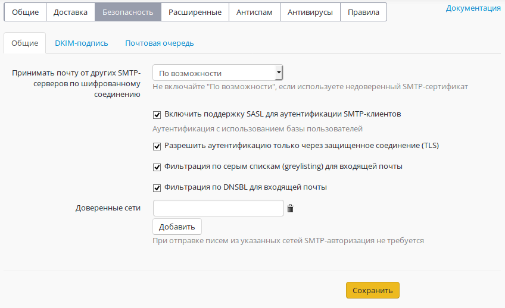

### DKIM-подпись

Настраивается в разделе **Сервисы -&gt; Почтовый сервер -&gt; Безопасность -&gt; DKIM-подпись**. Подписывает исходящую с сервера корреспонденцию уникальной для вашего почтового домена подписью так, что другие почтовые серверы в Интернет могут убедиться, что ваша почта легитимна и заслуживает доверия.

Для функционирования технологии вам потребуется создать TXT запись для вашего домена у держателя зоны со значением, которое сформирует для вашего почтового домена наш сервер. TXT записи будут сформированы для основного почтового домена, настроенного на ICS, и дополнительных почтовых доменов \(если указаны\). Сервер также проверит, правильно ли была указана запись для вашей зоны и резолвится ли она в Интернет.

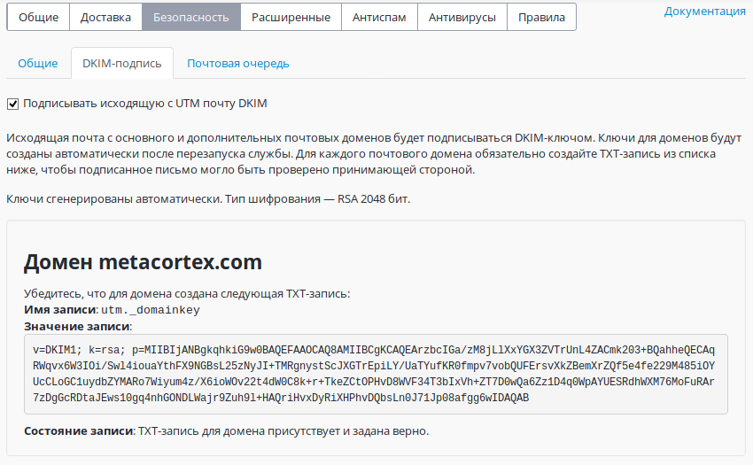

### Почтовая очередь

Эта вкладка раздела **Безопасность** позволяет управлять очередью почтовых отправлений, которые по каким-либо причинам не могут быть прямо сейчас отправлены или получены. Модуль позволяет управлять как входящей, так и исходящей отложенной корреспонденцией. Для анализа возможных причин задержки корреспонденции в очереди вы можете использовать информацию из соответствующегостолбца таблицы для каждого письма. Предусмотрены как выборочные, так и групповые действия с отправлениями в очереди \(очистка очереди, повторая отправка отдельного письма, удаление отдельных писем из очереди, повторная отправка всей корреспонденции из очереди\).

Форма управления очередью почтового сервера предоставлена на фрагменте ниже.

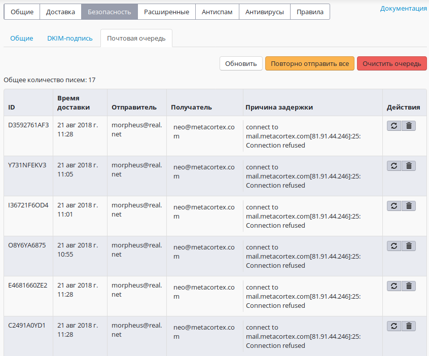

### Расширенные настройки

Электронная почта является важнейшей составляющей деловых процессов предприятия. Часто случается так, что базовых настроек оказывается недостаточно, и требуется более тонкая настройка, описанная в таблице ниже. В этом разделе описываются дополнительные параметры, которые вы можете определить в Ideco UTM.

| Параметр | Описание |
| :--- | :--- |
| Почтовый ящик для спама | Весь входящий спам будет пересылаться на этот ящик \(не используйте ящик spam\) |
| Сортировать спам в IMAP папку Spam | Письма, определенные как спам, перемещаются в отдельную IMAP папку Spam |
| Ящики исключения из сортировки и удаления | Спам, приходящий указанным адресатам, не будет подвергнут сортировке или удалению |
| Внешний SMTP-релей | Вся исходящая почта будет отправляться на указанный адрес. Используется, например, в случае, если почта должна проходить через вышестоящий сервер провайдера перед отправкой в интернет |
| Удалять из корзины письма старее | Удаляются письма старше указанного количества дней из IMAP папок **Удаленные** и **Спам** |
| Копировать всю исходящую с домена почту | Вся исходящая почта будет дублироваться на указанный почтовый ящик. Рекомендуется включать только при крайней необходимости |
| Копировать всю входящую на домен почту | Вся входящая почта будет дублироваться на указанный почтовый ящик. Рекомендуется включать только при крайней необходимости |
| Копировать всю почту | Вся почта будет дублироваться на указанный почтовый ящик. Рекомендуется включать только при крайней необходимости |
| Дополнительные почтовые домены | Список дополнительных доменов, почта которых будет обрабатываться почтовым сервером Ideco UTM |
| Загрузка почты с удаленных серверов \(fetchmail\) | Правила сбора почты с внешних ящиков и ее перенаправления на ящики пользователей сервера. Записываются в соответствии с синтаксисом fetchmail, например: pop3.mymail.ru:pop3 user pass localuser@smtp.ideco.ru |
| Интервал между проверкой почты \(fetchmail\) | Интервал в минутах между проверкой доступности новых сообщений на внешних ящиках пользователей для сбора почты с них по правилам fetchmail, указанным выше |
| Общие IMAP папки | Указанные папки будут созданы на сервере и доступны всем пользователям |

Форма расширенных настроек показана ниже.

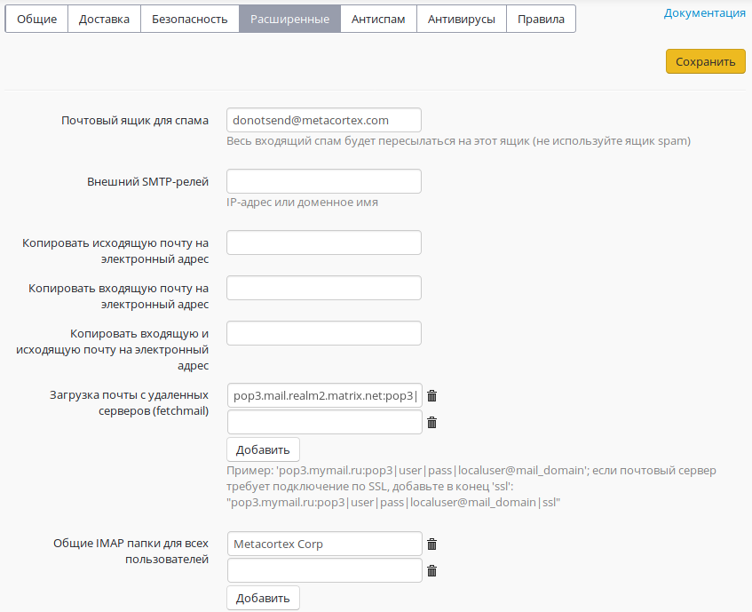

### Антиспам

Позволяет управлять работой службы антиспама на основе технологий Лаборатории Касперского с функцией машинного обучения и искусственного интеллекта. Также на этой вкладке предоставлена возможность добавления лицензионного ключа антиспама. Ключ поставляется в файле, имеющем расширение .key. Если вы приобретали лицензию на антиспам, но не имеете в своём распоряжении лицензионного ключа, проверьте переписку с отделом продаж нашей компании \(sales@ideco.ru\) на наличие вложений. В случае, если вы не нашли таких вложений, запросите ключ заново, выслав письмо на **sales@ideco.ru** с указанием наименования вашей организации или номером вашей лицензии.

Форма настройки модуля антиспама Касперского и добавления лицензионного ключа предоставлена ниже.

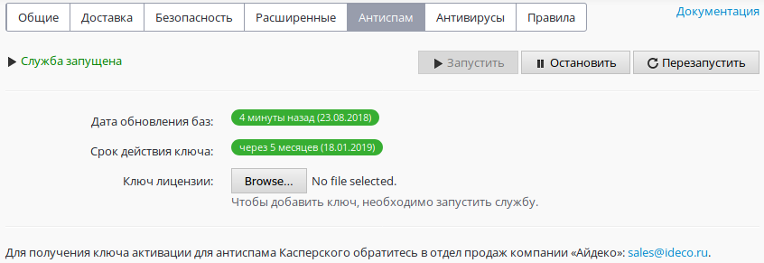

### Антивирусы

Позволяет управлять состоянием антивирусов, проверяющих вложения сообщений, обрабатываемых почтовым сервером.Также на вкладке отображается дата последнего обновления сигнатур антивирусных баз.

Рекомендуется использование только одного антивируса единовременно.Включение обоих антивирусов возможно, однако не имеет практического смысла. Кроме того, в этом случае потребление аппаратных ресурсов обоими антивирусами может быть неоправданно большим.

Форма настройки состояния антивирусов почтового сервера предоставлена ниже.

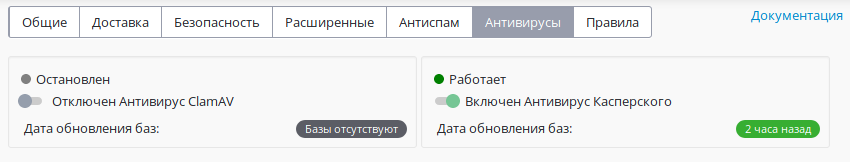

###  Правила 

#### Переадресация 

Позволяет настроить переадресацию почты на сервере с помощью почтовых алиасов. Алиасы отличаются от почтовых ящиков тем, что не требуют логинов и паролей, они закрепляются за ящиком и служат его копией с другим именем, или, в случае назначения алиаса нескольким почтовым ящикам, может служить группой рассылки. Поступающая на алиас почта автоматически пересылается на все реальные почтовые ящики, связанные с этим алиасом. Если перенаправление делается на какой-либо ящик в другом домене в интернете, то ящик, прописываемый в графе **Получатель**, должен реально существовать. 

Подробнее с документацией по настройке почтовых алиасов на Ideco UTM вы можете ознакомиться по этой [ссылке](pereadresaciya_pochty_pochtovye_aliasy_.md). 

Ниже предоставлен пример формы настройки алиасов на сервере. 

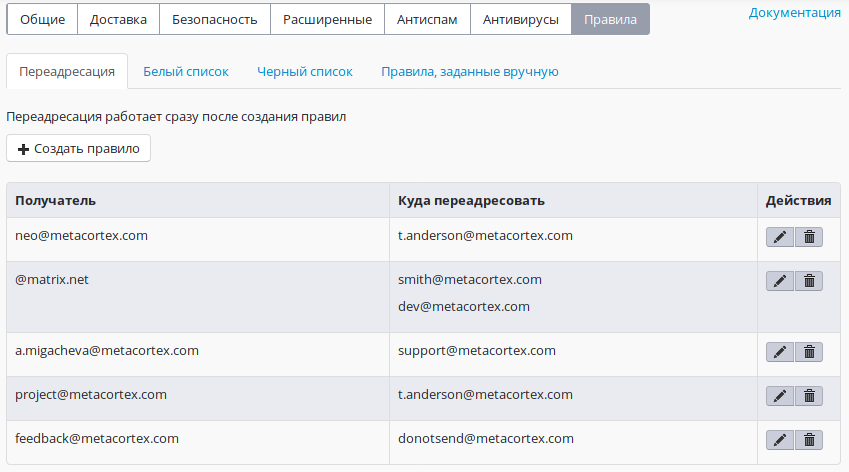

#### Белый список 

Позволяет указывать почтовые домены, IP-адреса почтовых серверов и почтовые ящики, отправления с которых не будут проверяться на спам. Если ящик одновременно указан и в чёрном, и в белом списке, последний имеет наивысший приоритет.

Форма настройки белого списка почтового сервера предоставлена ниже. 

#### Черный список

 Позволяет указывать почтовые домены и ящики, отправления с которых не будут приниматься сервером вовсе.Если ящик одновременно указан и в чёрном, и в белом списке, наивысший приоритет имеет белый список.

Форма настройки чёрного списка почтового сервера предоставлена ниже. 

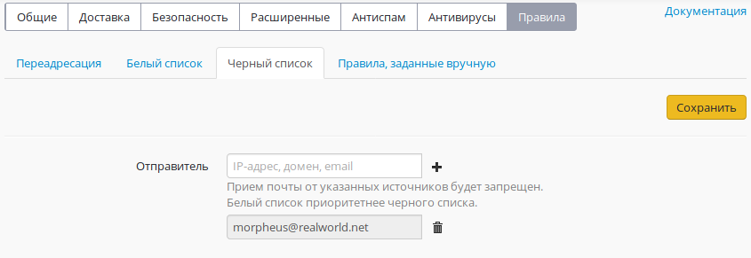

#### Правила, заданные вручную 

Предоставляет интерфейс для указания правил почтового сервера в формате регулярных выражений для Postfix. 

**Регуля́рные выраже́ния** \(англ. _regular expressions, regexp_\) — формальный язык поиска и осуществления манипуляций с подстроками в тексте, основанный на использовании метасимволов. Представляет собой строку-образец \(англ. _pattern_, по-русски её часто называют «шаблоном», «маской»\), состоящую из символов и метасимволов. Строка-образец задаёт правило поиска.

В нашем случае, при помощи регулярных выражений мы находим в письмах интересующие нас слова или символы, после чего разрешаем или запрещаем такую почту. 


В Ideco UTM мы предоставляем интерфейс для написания регулярных выражений с парой простейших примеров. Составление регулярных выражений - это обязанность администратора. 

**Техническая поддержка не консультирует пользователей по этим вопросам.**


С более подробной документацией по модулю указания правил, заданных вручную, вы можете ознакомиться по этой [ссылке](dopolnitelnye_vozmozhnosti_i_antispam.md).

Форма написания правил, заданных вручную для почтового сервера предоставлена ниже.

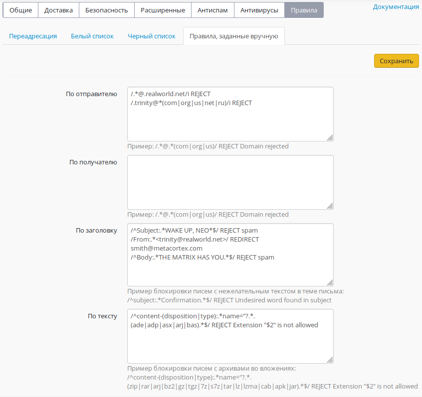

### Проверка настроек почтового сервера

Рекомендуется проверить корректность всех настроек DNS и почтового сервера с помощью сервиса: [mail-tester.com](https://mail-tester.com)

При правильной настройке почтовый сервер на Ideco UTM должен получить 10 баллов из 10.

