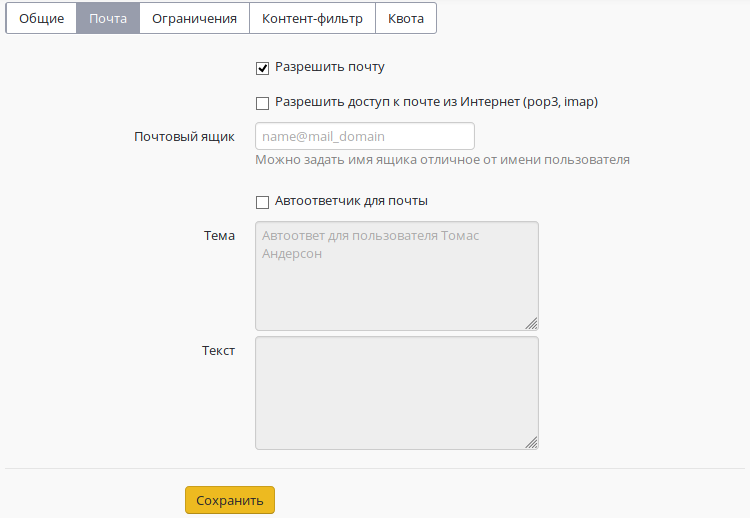
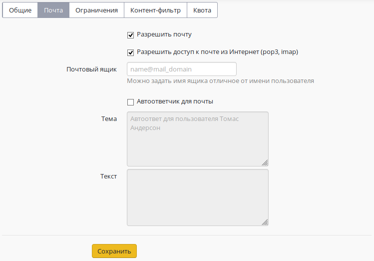
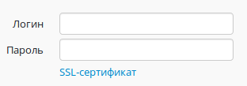
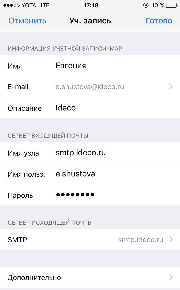
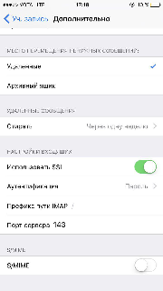

# Настройка почтовых клиентов

## Настройка почтового клиента для работы с сервером

Перед настройкой почтового клиента убедитесь, что у целевого пользователя отмечен чекбокс **Разрешить почту** на вкладке **Почта**:

Настройка почтового клиента при работе из локальной сети и из сети Интернет отличается, поэтому рассмотрим эти случаи отдельно:

### **Настройка почтового клиента при работе из локальной сети**

При подключении почтовым клиентом из локальной сети:

1. Сервер входящей почты работает на 995 TCP порту \(РОР3\) и на 143 TCP порту \(IMAP\) с шифрованием STARTTLS/SSL. 

* В качестве логина прописывается логин от учётной записи пользователя **либо** полностью название почтового ящика, если тот прописан в поле **Почтовый ящик** на вкладке **Почта** у настраиваемого пользователя. 
* В качестве пароля всегда прописывается пароль от учётной записи пользователя \(в том числе для пользователей, импортированных из дерева AD\), задать отдельный пароль на почтовый ящик нельзя. 

2. Сервер исходящей почты работает на 587 порту TCP с шифрованием STARTTLS. Если устройство \(принтер, сканер и т.п.\) не поддерживает шифрование или изменение порта, то возможна отправка почты с авторизацией по 25 TCP порту. Без авторизации возможна отправка почты только из доверенных сетей \(их можно настроить в разделе **Безопасность** почтового сервера\).

### Настройка почтового клиента при работе из сети Интернет 

При подключении почтовым клиентом из сети Интернет: 

1. Убедитесь, что у целевого пользователя в веб-интерфейсе отмечен чекбокс **Доступ к почте из Интернет** на вкладке **Почта:**

2. Сервер входящей почты работает на 995 TCP порту \(POP3S\) и на 143 TCP порту \(IMAP-STARTTLS\), шифрование обязательно.  

* В качестве логина прописывается логин от учётной записи пользователя либо полностью название почтового ящика, если тот прописан в поле **Почтовый ящик** пользователя на вкладке **Почта** у настраиваемого пользователя. 
* В качестве пароля всегда прописывается пароль от учётной записи пользователя, сделать отдельный пароль на почту нельзя. 

3. Сервер исходящей почты работает только с авторизацией и шифрованием. Необходимо обязательно использовать **587** порт для подключения \(а не 25\). Тип шифрования, логин и пароль указываются аналогично серверу входящей почты. 

Для любого почтового клиента, кроме веб-интерфейса почты в составе UTM, установите корневой сертификат сервера UTM, который можно скачать на странице входа в административный веб-интерфейс UTM. Это более правильное решение, которое позволяет избежать проблем с принятием деривативного сертификата для почтовых протоколов каждый раз после смены деривативного сертификата, например, вследствие изменения сетевых настроек сервера. 

Для отображения IMAP-папок снимите галочку **При просмотре дерева в Outlook показывать только подписанные папки** в свойствах IMAP-папок. 

### Настройка почтового клиента iphone 

Перед настройкой ящика надо установить корневой SSL сертификат UTM. Его можно скачать со страницы входа в административный веб-интерфейс UTM \(под формой ввода логина и пароля\). Например, прислав его себе на почту, открыть его на iphone. При открытии файла сертификата - система предложит его добавить. 

Нажать на кнопку **Добавить**. После надо зайти в **Настройки** и далее в раздел **Основные -&gt; Об этом устройств -&gt; Доверие сертификатов**.

Включить **Доверять корневым сертификатам полностью**.

После установки сертификата настройте доступ в почтовый ящик как показано на следующих фрагментах.

### Настройка почтового клиента Thunderbird


Начиная с версии UTM 7.0.0 подключиться из Интернет программой Outlook \(любой версии\) по протоколу POP3 **нельзя**. Outlook не поддерживает тип шифрования STARTTLS для POP3, а поддерживает только устаревшие и небезопасные SSL/TLS, которые в нашем почтовом сервере более не используются. Подключение без шифрования извне также запрещено на нашем почтовом сервере. Тем не менее, остается возможность подключаться по протоколу IMAP с использованием STARTTLS. Для этого выберите тип шифрования **Авто** в Outlook.


