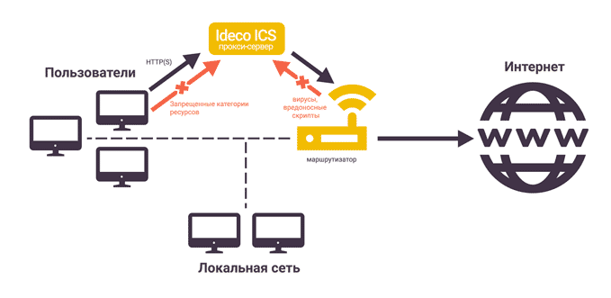

# Прокси

## Прокси-сервер для веб-трафика

Служба прокси в составе Ideco UTM по умолчанию после установки шлюза настроена для **прозрачного проксирования** веб-трафика потребителям в локальной сети предприятия, таким образом на хостах локальной сети не нужно явно указывать настройки прокси. Достаточно указания UTM в качестве шлюза по умолчанию для устройств в сети.  
Признак **«**Игнорировать ошибки модулей проверки и обработки веб-трафика \(ICAP error\)» применяется при наличии в сети сторонних ICAP-служб \(DLP, антивирусы веб-трафика и т.д...\) и во включенном состоянии не разрешает трафик пользователям, если такая служба возвращает в UTM ошибки.

По умолчанию кэширование трафика на диск отключено, но оно осуществляется в оперативной памяти сервера. Включить кэширование веб-трафика на диск вы можете в разделе **Сервисы -&gt; Прокси**, но мы не рекомендуем этого делать по причине излишней нагрузки на дисковую подсистему. Как правило, кэширования в оперативную память достаточно.

  
**Прямые подключения** к прокси-серверу можно настроить, отметив соответствующий чекбокс в **«Сервисы -&gt; Прокси**», указав IP-адрес и порт на стороне UTM. Затем эти реквизиты следует указать на тех сетевых устройствах локальной сети, веб-трафик которых нужно пропускать через прокси.

Настройка фильтрации HTTPS-трафика имеет свои особенности и описана в инструкции [настройка фильтрации HTTPS](../../pravila_dostupa/kontent-filtr/nastroika_filtracii_https.md).  
Ниже предоставлен скриншот вкладки **Общие** раздела **Прокси**.

## Роль прокси-сервера в работе шлюза Ideco UTM

Прокси-сервер, помимо проксирования веб-трафика, играет роль мастер-службы для нескольких сервисов, связанных с обработкой, контролем и учетом веб-трафика пользователей на шлюзе, а именно:

* Антивирус для веб-трафика \(Антивирус Касперского или ClamAV\).
* Сервис отчетности по веб-трафику пользователей.
* Контент-фильтр.

## Прямые подключения к прокси-серверу

Данный режим применяется в случае, когда Ideco UTM не является шлюзом по умолчанию для клиентов сети.

Настройка режима:

* Указать локальный IP-адрес Ideco UTM в качестве веб-прокси в локальной сети на клиентских устройствах. Возможно использование прокси-сервера для всех протоколов.
* В настройках прокси на Ideco UTM должны быть указаны IP-адрес и порт для прямых подключений к прокси \(возможен выбор портов из списка: 3128, 1080, 8000, 8080, 8888, 8081, 8088, 10080\).

В таком режиме UTM сможет предоставлять хостам веб-контент и трафик по другим портам \(по умолчанию по всем, при необходимости можно закрыть порты [файрволом](../../pravila_dostupa/fairvol.md)\), по необходимости производя учет \([квоты](../../pravila_dostupa/polzovatelskie_kvoty.md)\), контроль и проверку веб-трафика на вирусы, контент и вредоносное содержимое при соблюдении следующих условий:


* Наличие доступа в Интернет у сервера Ideco UTM \(его внешний интерфейс должен находится в не пересекающейся с локальной подсетью диапазоне и иметь доступ в сеть Интернет\). 
* Авторизованности хоста-потребителя веб-трафика на сервере UTM по одному из [типов авторизации](../../authorization-types/), поддерживаемом UTM. 
* Явном указании хосту \(в настройках прокси-сервера в браузерах\) адреса веб-прокси. При [Single Sign-On авторизации](../../authorization-types/single-sign-on-authorization.md) через Active Directory необходимо указывать в настройках доменное имя Ideco UTM, а не его IP-адрес.


Если в настройках программы под ОС Windows или Mac OS X нет возможности указать прокси-сервер, то можно воспользоваться сторонним ПО для маршрутизации всего трафика рабочей станции на прокси-сервер.  
Например, такую возможность представляет программа [Proxifier](../../populyarnye_recepty/nastroika_programmy_proxifier_dlya_pryamykh_podklyuchenii_k_proksi-serveru.md).

## Исключения ресурсов из обработки прокси-сервером

На вкладке **Исключения** возможно исключить ресурсы из обработки прокси-сервером и всеми связанными службами \(контент-фильтр, веб-отчетность, антивирусы\).

* По источнику: прокси-сервер исключается из обработки запросов из указанных внутренних сетей или IP-адресов.
* По назначению: прокси-сервер исключается из обработки запросов на внешние сети или IP-адреса \(как правило адреса веб-сайтов или веб-сервисов\).

**Исключить трафик из обработки прокси-сервером нельзя для варианта прямых подключений к прокси-серверу. Исключения нужно делать в настройках прокси-сервера на устройстве \(в веб-браузере или системных настройках прокси-сервера\).**  

