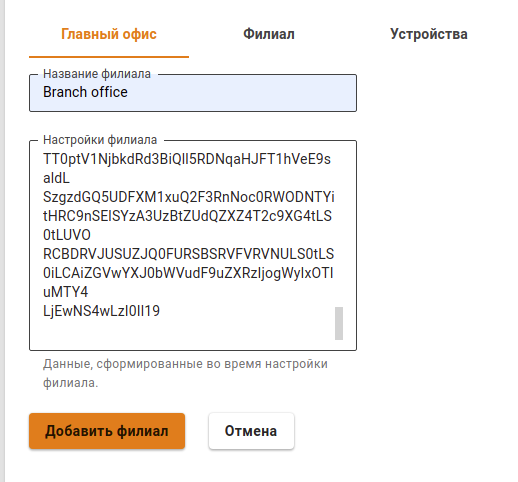
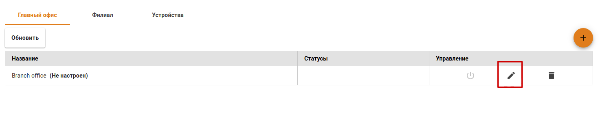
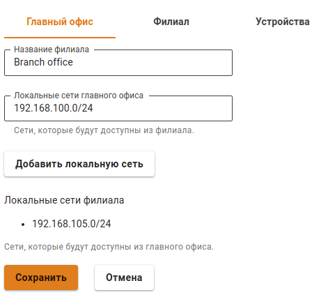
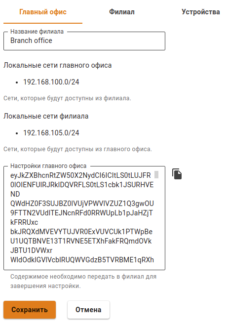
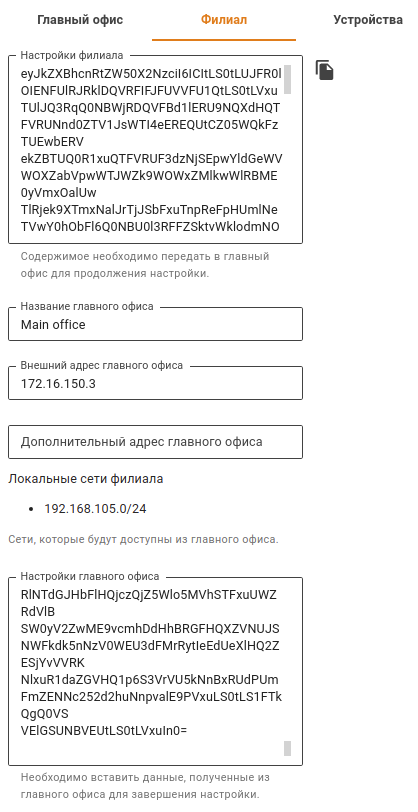
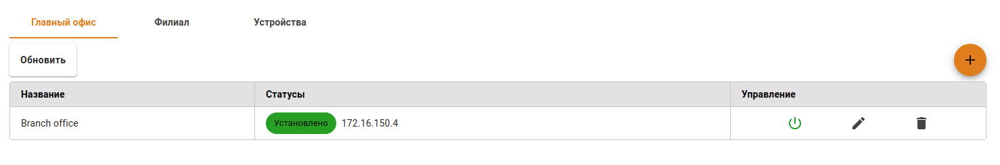

# Филиалы и главный офис

Особенности реализации технологии IPsec в Ideco UTM предполагают две роли использования Ideco UTM:

* **Главный офис** - Ideco UTM должен иметь публичный адрес в сети Интернет и принимать подключения от других Ideco UTM \(Филиалы\), сетевого оборудования или рабочих станций \(Удаленные пользователи\).
* **Филиал** - Ideco UTM, подключающийся к Главному офису и, как правило, не имеющий публичного адреса в сети Интернет. Но если Филиал имеет публичный адрес, то к нему тоже можно подключать любые другие устройства.

## Настройка подключения между Филиалом и Главным офисом

Добавление **Главных офисов** и **Филиалов** производится на одноименных вкладках в разделе **Сервисы -&gt; IPSec**.


* Перед тем как создать подключение между Филиалом и Главным офисом, убедитесь, что в каждой из подключаемых сторон **правильно настроена временная зона**. Без этого установить подключение невозможно.
* Перед настройкой IPsec нужно учесть, что для его работы все IP-подсети, участвующие в соединениях, включая сети Главного офиса и всех Филиалов, не должны пересекаться и, тем более, не должны совпадать.
* Сети локальных интерфейсов Главных офисов и Филиалов, до которых вы хотите дать доступ, должны быть заданы статически.
* Перед настройкой соединения нужно убедиться в том, что один из серверов имеет публичный \(белый\) IP-адрес от интернет-провайдера. Если окажется, что Главный офис не имеет публичного IP-адреса, а Филиал имеет такой адрес, то роли серверов для этого соединения следует поменять местами.


### Шаг 1. Создание подключения в Филиале

Для того чтобы создать подключение на Ideco UTM, который будет выступать в роли Филиала, необходимо в веб-интерфейсе этого UTM выполнить следующие настройки:

1. Откройте раздел **Сервисы -&gt; IPsec -&gt; Филиал** нажмите кнопку  в верхнем правом углу экрана.

2. Заполните следующие поля:

* **Название Главного офиса** - максимальное количество символов - 42.
* **Внешний адрес Главного офиса** - доменное имя или внешний IP-адрес главного офиса, выданный провайдером. Если есть необходимость, то можно ввести **Дополнительный адрес главного офиса**.
* **Локальная сеть Филиала** - IP-адрес подсети Филиала, которая будет доступна пользователям в Главном офисе в формате IP-адрес/маска.

3. После заполнения полей нажмите кнопку **Добавить Главный офис**.

4. Нажмите на иконку редактирования у добавленного Главного офиса. 

5. Скопируйте содержимое поля **Настройки Филиала**. Содержимое нужно будет вставить при настройке Главного офиса, к которому производится подключение \(см. [шаг 2](filialy-i-glavnyi-ofis.md#shag-2-sozdanie-podklyucheniya-v-glavnom-ofise)\).

### Шаг 2. Создание подключения в Главном офисе

Для того чтобы создать подключение на Ideco UTM, который будет выступать в роли Главного офиса, необходимо в веб-интерфейсе этого UTM выполнить следующие настройки:

1. Откройте раздел **Сервисы -&gt; IPsec -&gt; Главный офис** и нажмите кнопку  в верхнем правом углу экрана.

2. Заполните следующие поля:

* **Название Филиала** - максимальное количество символов - 42.
* **Настройки Филиала** - вставьте в это поле настройки, которые вы скопировали из Филиала после выполнения [шага 1](filialy-i-glavnyi-ofis.md#shag-1-sozdanie-podklyucheniya-v-filiale).

3. Нажмите кнопку **Добавить Филиал**.

4. Нажмите на иконку редактирования у добавленного Филиала.

5. Выберите локальные сети Главного офиса и нажмите кнопку **Сохранить**.

6. Еще раз перейдите к редактированию добавленного Филиала и скопируйте содержимое поля **Настройки главного офиса**. Содержимое нужно будет вставить в Филиал \(см. [шаг 3](filialy-i-glavnyi-ofis.md#shag-3-okonchatelnaya-nastroika-filiala)\).

### Шаг 3. Окончательная настройка Филиала

Для того чтобы завершить создание подключения на Ideco UTM, который будет выступать в роли Филиала, необходимо в веб-интерфейсе этого UTM выполнить следующие настройки:

1. Откройте раздел **Сервисы -&gt; IPsec -&gt; Филиал**.

2. Выберите нужный главный офис и нажмите кнопку **Редактировать**.

3. Вставьте в поле **Настройки Главного офиса** текст настроек, полученный из Главного офиса при выполнении [шага 2](filialy-i-glavnyi-ofis.md#shag-2-sozdanie-podklyucheniya-v-glavnom-ofise).

4. Нажмите кнопку **Сохранить**.

5. Откройте раздел **Сервисы -&gt; IPsec -&gt; Филиал** на UTM, выступающем в роли Филиала и раздел **Сервисы -&gt; IPsec -&gt; Главный офис** на UTM, выступающем в роли Главного офиса и убедитесь, что подключение к Главному офису установлено. Должна появиться надпись **Установлено** в зеленой рамке.

## Маршрутизация дополнительных сетей, находящихся за роутером в локальной сети UTM, через IPsec туннель.

Для того чтобы настроить маршрутизацию сетей, находящихся за роутером в локальной сети UTM, необходимо выполнить следующие действия:

1. Создайте на Ideco UTM маршрут в дополнительную сеть через IP роутера \(UTM, роутер и целевой хост будут в одной сети\).
2. Для клиентов, которым нужно предоставить доступ к этой сети по L2TP/IPSec, поставьте галочку нужно **Использовать основной шлюз в удаленной сети** в свойствах VPN-подключения \(**Сеть -&gt; Протокол интернета TCP/IP версии 4 -&gt; Дополнительно**\).
3. Для клиентов, которым нужно предоставить доступ к этой сети по IPSec IKEv2, нужно прописать маршруты в разделе **Пользователи -&gt; Авторизация -&gt; VPN-авторизация**. В поле **Маршруты** укажите сети, до которых нужно предоставить доступ.


* Если Ideco UTM находится за NAT, то для работы с IPsec нужно пробросить 500, 1701 и 4500 порты UDP.
* При установке IPsec туннеля между серверами Ideco UTM \(Филиалом и Главным офисом\) всегда используется 256-битное AES-шифрование, так как оно является распространенным и очень надежным.


