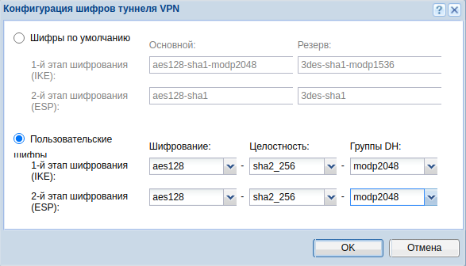
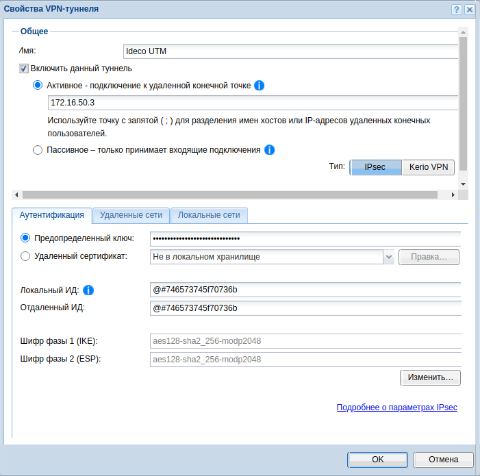

# Подключение-Kerio-Control-к-Ideco-UTM-по-IPSec

По шагам ниже можно объединить сети Kerio Control и Ideco UTM по IPsec с использованием PSK.

> Объединяемые локальные сети не должны пересекаться! {.is-info}

## Настройка Ideco UTM

1. В веб-интерфейсе Ideco UTM откройте вкладку **Сервисы -&gt; IPSec -&gt; Устройства**.
2. Добавьте новое подключение и заполните следующие поля:
   * **Название** – укажите произвольное имя для подключения. Значение не должно быть длиннее 42 символов;
   * **Тип** – выберите **Входящее**;
   * **Тип аутентификации** – выберите тип PSK;
   * **PSK** – укажите PSK-ключ, который будет использоваться для подключения;
   * **Ключ идентификации** – произвольный;
   * **Домашние локальные сети** – выберите локальную сеть Ideco UTM, которая будет видна из подсети Kerio Control;
   * **Удалённые локальные сети** – укажите локальную сеть Kerio Control, которая будет видна из подсети Ideco UTM.
3. Сохраните созданное подключение, затем активируйте подключение, нажав на иконку включения, в столбце **Управление**.
4. На Ideco UTM в папке `/etc/strongswan/autogen/` будут сгенерированы два конфигурационных файла. Необходимо перейти в консоль и открыть на редактирование файл вида `device_<номер>.peer`.
5. Из этого файла необходимо скопировать значение строки **rightid** \(примерный вид – `@#746573745f70736b`\). В дальнейшем это значение потребуется прописать на Kerio Control.
6. Настройка завершена, теперь переходим к настройке Kerio Control.

## Настройка Kerio Control

1. По умолчанию, Kerio Control использует IKEv1 для создания подключений к сторонним устройствам. Включить IKEv2 можно через консоль. Для этого необходимо выполнить следующие действия:

    1.1. Подключитесть к Kerio Control по SSH;

    1.2. Перейдите в папку `/var/winroute`;

    1.3. Откройте на редактирование файл `winroute.cfg`;

    1.4. В нём найдите раздел, начинающийся с текста `<table name="Firewall">`;

    1.5. В этом разделе найти строку `<variable name="IKEVersion">ikev1</variable>` и изменить в ней `ikev1` на `ikev2`;

    1.6. После этого желательно перезагрузить сервер и убедиться, что изменения в настройках сохранились.

2. В разделе **Правила трафика** необходимо разрешить трафик VPN-служб.
3. Далее перейти в раздел **Интерфейсы** и нажать на **Добавить**. В раскрывшемся списке выбрать **VPN-туннель...**. 
4. Откроется окно создания подключения. В нём выбрать:
   * **Тип** – IPsec;
   * **Имя** – произвольное;
   * Активировать **Включить данный туннель**;
   * Выбрать тип **Активное** и в поле под ним прописать IP-адрес внешнего интерфейса Ideco UTM, который будет использоваться для подключения;
   * Выбрать **Предопределённый ключ** и ввести PSK-ключ, который будет использоваться для подключения;
   * Локальный и внешний ИД: в оба поля нужно вставить значение строки `rightid`, которое копировали в шаге 5 настройки Ideco UTM;
   * Под заданием шифров нажать на **Изменить**. Задать шифры как на скриншоте:

     

   * Пример итоговых настроек на скриншоте ниже:

     

   * Перейти в раздел **Удалённые сети**, нажать на **Добавить** и ввести сведения о локальной сети Ideco UTM, которая будет видна из подсети Kerio Control;
   * Затем в разделе **Локальные сети** либо нажать на **Использовать автоматически определённые локальные сети**, либо настроить сети, которые будут видны из подсети Ideco UTM вручную, как на предыдущем шаге.
5. Настройка завершена. После добавление нового интерфейса нужно нажать на **Применить**. После чего подключение должно успешно установиться, информация об этом отображается в таблице:

   

> В случае возникновения проблем в первую очередь обратите внимание на настройки файрвола Kerio Control. {.is-info}

