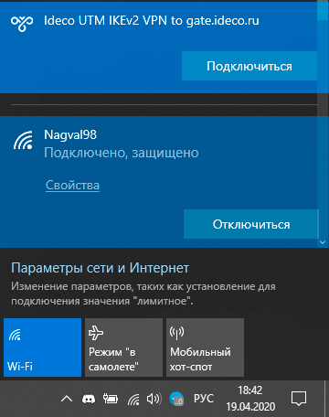

# Инструкция-по-запуску-PowerShell-скриптов

Используйте загруженные с вашего сервера готовые скрипты для создания VPN-подключения в ОС Windows версий 8.1 и 10.

Если вы используете Windows 7, необходимо создать подключение \[вручную\]\(/Настройка/Сервисы/Туннельные-протоколы-VPN/Подключение-пользователей-\(client-to-site\)/Инструкция-по-созданию-подключения-в-Windows-7\).

## Какой протокол VPN выбрать?

При нескольких вариантах возможных подключений по VPN выбирайте протоколы по следующим критериям: 1. **IKEv2/IPSec** - самый лучший в плане производительности и надежности подключения протокол. 1. **SSTP** - протокол основанный на TCP и SSL. Выберите его, если подключение по IKEv2 не проходит через вашего провайдера. 1. **L2TP/IPSec** - надежный в плане шифрования, но не самый оптимальный в плане скорости и производительности протокол. 1. **PPTP** - устаревший протокол, используйте его только в случае крайней необходимости и не работоспособности других протоколов на вашей ОС.

## Как запустить PowerShell скрипт?

1. Скачайте скрипт, кликнув по ссылке на него в личном кабинете.

   

2. Щелкните правой кнопкой мыши по скаченному файлу и в контекстном меню выберите **Свойства**.

   

3. Поставьте галочку **Разблокировать** справа в нижнем углу свойств файла \(по умолчанию ОС блокирует выполнение скаченных из интернета файлов\).

   

4. Снова нажмите правой кнопкой мыши на файл и выберите **Выполнить в PowerShell** в контекстном меню.

   

   При появлении ошибки «Выполнение сценариев отключено в этой системе», нужно включить выполнение сценариев, выполнив команду в PowerShell \(вызовите его через меню «Пуск»\): `Set-ExecutionPolicy Unrestricted`.

5. Ответьте **Да** на вопрос о внесении изменений в ваш компьютер.
6. Подключение создано. Нажмите **Подключиться** в списке ваших сетей.

   

## Что делать, если запустить скрипт не получается?

Возможно вам не хватает прав на запуск скриптов или PowerShell не установлен в системе.

Воспользуйтесь инструкцией для создания подключения в Windows 8-ой и 10-ой версии в \[данной статье\]\(/Настройка/Сервисы/Туннельные-протоколы-VPN/Подключение-пользователей-\(client-to-site\)/IPSec-IKEv2\).

