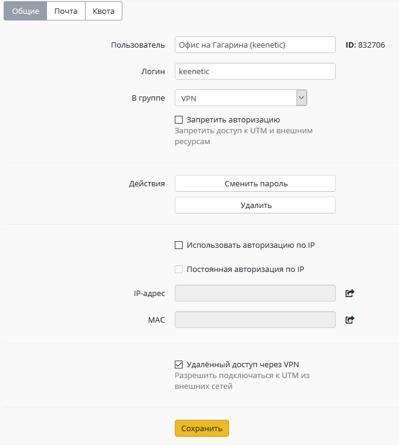
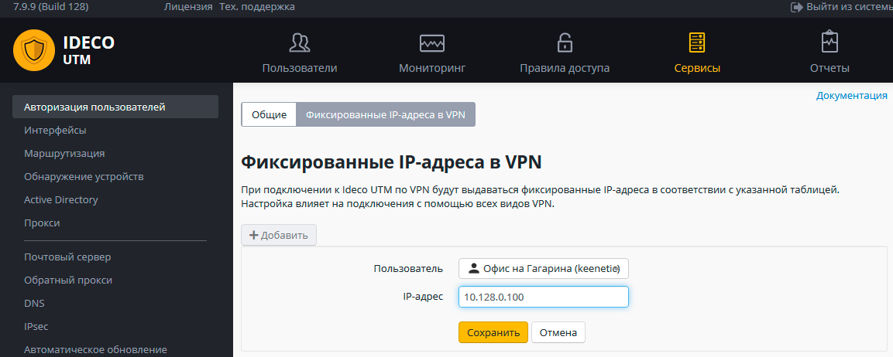
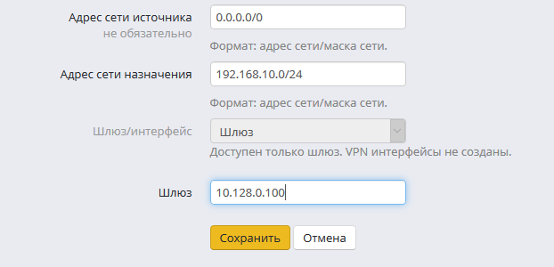

# Подключение Keenetic по SSTP

Вы можете подключить роутеры с поддержкой протокола SSTP в режиме site-to-site VPN \(если доступ из центрального офиса в сеть за Keenetic не нужен, то воспользуйтесь [инструкцией](https://github.com/ideco-team/docsUTM/tree/54be5c28981601375569bdca6ef75ead87808b16/Подключение_Wi-Fi_роутеров_Keenetic/README.md) по cline-to-site подключению\).

## Настройка Ideco UTM

1. Включите и настройте порт и домен для SSTP в разделе "Сервисы" -&gt;

   "Авторизация пользователей".

2. В разделе "Пользователи" создайте специального пользователя, для

   удаленного роутера.  

   Установите флажок "Удаленный доступ через VPN".  

   Логин/пароль пользователя будут использоваться на роутере, сохраните

   или запишите их.  

   

3. Создайте фиксированную привязку выдаваемого по VPN IP-адреса для

   данного пользователя \(она нужна будет для работы маршрутов\).  

   В разделе "Сервисы" -&gt; "Авторизация пользователей" -&gt;

   "Фиксированные IP-адреса в VPN"  

   

4. Пропишите маршруты в удаленную сеть.  

   Например, если сеть за роутером 192.168.10.0/24, а фиксированный

   IP-адрес роутера в VPN 10.128.0.100, необходимо добавить следующий

   маршрут в раздел "Сервисы" -&gt; "Маршрутизация":  

     

   В адресе сети источника оставьте 0.0.0.0/0 \(все сети\).

## Настройка роутера Keenetic

Настройте VPN-подключение роутера Keenetic по [инструкции](https://github.com/ideco-team/docsUTM/tree/54be5c28981601375569bdca6ef75ead87808b16/Подключение_Wi-Fi_роутеров_Keenetic/README.md) для client-to-site подключений.

Не забудьте выполнить все три пункта:

1. Настроить VPN-подключение.
2. Настроить маршруты.
3. Настроить DNS для резолвинга локального домена \(если используете

   Active Directory\).

## Проверка и возможные проблемы

Для проверки связи используйте утилиты ping и traceroute.

В случае, если VPN-соединение установлено, но нет доступа до ресурсов одной локальной сети из другой, воспользуйтесь инструкциями из [статьи](https://github.com/ideco-team/docsUTM/tree/54be5c28981601375569bdca6ef75ead87808b16/Особенности_маршрутизации_и_организации_доступа/README.md) по поиску возможных проблем.

Чаще всего доступ блокируется в Windows из-за настроек сетевых профилей.

Вы можете разрешить доступ до "не локальных" сетей во всех профилях выполнив команду в PowerShell \(запущенного с повышением прав до администратора\):

 \` Enable-NetFirewallRule -Group \`\`"@FirewallAPI.dll,-28502"\`

 \#\# Attachments:

 !\[\]\(images/icons/bullet\_blue.gif\) \[keenetic user.PNG\]\(attachments/16842871/16842873.png\) \(image/png\) !\[\]\(images/icons/bullet\_blue.gif\) \[фиксированные привязки.PNG\]\(attachments/16842871/16842874.png\) \(image/png\) !\[\]\(images/icons/bullet\_blue.gif\) \[маршрут.PNG\]\(attachments/16842871/16842877.png\) \(image/png\)

