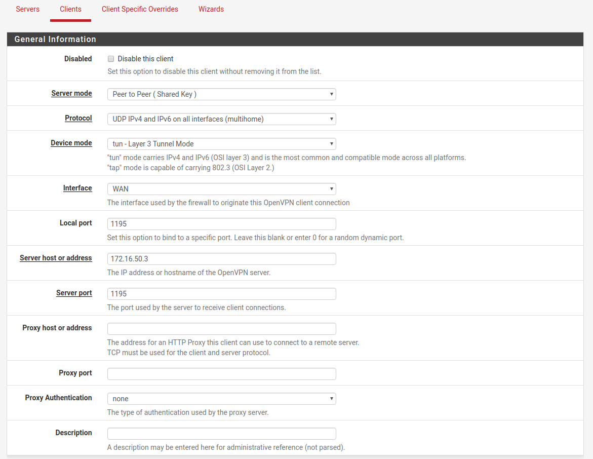
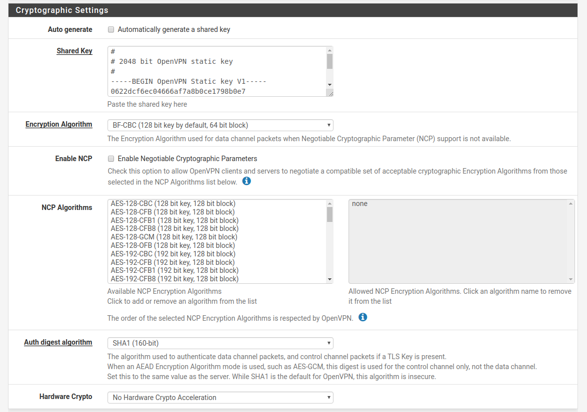
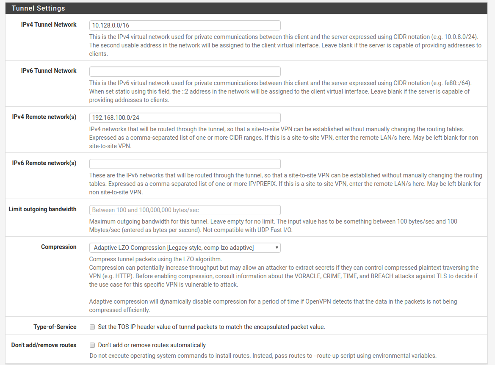
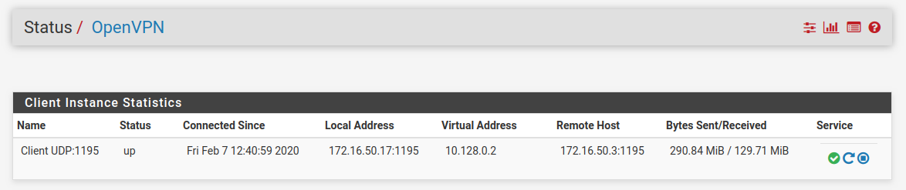

# Подключение pfSense к Ideco UTM с использованием OpenVPN

По шагам ниже можно настроить peer-to-peer туннель между pfSense и Ideco UTM с использованием OpenVPN.

 Объединяемые локальные сети не должны пересекаться\!

&lt;/div&gt;

## Создание подключения на Ideco UTM

1. В веб-интерфейсе Ideco UTM откройте вкладку \*\*Сервисы

   – Интерфейсы **и нажмите на кнопку** "Добавить"\*\*

2. В поле **"Тип"** выберите **OpenVPN**
3. Заполните поля:
   * Название интерфейса – л_юбое_
   * Внешний IP-адрес этого филиала – \*IP-адрес внешнего интерфейса

     Ideco UTM\*

   * Порт на стороне интерфейса – п\*о умолчанию 1194, можно указать

     любой другой свободный\*

   * Удалённая локальная сеть – \*здесь укажите адрес локальной

     подсети pfSense с маской \(например, 192.168.105.0/24\)\*

   * Удалённый внешний IP-адрес – \*IP-адрес внешнего интерфейса

     pfSense\*

   * Удалённый порт – \*порт, который будет использован на pfSense при

     создании там OpenVPN-подключения\*
4. Сгенерируйте ключ OpenVPN и скопируйте его для дальнейшей отправки

   на pfSense

5. Нажмите на **"Сохранить"**, а затем на **"Применить конфигурацию"**
6. Дождитесь окончания перезагрузки сервера

## Создание подключения на pfSense

На стороне pfSense необходимо установить клиентское OpenVPN-подключение к серверу Ideco UTM.

В веб-интерфейсе pfSense перейдите на вкладку VPN – OpenVPN – Clients и нажмите на "Add", откроется форма добавления нового подключения.

Заполните поля в разделе General Information:

* Server mode – _Peer to Peer \( Shared Key \)_
* Protocol – _UDP IPv4 and IPv6 on all interfaces \(multihome\)_
* Device mode – _tun - Layer 3 Tunnel Mode_
* Interface – _WAN_
* Local port – \*номер порта, который указали при создании подключения

  на Ideco UTM в поле "Удалённый порт"\*

* Server host or address – _IP-адрес внешнего интерфейса Ideco UTM_
* Server port – \*номер порта, который указали при создании подключения

  на Ideco UTM в поле "Порт на стороне интерфейса"\*

Остальные поля можно оставить пустыми. Ниже приведён скриншот с примером настроек.

Перейдите в раздел **Cryptographic Settings**. Здесь необходимо снять флажок с **Auto generate** и **Enable NCP**, а затем вставить сгенерированный на Ideco UTM ключ OpenVPN в появившееся поле **Shared Key**.

Далее выберите алгоритмы шифрования:

* Encryption Algorithm – \*BF-CBC \(128 bit key by default, 64 bit

  block\)\*

* Auth digest algorithm – _SHA1 \(160 bit\)_

 На текущий момент установить связь возможно только с использованием указанных здесь алгоритмов.

&lt;/div&gt;

Пример настроек данного раздела на скриншоте.

Осталось настроить раздел **Tunnel Settings**. Заполняем в нём поля следующим образом:

* IPv4 Tunnel Network – \*здесь нужно указать ту сеть, которая на Ideco

  UTM выделена для VPN-подключений \(посмотреть можно, перейдя в

  веб-интерфейсе Ideco UTM на вкладку Сервисы – Авторизация

  пользователей\)\*

* IPv4 Remote network\(s\) – \*адрес локальной подсети Ideco UTM с маской

  \(например, 192.168.100.0/24\)\*

* Compression – \*Adaptive LZO Compression \[Legasy style, comp-lzo

  adaptive\]\*

После завершения подключения, клиент pfSense, подключающийся к OpenVPN-серверу Ideco UTM, получит второй адрес из подсети для VPN-подключений \(например, 10.128.0.2 из подсети 10.128.0.0/16\).

 Если в вашей сети такой адрес уже используется, как фиксированный для подключения какого-либо пользователя по VPN, либо вы хотите подключить несколько устройств, то нужно сменить туннельный IP на pfSense на любой свободный. Для этого в разделе \*\*Advanced Configuration\*\* нужно прописать: \`ifconfig 10.128.0.3 10.128.0.1\` Здесь 10.128.0.3 – новый адрес для pfSense, а 10.128.0.1 – адрес OpenVPN-сервера Ideco UTM \(первый адрес в выделенной подсети\).

&lt;/div&gt;

Пример итоговых настроек:

На этом настройка подключения завершена. Нажмите на **"Save"**, а затем перейдите на вкладку **Status – OpenVPN**. Если подключение прошло успешно, то соединение будет выглядеть так:

 Помните, что файрвол в pfSense по умолчанию запрещает весь трафик. Поэтому после создания подключения добавьте в него правило, разрешающее подключение на порт, выбранный для OpenVPN.

&lt;/div&gt;

Теперь устройства из локальной сети Ideco UTM будут иметь доступ до локальной сети pfSense и наоборот. Таким способом можно подключить к Ideco UTM несколько устройств, однако необходимо:

* для каждого нового подключения указывать отдельный порт
* на каждом новом устройстве pfSense прописывать свой туннельный IP из

  выделенной подсети

 \#\# Attachments:

 !\[\]\(images/icons/bullet\_blue.gif\) \[gen\\_info.png\]\(attachments/15564806/15564802.png\) \(image/png\) !\[\]\(images/icons/bullet\_blue.gif\) \[cry\\_set.png\]\(attachments/15564806/15564803.png\) \(image/png\) !\[\]\(images/icons/bullet\_blue.gif\) \[tun\\_set.png\]\(attachments/15564806/15564804.png\) \(image/png\) !\[\]\(images/icons/bullet\_blue.gif\) \[status.png\]\(attachments/15564806/15564805.png\) \(image/png\)

