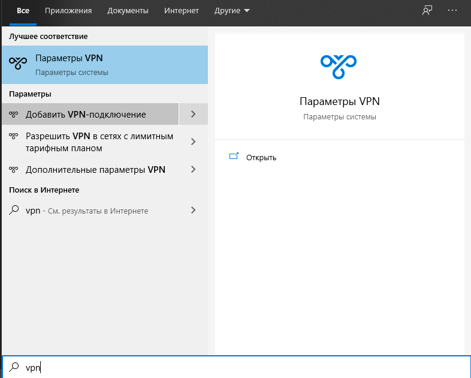
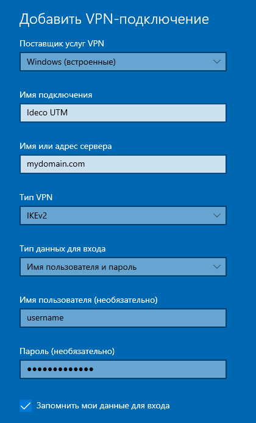

# IPSec IKEv2

Доступно начиная с версии Ideco UTM 7.9.9 build 155.

## Настройка Ideco UTM

1. Для включения авторизации по SSTP установите соответствующий флажок

   в веб-интерфейсе в разделе \*\*Сервисы - Авторизация пользователей -

   Общие - Авторизация IKEv2/IPSec.\*\*

2. При необходимости настройте передачу маршрутов клиентам до ваших

   локальных сетей.  

   

3. Подключение возможно только по DNS-имени, поэтому IP-адрес внешнего

   интерфейса Ideco UTM должен резолвится в одно из имен вашей внешней

   доменной зоны.  

   Поэтому на этом шаге в поле "Домен" необходимо указать данное

   DNS-имя \(используйте реальное имя с правильной А-записью, т.к.

   оно необходимо для выписки сертификата Let’s Encrypt\).

4. У пользователей, которым необходимо подключаться из вне по VPN

   установите флажок "Удалённый доступ через VPN" в дереве

   пользователей.  

   Указанный там логин и пароль будут использоваться для подключения.

## Настройка VPN-подключения в Windows

Для создания VPN вы можете использовать [скрипт](https://github.com/ideco-team/docsUTM/tree/54be5c28981601375569bdca6ef75ead87808b16/Скрипт_автоматического_создания_пользовательских_подключений_по_IPSec_IKEv2/README.md). Либо создать его вручную.

1. В меню "Пуск" введите с клавиатуры "vpn" и в появившихся программах выберите "Добавить VPN-подключение" 
2. В появившемся окне параметров VPN-подключений нажмите "Добавить VPN-подключение" 
3. В появившемся окне добавления подключений выберите соответствующие параметры:  Поставщик услуг VPN: Windows \(встроенные\) Имя или адрес сервера: укажите ваш домен \(указанный в настройках IKEv2 в Ideco UTM и резолвящийся в IP-адрес внешнего интерфейса Ideco UTM\) Тип VPN: IKEv2 Тип данных для входа: имя пользователя и пароль Имя пользователя и пароль.

На некоторых установках Windows может потребоваться изменение реестра \(в случае получения ошибки 619 при подключении по VPN\). Выполните команду:

```text
reg add HKLM\System\CurrentControlSet\Services\Rasman\Parameters /v NegotiateDH2048_AES256 /t REG_DWORD /d 1 /f
```

## Настройка VPN-подключения в Android

Скачайте приложение [StrongSwan](https://play.google.com/store/apps/details?id=org.strongswan.android) для подключения.

В нем добавьте новое подключение с доменом и вашими реквизитами доступа.

 \#\# Attachments:

 !\[\]\(images/icons/bullet\_blue.gif\) \[vpn.png\]\(attachments/16842894/17072157.png\) \(image/png\) !\[\]\(images/icons/bullet\_blue.gif\) \[параметры.PNG\]\(attachments/16842894/17072158.png\) \(image/png\) !\[\]\(images/icons/bullet\_blue.gif\) \[добавить vpn.PNG\]\(attachments/16842894/17072159.png\) \(image/png\) !\[\]\(images/icons/bullet\_blue.gif\) \[photo\\_2020-05-20\\_13-31-36.jpg\]\(attachments/16842894/17072225.jpg\) \(image/jpeg\)

