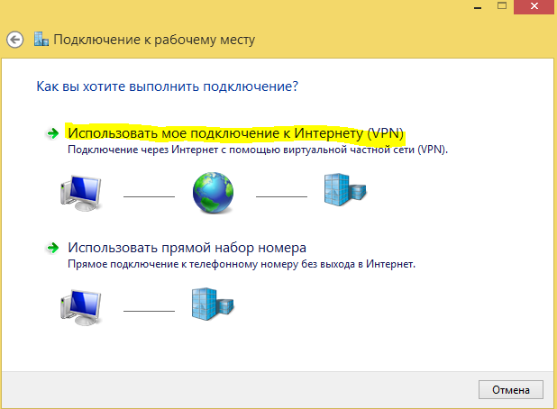
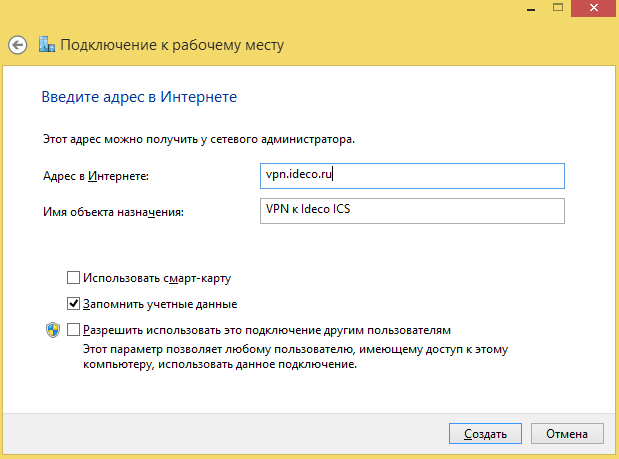
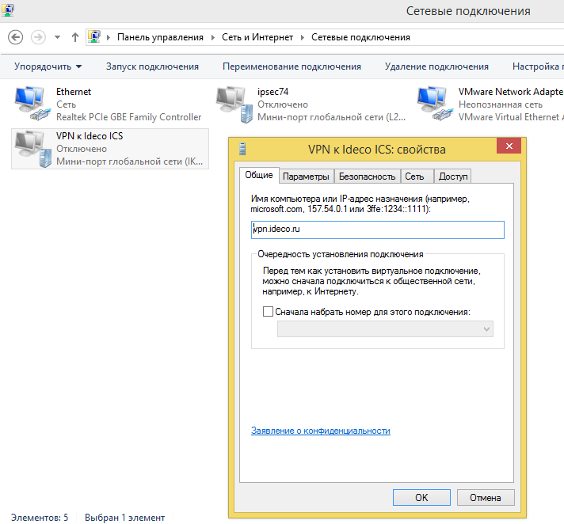

# L2TP/IPSec

## Настройка глобальных параметров Ideco UTM

В разделе **Сервисы -&gt; IPsec -&gt; Пользователи** поставьте галочку возле пункта **Разрешить подключения пользователей** и укажите секретную фразу \(PSK ключ\).

## Настройка аккаунта для подключения по VPN

Разрешите пользователю подключения по VPN из сети интернет, включив в настройках пользователя следующий флажок: **Пользователи -&gt; Нужный пользователь -&gt; вкладка Общие -&gt; Удалённый доступ через VPN.**

## Общие настойки подключающегося устройства

При настройке подключения по VPN из сети Интернет, в свойствах VPN-подключения нужно указывать:

* Тип VPN - L2TP/IPsec.
* внешний адрес Ideco UTM в качестве VPN-сервера.
* логин и пароль созданного пользователя.
* PSK \(pre-shared key\) - ключ, указанный на странице Сервер - IPsec

  пользователи.

* Включить шифрование соединения.

После подключения вы будете авторизованы на сервере Ideco UTM от имени созданного пользователя и вам будут доступны сетевые хосты в локальной сети предприятия.


Если вы не хотите чтобы после подключения по VPN интернет-трафик до внешних ресурсов ходил через Ideco UTM, то свойствах VPN-подключения Сеть/Протокол интернета TCP/IP версии 4/Дополнительно уберите галочку Использовать основной шлюз в удаленной сети. Далее чтобы получить доступ к компьютерам за Ideco UTM, вручную пропишите маршруты.


### Настройка подключения к серверу в Windows 7, 8, 10.

Вы можете создать [скрипт для подключения пользователей](skript_avtomaticheskogo_sozdaniya_polzovatelskikh_podklyuchenii_po_l2tp_ipsec.md), тогда достаточно будет запустить полученный файл - все настройки будут создаваться автоматически.

1. ****Перейдите в **Центр управления сетями и общим доступом -&gt; Создание и настройка нового подключения или сети**.  
2. Выберите **Подключение к рабочему месту**.

3. Использовать мое подключение к Интернету \(VPN\).  

4. Введите адрес сервера \(доменное имя или внешний IP-адрес Ideco UTM\) и название подключения.  

5. Перейдите к **Свойствам** данного подключения.  

6. На вкладке **Безопасность** установите следующие параметры:  

7. Нажмите кнопку **Дополнительные параметры**, и введите общий ключ \(PSK-ключ\).  

### Возможные неполадки

* Неправильно указан логин или пароль пользователя. Когда такое происходит то часто при повторном соединении предлагается указать домен. Старайтесь создавать цифро-буквенные пароли, желательно на латинице для ваших учетных записей. Если есть сомнения в этом пункте, то временно установите логин и пароль пользователю "user" и "123456" соответственно.
* Если подключение осуществляется с Windows, то для того, чтобы пакеты пошли через него надо убедиться, что в настройках этого подключения стоит чекбокс: **Свойства подключения VPN -&gt; Вкладка Сеть -&gt; Свойства опции Протокол Интернета версии 4 \(TCP/IPv4\) -&gt;**

  **Дополнительно -&gt; Использовать основной шлюз в удалённой сети**.

  Если же маршрутизировать все пакеты в этот интерфейс не обязательно, то маршрут надо писать вручную.

* Подключение происходит через DNAT, т.е. внешний интерфейс Ideco UTM не имеет "белого" IP-адреса, а необходимые для работы порты \(500 и 4500\) "проброшены" на внешний интерфейс устройства, расположенного перед Ideco UTM и имеющего "белый" IP-адрес. В данном случае VPN-подключение либо вообще не будет устанавливаться, либо будут периодические обрывы. Решение только одно - исключить устройство перед Ideco UTM и указать на внешнем интерфейсе Ideco UTM "белый" IP-адрес, к которому в итоге и будут осуществляться L2TP/IPsec-подключения. Либо используйте протокол [SSTP](../sstp/), его проще опубликовать с помощью проброса портов.


Убедитесь, что локальная сеть \(или адрес на сетевой карте\) на удалённой машине не пересекается с локальной сетью вашей организации, если пересекается, то доступа к сети вашей организации не будет \(трафик по таблице маршрутизации пойдёт в физический интерфейс, а не в VPN\). **Адресацию надо менять**.


## Если VPN-соединение установлено, но не получается получить доступ к ресурсам локальной сети

Выполните рекомендации специальной статьи: [особенности маршрутизации и организации доступа](../osobennosti_marshrutizacii_i_organizacii_dostupa.md).

