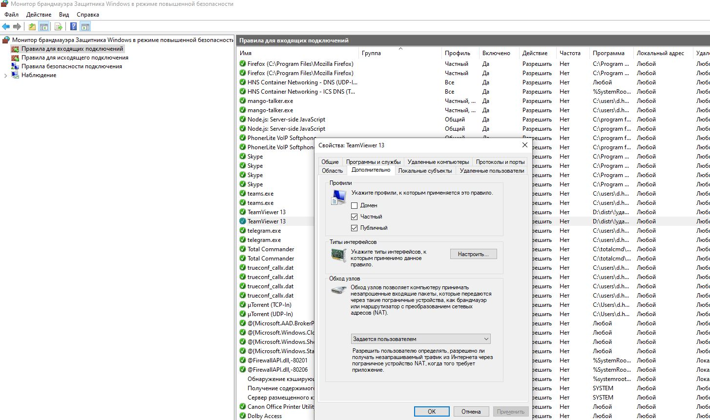
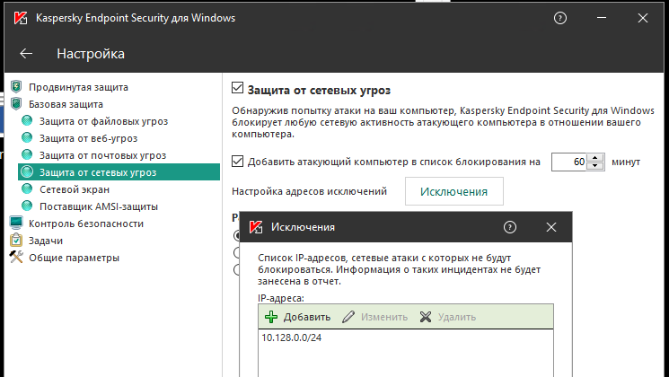

# Особенности маршрутизации и организации доступа

## Если по VPN необходим доступ только к ресурсам локальной сети

В случае, если в Интернет необходимо выходить напрямую через своего провайдера, а через VPN получать доступ только к ресурсам корпоративной сети, на компьютерах, подключающихся по VPN необходимо выполнить следующие настройки.

* В свойствах VPN-подключения убрать флажок "Использовать основной шлюз в удаленной сети". Вкладка Сеть - IP версии 4 - Дополнительно - Параметры IP.
* Прописать маршрут до корпоративной сети \(**в Windows 7, 8, 8.1, 10 автоматически будут создан маршрут основанный на классе, в зависимости от адреса, который подключение получит по VPN. Например, маршрут будет добавлен для сети 10.0.0.0/8, если по VPN сервер получит адрес из сети 10.128.0.0/16**\). Для [IKEv2](https://github.com/ideco-team/docsUTM/tree/54be5c28981601375569bdca6ef75ead87808b16/IPSec_IKEv2/README.md) вы можете настроить автоматическое получение маршрута. Пример маршрута, если корпоративная сеть 172.16.0.0/16, а cеть для VPN-подключений настроенная на Ideco UTM 10.128.0.0/16 \(и из этой же сети выдается IP-адрес VPN-подключению\), то маршрут будет таким: route -p add 172.16.0.0 mask 255.255.0.0 10.128.0.1
* В некоторых случаях маршрут может не работать, тогда есть пинг до защищённого интерфейса \(10.128.0.1\), но нет пинга до хостов в локальной сети. В этом случае при создании маршрута нужно указать номер интерфейса VPN-подключения. Итоговый маршрут будет таким:  
  route -p add 172.16.0.0 mask 255.255.0.0 10.128.0.1 if nn

  где, nn-номер интерфейса VPN-подключения, посмотреть который можно при активном VPN-подключении в выводе в консоли команды `route print` раздел "Список интерфейсов".

## Если не удается получить доступ к компьютерам в локальной сети Ideco UTM

* Убедитесь, что локальная сеть \(или адрес на сетевой карте\) на

  удалённой машине не пересекается с локальной сетью вашей

  организации, если пересекается, то доступа к сети вашей

  организации не будет \(трафик по таблице маршрутизации пойдёт

  в физический интерфейс, а не в VPN\). **Адресацию надо менять.**

* На компьютерах локальной сети в качестве основного шлюза должен быть

  прописан Ideco UTM. Если это не так, то необходимо прописать

  соответствующий маршрут вручную на устройствах, чтобы

  сетевые пакеты шли на Ideco UTM для VPN-сети.  

  Например: route -p add 10.128.0.0 mask 255.255.0.0 10.1.1.1  

  где: 10.128.0.0/16 - адрес VPN-сети Ideco UTM \(настраивается в

  Сервисы - Авторизация пользователей\), а 10.1.1.1 - IP-адрес

  локального интерфейса Ideco UTM.

* Отключите RP-FILTER: _\*_Сервисы -&gt; Дополнительно -&gt; Проверка

  обратного пути \(RP\_FILTER\)_\*_

* Проверьте настройки файрвола \(таблица FORWARD\) на Ideco UTM на

  предмет запрещающих правил.

* Компьютеры и серверы на ОС Windows могут ограничивать доступ к сетевым папкам с помощью правил настроек профилей сети \(причем как на стороне подключающегося по VPN компьютера, так и на стороне компьютеров и серверов локальной сети\):

  **Включите доступ к файлам и принтерам для профиля "Все сети" и "Частных сетей"**    
  Вы можете сделать это с помощью PowerShell \(запущенного с повышением прав до администратора\), выполнив команду_\*\*_

   \` Enable-NetFirewallRule -Group \`\`"@FirewallAPI.dll,-28502"\`

* Брандмауэр Защитника Windows может блокировать доступ определенных

  программ или сервисов \(включая RDP\) до внешних сетей.  

  Проверьте это в настройках входящих и исходящих подключений

  \(необходимо разрешить доступ из частых и локальных сетей\):  

  

* Антивирусное ПО на компьютере может блокировать доступ к нему из не

  локальных сетей. Либо блокировать доступ конкретных программ  

  Например для Kaspersky Endpoint Security нужно добавить сеть для

  VPN-подключений \(по-умолчанию 10.128.0.0/16\) в исключения:  

  

 \#\# Attachments:

 !\[\]\(images/icons/bullet\_blue.gif\) \[защитник.JPG\]\(attachments/16842788/16842794.jpg\) \(image/jpeg\) !\[\]\(images/icons/bullet\_blue.gif\) \[защитник.JPG\]\(attachments/16842788/16842793.jpg\) \(image/jpeg\) !\[\]\(images/icons/bullet\_blue.gif\) \[KES.jpg\]\(attachments/16842788/16842796.jpg\) \(image/jpeg\)

