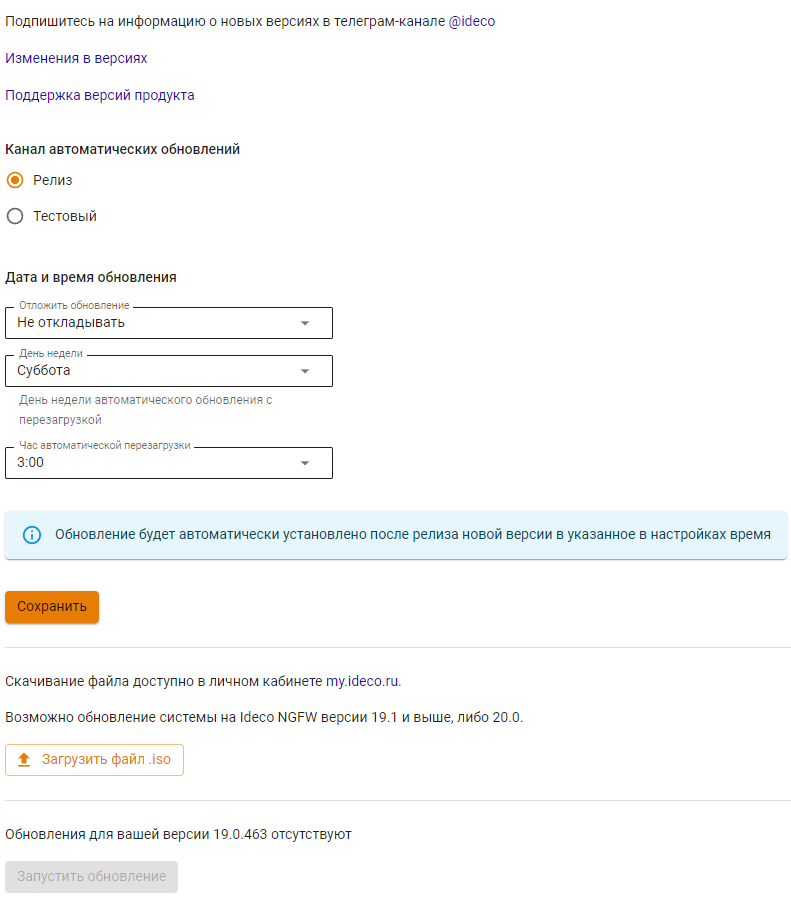
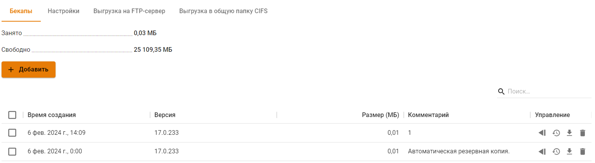
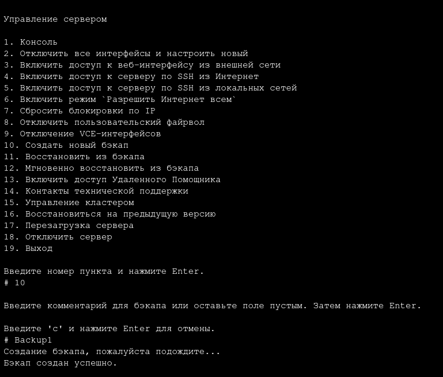
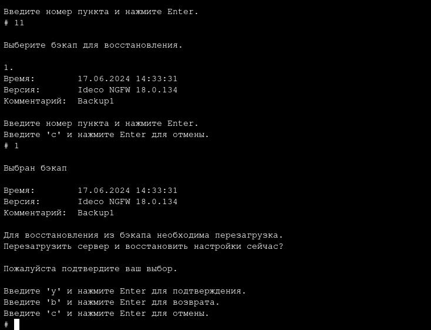

# Управление сервером

## Администраторы

В Ideco Center можно создать несколько администраторов с разными ролями:

* **Администратор** - администратор с этой ролью имеет доступ ко всем функциональностям Ideco Center;
* **Только просмотр** - администратор с этой ролью не имеет возможности управлять правилами в Ideco Center (создавать, менять приоритет и др.).


Удалять подключенный Ideco NGFW из Ideco Center могут только администраторы с ролью **Администратор**.


Войти в подключенный Ideco NGFW с логином и паролем администратора Ideco Center **невозможно**.

## Обновления


Название службы раздела **Обновления**: `ideco-sysupdate-backend`.



Для отключения автоматического обновления Ideco Сenter в строке **Отложить обновление** выберите **Навсегда**.


## Система

Обновить систему Ideco Center можно как в офлайн-режиме, так и по сети. Отрегулировать режим обновления можно в разделе **Управление сервером -> Лицензия**.

В режиме **Автоматического обновления** доступны следующие настройки:

* **Канал обновлений** - выберите **Релиз** или **Тестовый**. Канал **Релиз** позволяет обновляться на стабильно работающие версии. Канал **Тестовый** позволяет быстрее обновляться как на релизные версии, так и на последние бета-версии продукта во время коротких периодов бета-тестирования новых мажорных версий. По умолчанию выбран пункт **Релиз**;
* **Отложить обновления** - время, на которое будет отложено обновление (максимальный срок 6 месяцев с даты релиза последней версии, до которой доступно обновление);
* **День недели** - день недели запуска автоматического обновления;
* **Час автоматической перезагрузки** - позволяет выбрать час запуска автоматического обновления;
* **Запустить обновление** - запускает механизм принудительного обновления. Если кнопка неактивна, обновления отсутствуют.

В режиме **Ручной загрузки** обновлений необходимо скачать ISO-образ новой версии Ideco Center в личном кабинете MY.IDECO и загрузить его с внешнего носителя:


Кнопка принудительного обновления активна, когда обновление уже скачано, и только применяет его, инициировать скачивание нельзя.

После принудительного обновления потребуется полная перезагрузка сервера.


После проведения процедуры обновления новая версия будет отображаться в верхнем левом углу локальной консоли и веб-интерфейса администратора.

### Восстановление на предыдущую версию

Кнопка **Восстановить** позволяет вернуться к предыдущей версии Ideco Center. Система будет перезагружена, при этом текущие настройки будут потеряны. После восстановления отложите автоматическое обновление.

Если в **Ideco Center** настроен кластер, то в веб-интерфейсе будет отсутствовать пункт **Восстановление на предыдущую версию**.


При восстановлении на предыдущую версию данные перенесены не будут. Сохраните информацию на внешнем носителе.


### Процесс выхода релизов в каналы обновлений

**Тестовый** канал обновлений позволяет быстрее обновляться до новых версий (релизных или бета-версий во время их активного тестирования). После выхода бета-версии Ideco Center в **Тестовый** канал ожидается обратная связь от пользователей по использованию новой версии продукта. Обратная связь позволяет выявить недочеты и уязвимости в продукте. После их исправления происходит выкладка в канал **Релиз**.


Если в версии Ideco Center, вышедшей в канал **Релиз**, в ходе использования выявляются недочеты, то они исправляются ближайшими обновлениями версии. Обновление в канале **Релиз** появляется постепенно.


### Особенности обновления Ideco Center

* Обновление будет автоматически установлено в указанное в настройках время после релиза новой версии.
* Обновления можно отложить на срок до шести месяцев или навсегда. Если отложить обновление на определенный срок, то период будет отсчитываться от **даты релиза** последнего доступного обновления и корректироваться в соответствии с указанным для обновления днем недели.
* Даты релизов можно посмотреть на [сайте](https://ideco.ru/changelog) или в документации в разделе [Changelog](../changelog/ideco-utm/).
* Номер мажорной версии Ideco Center - часть номера до точки (например, 14.x), номер минорной версии - часть после точки (например, x.7).


Если обновление было отложено на шесть месяцев, но за это время вышел новый минорный релиз, дата обновления сдвигается. Шесть месяцев теперь отсчитываются с даты выхода последнего доступного минорного релиза.


## Бэкапы

Бэкап - это предварительно созданная резервная копия данных, позволяющая восстановить большинство настроек и сохраненной информации.


Название служб раздела **Бэкапы**: `ideco-backup-backend`; `ideco-backup-create`; `ideco-backup-restore`; `ideco-backup-rotate`.


В Ideco Center создается только полный бэкап, который включают в себя все настройки, созданные администратором в веб-интерфейсе.

Бэкапы не включают:

* Системный журнал;
* Любые данные, генерируемые в процессе работы системы автоматически.

В Ideco Center бэкап создается как автоматически, так и вручную.

## Автоматическое создание бэкапа

Для настройки автоматического бэкапа перейдите в раздел **Управление сервером -> Бэкапы -> Настройки**:

Установите время ежедневного создания и продолжительность хранения бэкапа на локальном жестком диске. При настройке выгрузки на сетевое файловое хранилище автоматический бэкап будет также дублироваться туда.

* **Время ежедневного создания копии** - укажите в настройках час (рекомендуется выбирать ночное время для создания бэкапа);
* **Хранить в течение** - хранить бэкапы на локальном жестком диске можно в течение недели или месяца.


Каждый автоматически созданный бэкап сохраняется в таблице бэкапов с комментарием "Автоматическая резервная копия".


Рекомендуется хранить бэкапы не только на локальном жестком диске, но и на внешних носителях. Ideco Center предоставляет возможность выгружать бэкапы:

* на сетевое файловое хранилище по протоколу FTP;
* на сетевое файловое хранилище по протоколу NetBIOS (CIFS);
* на ПК через кнопку **Скачать** в таблице бэкапов () для переноса с сервера на иной внешний носитель вручную.



Ключевые параметры, необходимые для настройки бэкапа на NetBIOS-сервер:

* Адрес сервера - IP-адрес удаленного NetBIOS-сервера, на котором будут размещаться бэкапы;
* Логин - Имя пользователя для авторизации на сетевом ресурсе Windows;
* Пароль - Пароль для авторизации на сетевом ресурсе Windows;
* Путь к каталогу - Каталог, в который будут записываться бэкапы.



Ключевые параметры, необходимые для настройки бэкапа на FTP-сервер:

* Адрес сервера - IP-адрес удаленного FTP-сервера, на котором будут размещаться бэкапы;
* Логин - Имя пользователя для авторизации на FTP-сервере;
* Пароль - Пароль для авторизации на FTP-сервере;
* Путь к каталогу - Каталог, в который будут записываться бэкапы.




Укажите путь к каталогу в UNIX-формате. К примеру, в ОС Windows каталог открывается по следующему пути `\\192.168.1.1\dir_1\dir_2\backup`, значит, в поле **Путь к каталогу** пропишите `dir_1/dir_2/backup`.


## Ручное создание бэкапа

Через веб-интерфейс

Для создания бэкапа через интерфейс Ideco Center перейдите в **Управление сервером -> Бэкапы -> Бэкапы** и нажмите **Добавить -> Создать**. Введите комментарий и нажмите **Добавить** или нажмите  **Создать бэкап** в правом верхнем углу веб-интерфейса. Новый бэкап появится в таблице:

Через локальное меню

Чтобы создать новый бэкап через локальное меню Ideco Center, выполните действия:

1\. Выберите пункт **10** и нажмите **Enter**.

2\. Введите комментарий для бэкапа и нажмите **Enter**.

Пример создания бэкапа через локальное меню приведен на скриншоте ниже:

Настройка сохранения бэкапа в сетевом файловом хранилище возможна только через веб-интерфейс Ideco Center. Выгрузка на внешние сетевые хранилища производится только при автоматическом создании бэкапа.

### Восстановление конфигурации из бэкапа

В Ideco Center восстановление из бэкапа возможно полное и мгновенное.

При выполнении полного восстановления система будет перезагружена для применения настроек сервера.

При выполнении мгновенного восстановления бэкап применятся без перезагрузки. При этом не сохраняются:

* Счетчики квот;
* Системный журнал.


При восстановлении системы из резервной копии информация о лицензии не будет восстановлена, поскольку это может привести к использованию устаревшей лицензии.

После завершения процесса восстановления Ideco Center автоматически отправит запрос в личный кабинет для обновления лицензии. Если используется офлайн-лицензия, ее необходимо загрузить самостоятельно.

Если резервное копирование используется для переноса настроек с одного сервера на другой, выполните "перепривязку" лицензии. Подробную информацию можно найти в статье [Перенос данных и настроек на другой сервер](../recipes/popular-recipes/transferring-data-to-another-server.md#etap-6-privyazka-licenzii-k-vosstanovlennomu-iz-bekapa-serveru).



Полное восстановление возможно либо на текущую версию, либо на предыдущую мажорную версию. Например, на версии 17 возможно полное восстановление бэкапа версии 16 или версии 17.

Мгновенное восстановление возможно только для бэкапа версии, полностью совпадающей с установленной на сервере.


Через веб-интерфейс

Перейдите в раздел **Управление сервером -> Бэкапы -> Бэкапы** и нажмите кнопку **Полное восстановление** () или **Мгновенное восстановление** () в столбце **Управление**.

Также можно загрузить бэкап из файла. Например, в случае переноса с другого сервера. Для восстановления конфигураций бэкапа, который находится на внешнем носителе, перейдите на **Управление сервером -> Бэкапы -> вкладка Бэкапы**, нажмите на кнопку **Добавить** и выберите **Загрузить из файла**:

Через локальное меню

Перейдите в локальное меню и выполните действия:

1\. Выберите пункт:

* **11** - восстановятся все настройки и перезагрузится сервер;
*   **12** - восстановятся все настройки без перезагрузки сервера, кроме изменений в списке пользователей и отчетах.

    Нажмите **Enter**.

2\. Выберите из списка бэкап, введя пункт нужной копии, и нажмите **Enter**.

3\. Перезагрузите сервер при запуске полного восстановления, введя **y**, а затем **Enter**. При мгновенном восстановлении перезагрузка не нужна.

Пример восстановления из бэкапа через локальное меню:

Чтобы перенести установленный Ideco Center с одного сервера на другой с сохранением всех настроек, воспользуйтесь статьей [Перенос данных и настроек на другой сервер](/recipes/popular-recipes/transferring-data-to-another-server.md).

## Терминал


Используйте терминал только для диагностики. Воздержитесь от команд, изменяющих файлы. Система рассчитана на настройку только через веб-интерфейс. Компания "Айдеко" не несет ответственности за негативные последствия работы с Ideco Center из терминала. Техническая поддержка вправе отказать в обслуживании, если окажется, что работа системы была нарушена из-за действий пользователя в терминале.


## Основные команды

* **Утилиты сетевой диагностики:** `ping`, `host`, `nslookup`, `tracepath`, `tcpdump`, `arping`, `ss` (аналог `netstat`);
* **Файловый редактор:** `nano`;
* **Просмотр логов:** `journalctl -u <название службы>` (например, `journalctl -u ideco-routing-backend`);
* **Проверка скорости интернета:** `speedtest-cli`;
* **Просмотр ARP-таблицы:** `ip neigh show`;
* **Разблокировка в случае срабатывания защиты от брутфорс-атак:**
  * `fail2ban-client unban --all` - команда используется для снятия всех блокировок;
  * `fail2ban-client unban <IP-адрес>` - команда используется для разблокировки конкретного IP-адреса. Укажите нужный IP-адрес в качестве аргумента.
* **Просмотр конфигурации FRR:** `vtysh`.

## Таблица служб

<table><thead><tr><th width="329">Раздел</th><th>Имя службы</th></tr></thead><tbody><tr><td>Файрвол</td><td>ideco-nflog;ideco-firewall-backend</td></tr><tr><td>Профили контроля приложений</td><td>ideco-app-backend; ideco-app-control-nfq</td></tr><tr><td>Контент-фильтр</td><td>ideco-content-filter-backend</td></tr><tr><td>Ограничение скорости</td><td>ideco-shaper-backend</td></tr><tr><td>Антивирус</td><td>ideco-av-backend</td></tr><tr><td>Предотвращение вторжений</td><td>ideco-suricata-backend; ideco-suricata; ideco-suricata-event-syncer; ideco-suricata-profiles-syncer</td></tr><tr><td>Объекты</td><td>ideco-alias-backend</td></tr><tr><td>Сетевые интерфейсы</td><td>ideco-network-backend; ideco-network-nic</td></tr><tr><td>Балансировка и резервирование, Маршрутизация</td><td>ideco-routing-backend</td></tr><tr><td>BGP, OSPF</td><td>frr; ideco-routing-backend</td></tr><tr><td>Прокси</td><td>ideco-proxy-backend; squid</td></tr><tr><td>Обратный прокси</td><td>ideco-reverse-backend</td></tr><tr><td>DNS</td><td>ideco-dns-backend; unbound; nsd</td></tr><tr><td>DDNS</td><td>ideco-dns-backend</td></tr><tr><td>DHCP</td><td>ideco-dnsmasq</td></tr><tr><td>NTP</td><td>chronyd</td></tr><tr><td>IPsec</td><td>ideco-ipsec-backend; strongswan</td></tr><tr><td>Центральная консоль</td><td>ideco-central-console-backend</td></tr><tr><td>VCE</td><td>ideco-vce-backend</td></tr><tr><td>Кластеризация</td><td>ideco-cluster-backend; ideco-cluster-backup-pusher</td></tr><tr><td>Обновления</td><td>ideco-sysupdate-backend</td></tr><tr><td>Бэкапы</td><td>ideco-backup-backend; ideco-backup-create; ideco-backup-restore; ideco-backup-rotate</td></tr><tr><td>Лицензия</td><td>ideco-license-backend</td></tr><tr><td>VPN-подключения</td><td>ideco-accel-l2tp; ideco-accel-pptp; ideco-accel-sstp; ideco-vpn-servers-backend; ideco-vpn-authd; ideco-vpn-dhcp-backend</td></tr><tr><td>Авторизация</td><td>ideco-auth-backend</td></tr><tr><td>Веб-аутентификация, Двухфакторная аутентификация</td><td>ideco-web-authd</td></tr><tr><td>Active Directory</td><td>ideco-ad-backend; ideco-ad-log-collector@&#x3C;имя домена></td></tr><tr><td>ALD Pro</td><td>ideco-ald-rest; ideco-ald-backend</td></tr><tr><td>Ideco Client</td><td>ideco-agent-backend; ideco-agent-websocket</td></tr><tr><td>Syslog</td><td>ideco-logs-backend</td></tr><tr><td>Обнаружение устройств</td><td>ideco-netscan-backend</td></tr><tr><td>Web Application Firewall</td><td>ideco-waf-backend; ideco-waf-event-syncer</td></tr><tr><td>IGMP Proxy</td><td>ideco-igmpproxy-backend; ideco-igmpproxy</td></tr></tbody></table>

## Дополнительно

В разделе доступны настройки:

* **Адрес Ideco Center** - поле заполняется, если сервер Ideco Center находится за NAT;
* **Настройка часового пояса** - изменения вступают в силу только после перезагрузки Ideco Center;
* **Настройки языка** - изменения вступают в силу только после перезагрузки Ideco Center.
* **Сбор анонимной статистики о работе сервера** - включение этого параметра разрешает серверу отправлять информацию об используемых модулях. При этом не отправляется информация о пользователях, проходящем dчерез сервер трафике, сетевых интерфейсах и идентификаторах сервера и лицензии.