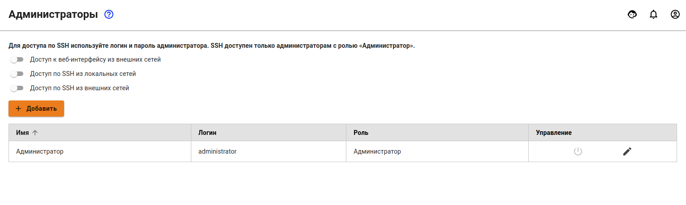
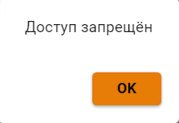
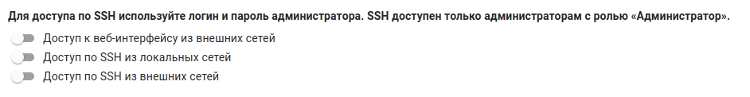

# Администраторы

## Управление администраторами

Существует возможность задать учетные данные нескольких администраторов сервера Ideco UTM для доступа к веб-интерфейсам настроек.

Предустановленную запись администратора нельзя удалить, можно только сменить ее данные - имя, логин, пароль, с помощью соответствующих элементов в столбце **Управление**.

Создать дополнительных администраторов сервера и управлять учетными записями можно в разделе **Управление сервером -&gt; Администраторы**.

Чтобы добавить нового администратора, нажмите кнопку **Добавить** и заполните следующие поля:

* **Имя** - введите имя нового администратора. Значение не должно быть длиннее 42 символов.
* **Логин** - введите логин нового администратора. Значение не должно быть длиннее 42 символов. 
* **Пароль/повторите пароль** - введите пароль нового администратора. Значение не должно быть короче 10 символов. Рекомендуем использовать сложные пароли, содержащие латинские строчные и заглавные буквы, цифры и специальные символы.
* **Роль** - выберите роль **Администратор** или **Только просмотр**. При выборе роли **Только просмотр** администратор не сможет производить никаких настроек в веб-интерфейсе, так как при попытке внесения изменений будет появляться окно с ошибкой. 

## Доступ к веб-интерфейсу из внешней сети и удаленный доступ по SSH

* Для включения доступа из внешней сети переключите ползунок в положение **Включен** около пункта **Доступ к веб-интерфейсу из внешней сети**. Эта функция помогает заниматься администрированием Ideco UTM удаленно.
* Для включения доступа к серверу по SSH из локальной или внешних сетей переключите ползунок в положение **Включен** около соответствующих пунктов \(не рекомендуется\). Доступ осуществляется по 22 TCP-порту. Попытки побора паролей блокируются автоматически. Используйте команду **ideco-local-menu** для запуска меню, команду **mc** – для запуска файлового менеджера.

Подробнее о настройке подключения к веб-интерфейсу при удаленном доступе смотрите в статье [Удаленный доступ для управления сервером](../../service/remote-access-for-server-management.md#dostup-k-veb-interfeisu-upravleniya-serverom-iz-seti-internet).

