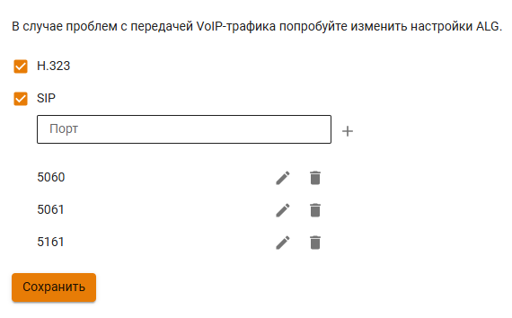

# Настройка ALG

Вкладка **Настройка ALG** позволяет управлять параметрами протоколов VoIP (H.323 и SIP), а также настраивать порты, используемые для передачи голосового трафика. 
Используйте этот раздел, если:

* Возникли проблемы с передачей VoIP-трафика, например, отсутствуют гудки или голос при повторных звонках между абонентами.
* Используются нестандартные порты для протокола SIP.

## Изменение настроек ALG

1\. Перейдите на вкладку **Правила трафика -> Файрвол -> Настройка ALG** и заполните поля:

* **H.323** - активировано по умолчанию. Если протокол не используется, то отключите опцию;
* **SIP** - активировано по умолчанию. Если протокол не используется, то отключите опцию;
* **Порт** - укажите порт для протокола SIP, если используется нестандартный. Максимальное количество портов - 10.

2\. Нажмите **Сохранить**.