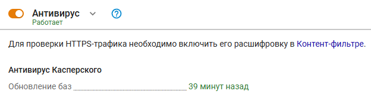

# Антивирусы веб-трафика


Название службы раздела _Антивирусы веб-трафика_: `ideco-av-backend`.\
Список имен служб для других разделов, доступен по [ссылке](../server-management/terminal.md).


Для удобства администрирования оптимальные настройки производительности антивирусных модулей и настроек антивирусной фильтрации преднастроены в продукте и не требуют ручного конфигурирования. При необходимости настройки оптимизируются в обновлениях версий Ideco UTM.

В настройках можно выбрать между антивирусной фильтрацией модулями ClamAV (OpenSource-антивирус) или антивирусом от Лаборатории Касперского (лицензируется отдельно и может быть не доступен по условиям лицензии).



Модуль антивируса связан с прокси-сервером и контент-фильтром, поэтому фильтрует веб-трафик при выполнении следующих условий:

* Веб-ресурс не находится в списках исключений прокси-сервера по назначению;
* Пользователь, к которому поступает трафик, не включен в исключения прокси-сервера по источнику;
* HTTPS-сайт проверяется только в случае расшифровки HTTPS-трафика контент-фильтром.

<details>

<summary>Проверка работы антивируса</summary>

Можно попробовать скачать тестовые файлы с сайта: [https://www.eicar.org/download-anti-malware-testfile](https://www.eicar.org/download-anti-malware-testfile/).

В случае правильной настройки браузер выведет ошибку доступа:


</details>

<details>

<summary>Лицензирование антивируса Касперского</summary>

Данный модуль в нашем продукте создан на базе Kaspersky Anti-Virus Software Development Kit и лицензируется совместно с Ideco UTM компании **Айдеко**.

Корпоративные ключи для других продуктов Лаборатории Касперского не могут быть использованы для его активации.

</details>

<details>

<summary>Добавление сигнатур в список исключений ClamAV</summary>

Просмотреть логи CalmAV и определить сработавшую сигнатуру можно, введя в терминале Ideco UTM команду:

```
journalctl -u ideco-clamd.service
```

Пример вывода команды:

`Dec 20 13:40:40.083733 info clamd[12443]: /tmp/CI_TMP_1qlsy5: Html.Exploit.CVE_2016_0228-6327291-2(00000000000000000000000000000000:888502) FOUND Dec 20 13:40:40.083750 info clamd[12443]: /tmp/CI_TMP_1qlsy5: Html.Exploit.CVE_2016_0228-6327291-2 FOUND`

`Dec 20 14:11:24.375281 info clamd[12443]: /tmp/CI_TMP_DPpHnS: Win.Trojan.LOLBins-7360503-2(00000000000000000000000000000000:388262) FOUND Dec 20 14:11:24.375293 info clamd[12443]: /tmp/CI_TMP_DPpHnS: Win.Trojan.LOLBins-7360503-2 FOUND`

`Dec 20 15:28:11.031128 info clamd[5165]: /tmp/CI_TMP_g7aPdY: Html.Exploit.CVE_2017_0011-5752098-0(00000000000000000000000000000000:354192) FOUND Dec 20 15:28:11.031144 info clamd[5165]: /tmp/CI_TMP_g7aPdY: Html.Exploit.CVE_2017_0011-5752098-0 FOUND`

Допустим, в 13:40 открывали сайт, на котором произошло ложное срабатывание ClamAV. Исходя из логов в исключения нужно добавить сигнатуру **Html.Exploit.CVE\_2016\_0228-6327291-2**.

Далее создайте файл белого списка `whitelist.ign2`, введя следующую команду:

```
touch /var/cache/ideco/av-backend/clamav_bases/whitelist.ign2 
```

Добавьте в созданный файл следующий текст (не забудьте заменить сигнатуру из команды ниже на ту, которую хотите добавить):

```
echo 'Html.Exploit.CVE_2016_0228-6327291-2' >> /var/cache/ideco/av-backend/clamav_bases/whitelist.ign2
```

Для применения изменений перезагрузите ideco-clamd.service.

```
systemctl restart ideco-clamd.service
```

</details>
