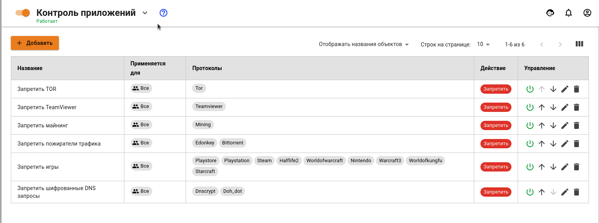
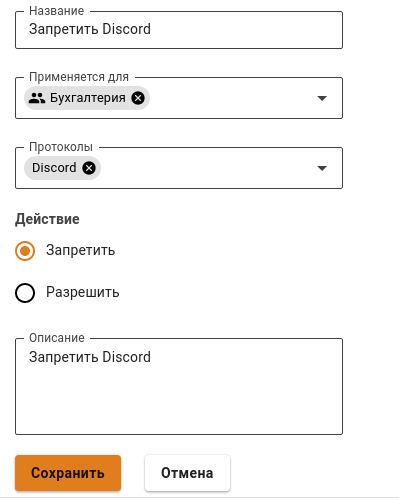

# Контроль приложений


Контроль приложений работает только в редакции Enterprise у пользователей с активной подпиской на обновления и техническую поддержку, а также в редакции Ideco SMB с приобретённым модулем. Список совместимых сетевых адаптеров, с которыми точно работает данный модуль, находится в разделе [Процесс установки](../../installation/installation-process.md).

Правила [Предотвращения вторжений](ips.md), [Контроля приложений](application-control.md) и [Ограничение скорости](shaper.md) не обрабатывают трафик между локальными сетями и сетями филиалов.



О том как заблокировать программы удаленного доступа, анонимайзеры, торренты и другие популярные ресурсы смотрите статью [Блокировка популярных ресурсов](../../recipes/popular-recipes/blocking-popular-resources.md).


Статус модуля можно посмотреть, нажав на иконку флаг в верхней части экрана около надписи **Контроль приложений**:

Принцип действия набора правил:

Ideco UTM анализирует трафик, ищет правило, которое подходит к этому трафику из списка, и применяет его. Если в списке есть несколько правил с одними и теми же условиями (колонки "Применяются для" и "Протоколы"), но разными действиями (колонка "Действие"), то будет применено правило стоящее выше по списку.

## Создание правил

Правила настраиваются в разделе **Правила трафика -> Контроль приложений**.

Для того чтобы создать новое правило, выполните действия:

1\. Нажмите **Добавить** в левом верхнем углу экрана:

2\. Укажите значения следующих параметров:

* **Название** - введите название правила для удобства администрирования. 
* **Применяется для** - вы можете выбрать объекты следующих типов: пользователь, группа пользователей, IP-адрес, диапазон IP-адресов, подсеть, список IP-адресов или специальный объект **Превышена квота** (в этот объект попадают пользователи превысившие квоту по трафику).
* **Протоколы** - выберите протокол(ы) 7-го уровня (приложения) из списка.
* **Действие** - разрешить или запретить выбранный протокол.

3\. Нажмите **Сохранить**.
