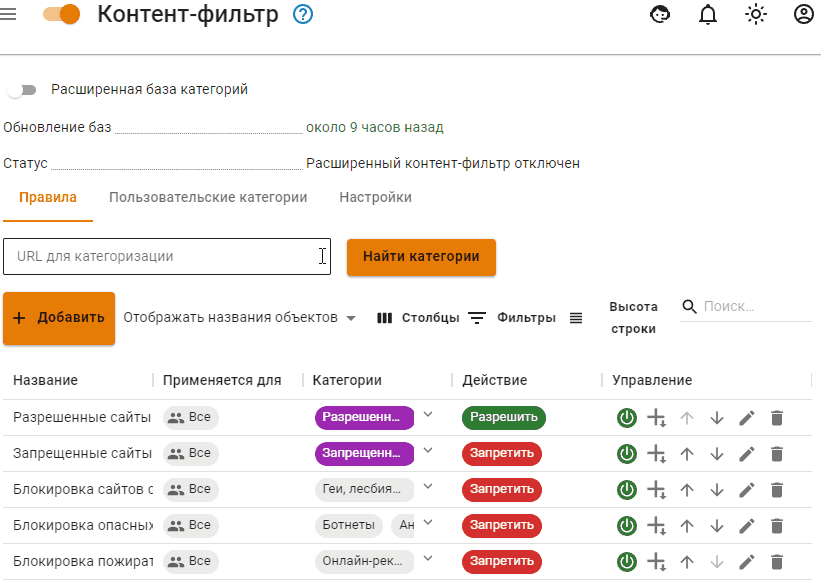
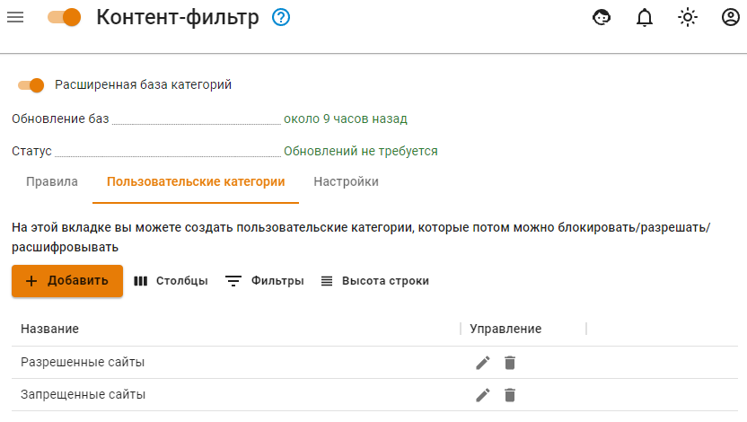
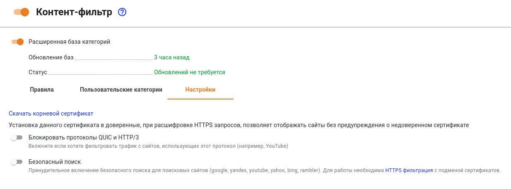
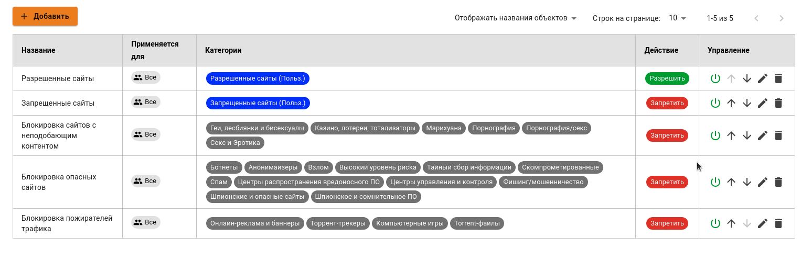
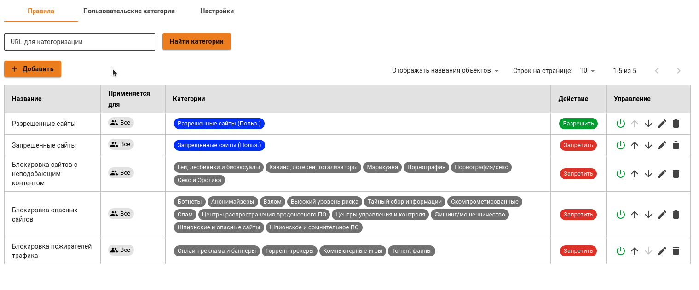
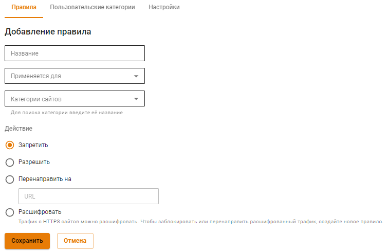
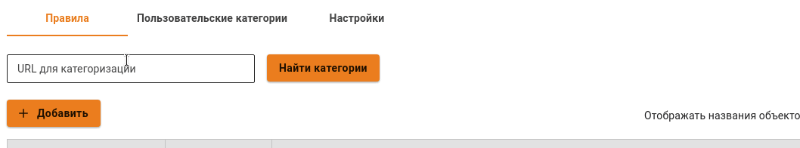

# Контент-фильтр

Механизм контентной фильтрации работает по принципу проверки принадлежности адреса, запрашиваемого пользователем сайта или отдельной страницы сайта, на наличие его в списках запрещенных ресурсов. Списки поделены на категории для удобства администрирования.


Модуль контент-фильтра работает только при активной подписке на обновления в редакции Enterprise.



HTTPS-сайты без расшифровки трафика фильтруются только по домену (а не полному URL), правила категории **Файлы** на них также применить невозможно. Для полной фильтрации HTTPS создайте правила расшифровки HTTPS-трафика нужных категорий.


Если включить опцию **Расширенная база категорий**, то будет включена работа более 140 категорий, автоматически обновляемых сервером. Данные категории работают только при активной подписке на обновления в коммерческих редакциях.


Если отключить опцию **Расширенная база категорий**, то все правила, включающие в себя расширенные категории, перестанут срабатывать.


Контент-фильтр состоит из трех вкладок: правила, пользовательские категории и настройки.

## Правила

Вкладка содержит в себе:

* **Строку поиска категории URL для категоризации**. Позволяет по URL найти категорию, в которой этот URL состоит, для дальнейшего создания правила; 
* **Таблицу созданных правил**. Правила в таблице действуют сверху вниз. То есть, если вверху расположено правило разрешающее контент, а внизу запрещающее этот контент, то будет работать только верхнее правило. Для перемещения правил используйте стрелки  и ;
* **Возможность добавления правил в Контент-фильтр.** При добавлении правила требуется заполнить название правила, указать для кого оно будет применено и выбрать категорию сайтов. Далее указать, какое действие будет выполняться. Если выбрать действие **Перенаправить на**, то нужно создать аналогичное правило с действием **Расшифровать** и поместите его выше перенаправляющего правила.

Категории сайтов делятся на четыре вида:

1\. **Пользовательские**. Включают в себя категории, созданные во вкладке **Пользовательские категории**;

2\. **Специальные**. Включает 4 категории - все запросы, все категоризированные запросы, все некатегоризированные запросы и запросы с прямыми обращениями по IP-адресам;

3\. **Расширенные**. Правила, включающие в себя расширенные категории работают только с включенной опцией **Расширенная база категорий** в левом верхнем углу;

4\. **Файлы**. Восемь сформированных категорий файлов, блокируемых по расширениям и MIME-type. Предустановленные группы файлов (Исполняемые файлы, Архивы, Видеофайлы, Аудиофайлы, Flash-видео, Active-X, Torrent-файлы, Документы) нельзя редактировать. Работа по фильтрации HTTPS-трафика по данному типу категорий возможна только при его расшифровке.

## Пользовательские категории

На одноименной вкладке создаются собственные категории правил.

 

Подробное описание **расширенных** и **специальных** категорий читайте в статье [Описание категорий контент фильтра](custom-categories.md).

## Настройки

На вкладке **Настройки** можно настроить дополнительные параметры фильтрации:

* **Блокировать протоколы QUIC и HTTP/3.** Экспериментальный протокол, используемый современными браузерами для доступа к некоторым ресурсам (например Google, YouTube). Рекомендуется блокировать его, т.к. иначе фильтрация ресурсов, работающих по этому протоколу, будет невозможна;
* **Безопасный поиск.** Принудительно включает безопасный поиск в поисковых системах (google, yandex, youtube, yahoo, bing, rambler). **Для работы данной функции нужно включить HTTPS-фильтрацию методом подмены сертификата для данных ресурсов**.

## Применение правил

Применение правил фильтрации для пользователей

Правила применяются сверху вниз в порядке следования в таблице до первого совпадения. Таким образом если вышестоящим правилом будет разрешен какой-то ресурс для определенной группы пользователей, то правила ниже применяться не будут. Таким образом можно создавать гибкие настройки фильтрации, исключая нужных пользователей вышестоящими правилами из правил блокировки. Аналогичным образом действуют правила расшифровки HTTPS.

В столбце **Управление** можно активировать или деактивировать правило, менять его приоритет, редактировать и удалить. Правила контентной фильтрации применяются сразу после создания или их включения.

Чтобы создать новое правило, нажмите **Добавить** в левом верхнем углу над таблицей.

Заполните следующие поля:

* **Название** - наименование правила в списке. Значение не должно быть длиннее 42 символов;
* **Применяется для** - можно выбрать объекты типа: пользователь, группа пользователей, IP-адрес, диапазон IP-адресов, подсеть, список IP-адресов или специальный объект **Превышена квота** (в этот объект попадают пользователи, превысившие квоту по трафику).
* **Категории сайтов** - пользовательские, специальные и расширенные категории веб-ресурсов;
* **Действие** - действие данного правила на веб-запросы. Можно запретить, разрешить или расшифровать HTTPS-трафик.

Диагностика

Если правила контентной фильтрации не действуют, проверьте следующие параметры в настройках:

1\. IP-адрес компьютера пользователя должен соответствовать его адресу в авторизации (раздел **Мониторинг - Авторизованные пользователи**), и пользователь должен находиться в нужной группе, на которую назначено правило.

2\. IP-адрес пользователя и ресурса, к которому он обращается, не должен входить в исключения прокси-сервера.

3\. Проверьте правильность категоризации ресурса к которому вы обращаетесь в поле **URL для категоризации** на вкладке **Правила**.

**В случае, если сайт неправильно категоризирован, воспользуйтесь формой обратной связи [SkyDNS](https://www.skydns.ru/feedback/).**

4\. В браузере и на компьютере пользователя не используются функции или плагины VPN, не прописаны сторонние прокси-сервера.

5\. Проверить настройки контентной фильтрации по блокировке опасных и потенциально опасных файлов можно с помощью сервиса [security.ideco.ru](https://security.ideco.ru).

