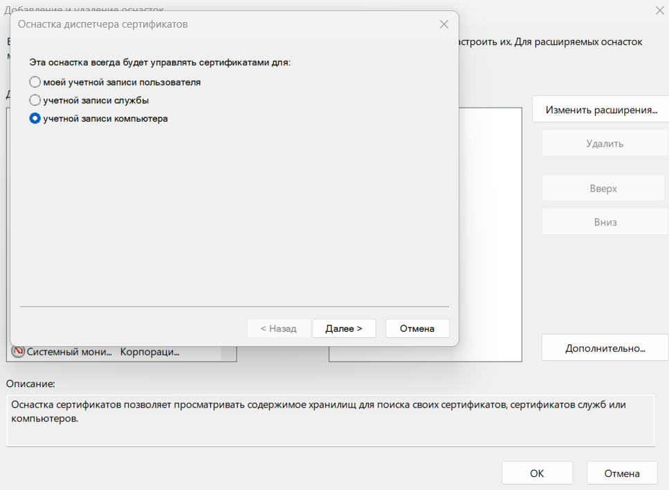
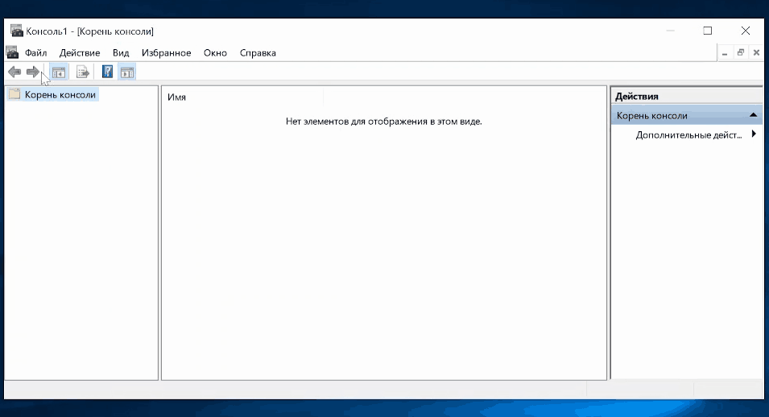
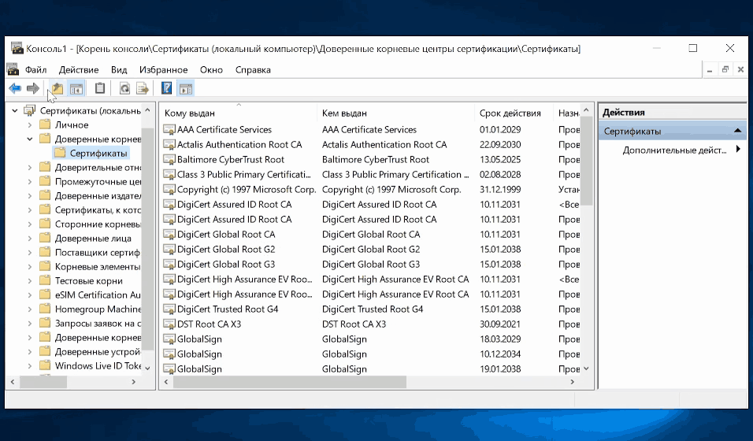

# Настройка фильтрации HTTPS

Фильтрация реализуется несколькими методами:

* **Анализ заголовков Server Name Indication (SNI)** - благодаря этому методу возможен анализ домена, к которому подключается клиент, без подмены сертификата и вмешательства в HTTPS-трафик. Также анализируются домены, указанные в сертификате;
* **Метод SSL-bump** - фильтрация происходит путем подмены "на лету" сертификата, которым подписан запрашиваемый сайт. Оригинальный сертификат сайта подменяется новым, подписанным не центром сертификации, а корневым сертификатом Ideco NGFW. Таким образом, передающийся по защищенному HTTPS-соединению трафик становится доступным для обработки всем модулям Ideco NGFW: антивирусам Касперского и ClamAV, внешним ICAP-сервисам и контент-фильтру (можно категоризировать полный URL запроса и MIME-type контента).


Специфика фильтрации HTTPS-трафика с подменой сертификата требует настройки обеих сторон подключения: сервера Ideco NGFW и рабочей станции каждого пользователя в локальной сети.


## Настройка сервера Ideco NGFW

По умолчанию сервер фильтрует HTTPS без подмены сертификатов с помощью анализа SNI и доменов в сертификате.

Дешифрация HTTPS-трафика настраивается в разделе **Правила трафика -> Контент-фильтр -> Правила** с помощью создаваемых администратором правил с действием **Расшифровать**.

Пример правила для расшифровки:

## Настройка рабочей станции пользователя

При включенной опции расшифровки HTTPS-трафика браузер, антивирусы, клиенты IM и другое сетевое ПО на рабочей станции пользователя потребуют явного подтверждения на использование подменного сертификата, созданного и выданного сервером Ideco NGFW. Чтобы повысить удобство работы пользователя, установите в операционную систему рабочей станции корневой сертификат сервера Ideco NGFW и сделайте его доверенным. Для этого выполните действия:

1\. Скачайте корневой SSL-сертификат, открыв раздел веб-интерфейса Ideco NGFW **Сервисы -> Сертификаты -> Загруженные сертификаты**:

2\. Откройте на рабочей станции центр управления сертификатами: **Пуск -> Выполнить**, выполнив в диалоге команду **mmc**:

3\. В меню **Файл** выберите **Добавить или удалить оснастку**:

4\. В списке **Доступные оснастки** выберите **Сертификаты**, а затем нажмите кнопку **Добавить**.

5\. В открывшемся окне выберите пункт **Учетная запись компьютера** и нажмите кнопку **Далее**.

6\. В окне **Выбор компьютера** оставьте флаг **Локальный компьютер** и нажмите кнопку **Готово**.

7\. В левой части окна нажмите на стрелку рядом с директорией **Сертификаты (локальный компьютер) -> Доверенные корневые сертификаты -> Сертификаты**:

8\. В меню **Действие** выберите **Все задачи -> Импорт**:

9\. Следуя инструкциям Мастера импорта сертификатов, импортируйте корневой сертификат сервера Ideco NGFW. Импортированный сертификат появится в списке в правой части окна:

## Добавление сертификата через политики домена Microsoft Active Directory

В сетях, где управление пользователями осуществляется с помощью Microsoft Active Directory, можно установить сертификат Ideco NGFW для всех пользователей автоматически с помощью Active Directory. Для этого необходимо выполнить действия:

1\. Скачать корневой SSL-сертификат, открыв раздел веб-интерфейса Ideco NGFW **Сервисы -> Сертификаты -> Загруженные сертификаты**:

2\. Зайдите на контроллер домена с правами администратора.

3\. Запустите оснастку управления групповой политикой, выполнив команду **gpmc.msc**.

4\. Найдите **политику домена**, использующуюся на компьютерах пользователей в **Объектах групповой политики** (Default Domain Policy). Нажмите на нее правой кнопкой мышки и выберите **Изменить**.

5\. В открывшемся редакторе управления групповыми политиками выберите: **Конфигурация компьютера -> Политики -> Конфигурация Windows -> Параметры безопасности -> Политики открытого ключа -> Доверенные корневые центры сертификации**.

6\. Нажмите правой кнопкой мыши по открывшемуся списку, выберите **Импорт** и импортируйте ключ Ideco NGFW.

7\.  После перезагрузки рабочих станций или выполнения на них команды `gpupdate /force` сертификат появится в локальных хранилищах сертификатов и будет установлен нужный уровень доверия к нему.

## Настройка повторной зашифровки трафика c помощью отдельного сертификата

1. Загрузите сертификат, который будет использоваться для зашифровки, в раздел **Сервисы -> Сертификаты -> Загруженные сертификаты**;
2. Перейдите в раздел **Правила трафика -> Контент-фильтр -> Настройки**;
3. Выберите в пункте **Повторное шифрование** сертификат, загруженный на 1 шаге.


Для получения информации, расшифрованной Контент-фильтром, у клиента должен быть установлен загруженный сертификат в хранилище сертификатов пользователя. Рекомендации по настройке компьютера пользователя можно найти в разделе **Настройка рабочей станции пользователя**.


## Возможные проблемы и методы их решения

* Включения расшифровки трафика может быть недостаточно для подмены сертификата некоторых сайтов (например, `ya.ru`, `google.com`). В этом случае необходимо включить опцию **Блокировать протоколы QUIC и HTTP/3** на вкладке **Настройки** раздела **Контент-фильтр**. 
* Если браузер не использует системное хранилище сертификатов, нужно добавить сертификат Ideco NGFW в доверенные сертификаты браузера. В Mozilla Firefox также можно присвоить параметру `security.enterprise\_roots.enabled` (в **about:config**) значение `true` для доверия системным сертификатам;
* Если на локальной машине используется антивирус, проверяющий HTTPS-трафик методом подмены сертификатов, сайты могут не открываться из-за двойной подмены сертификатов. Нужно отключить в настройках антивируса проверку HTTPS-трафика;
* При включенной SNI-фильтрации сервер не будет пропускать по HTTPS-порту трафик, отличный от HTTPS-трафика. В результате могут возникнуть проблемы с программами, пытающимися это сделать. Для их работы необходимо разрешить обход прокси-сервера к нужным им ресурсам;
* При блокировке HTTPS-ресурсов для отображения страницы блокировки необходимо настроить доверие корневому SSL-сертификату NGFW, даже если включена только SNI-фильтрация, т. к. в случае срабатывания блокировки ресурса, открываемого по HTTPS, будет применен SSL-bumping с подстановкой SSL-сертификата NGFW для подмены контента ресурса страницей о его блокировке сервером.
