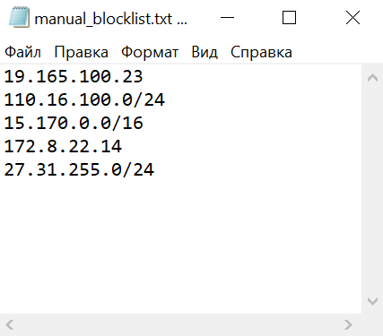
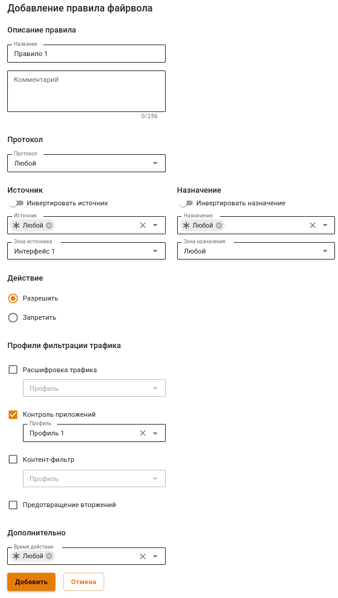

# Таблицы файрвола (FORWARD, DNAT, INPUT и SNAT)


Правила в таблицах имеют приоритет сверху вниз (т.е. верхнее правило приоритетнее нижнего). \
По умолчанию используется политика **РАЗРЕШИТЬ**. Если вы не создадите запрещающих правил, все порты и протоколы для пользователей будут разрешены.



Не рекомендуем создавать FORWARD и INPUT правила, которые запрещают весь трафик.


Для удобства управления правилами в интерфейсе они разбиты на четыре таблицы: FORWARD, DNAT, INPUT и SNAT.

## FORWARD

Правила в данной таблице действуют на трафик, проходящий между интерфейсами сервера, т.е. сетью Интернет и локальной сетью, а также между локальными сетями. Это основная таблица, в которую могут быть добавлены правила, ограничивающие трафик пользователей.

## DNAT (перенаправление портов)

Правила этой таблицы используются для прямого перенаправления портов с внешнего интерфейса на определенные ресурсы в локальной сети. Такие правила часто называются правилами проброса портов (port forwarding, portmapper).

## INPUT

Таблица для правил входящего трафика на интерфейсы сервера. Как правило, это трафик для служб сервера (например, почтового сервера).

## SNAT

Таблица пользовательских правил для управления трансляцией сетевых адресов. Для включения автоматического SNAT локальных сетей, переведите соответствующую опцию в положение включен. \
Пользовательские правила SNAT приоритетнее автоматического SNAT локальных сетей.

## Создание правил

Для создания правила в нужной таблице, нажмите кнопку **Добавить** в левом верхнем углу экрана.

Укажите необходимые параметры и действия правила и нажмите кнопку **Сохранить**. Правило будет добавлено в конец списка. Если необходимо, измените его приоритет кнопками .


Если в строке **Протокол** выбрать из списка параметр **Любой**, то правило будет действовать на весь трафик.


При создании правил для фильтрации веб-трафика из локальных сетей (80, 443 TCP порты), для полноценной работы правила, в поле **Входящий интерфейс** должен указываться объект **Любой**. Если будет указан иной входящий интерфейс, то правило не будет обрабатывать веб-трафик.

Описание параметров и действий при создании правил

**Параметры**

* **Протокол** - Протокол передачи данных (UDP/TCP/ICMP/GRE/ESP/AH, либо **Любой**);
* **Источник** - IP-адрес источника трафика (src), проходящего через шлюз. В этом поле могут быть указаны IP-адреса, диапазоны IP-адресов, сети или домены - данные берутся из [Объектов](aliases.md), заданных пользователем. Также в качестве источника могут использоваться пользователи и группы (при смене их IP-адресов, файрвол автоматически это учтет);
* **Порт назначения** - Указывается при создании правила с протоколами TCP/UDP. Это может быть отдельный порт, список портов или диапазон портов, определенных в [Объектах](aliases.md);
* **Входящий интерфейс** - Интерфейс UTM, в который будет входить трафик;
* **Исходящий интерфейс** - Интерфейс UTM, через который будет выходить трафик;
* **Время действия** - Время действия правила. Указываются временные промежутки (например, **рабочее время**), которые определяются в [Объектах](aliases.md);
* **Комментарий** - Произвольный текст, поясняющий цель действия правила. Значение не должно быть длиннее 255 символов;
* **Действие** - Pазрешает или запрещает трафик.

**Действия**

* **Запретить** - Запрещает трафик;
* **Разрешить** - Разрешает трафик;
* **DNAT** - Транслирует адреса назначения, тем самым позволяет перенаправить входящий трафик. Ниже в поле **Изменить IP-адрес назначения** вы можете указать один IP-адрес или диапазон (при указании диапазона IP-адресов пакет будет перенаправлен на любой из них). Аналогично, если при создании правила вы указали протоколы TCP или UDP, то появится поле **Сменить порт назначения**. С помощью этой возможности можно прозрачно переадресовать входящий трафик на другой адрес или порт;
* **SNAT** - Транслирует адреса источника;
* **Не производить SNAT** - Отменяет действие SNAT для трафика, удовлетворяющего критериям правила;
* **Не производить DNAT** - Отменяет действие DNAT для трафика, удовлетворяющего критериям правила.

### Примеры 

Портмаппинг, DNAT, публикация сервера в локальной сети

Примеры данных настроек подробно описаны в статьях раздела [Публикация ресурсов](../publishing-resources/README.md).

Блокировка различных ресурсов средствами файрвола

Вопросы блокировки различных ресурсов: программ удаленного управления (AmmyAdmin и TeamViewer), мессенджеров и другого ПО описаны в разделе [Блокировка популярных ресурсов](../../recipes/popular-recipes/blocking-popular-resources.md).

Массовая блокировка IP-адресов и сетей

1\. Нужно сформировать список для блокировки в текстовом файле:

* Наименование файла обязательно должно быть manual\_blocklist.txt;
* В одной строке следует указывать только один IP-адрес или одну сеть;
* Формат написания IP-адреса: 1.2.3.4;
* Формат написания сети: 1.2.3.0/24.

2\. Переместить файл manual\_blocklist.txt в каталог /var/opt/ideco/firewall-backend/

3\. В терминале Ideco UTM выполнить команду ideco-apply-manual-blocklist

После перезагрузки Ideco UTM, IP-адреса и сети из файла будут автоматически блокироваться (дополнительно выполнять команду ideco-apply-manual-blocklist не нужно). При обновлении Ideco UTM, список блокировок сохранится.

Если требуется добавление адресов в список заблокированных, следует добавить адреса в файл /var/opt/ideco/firewall-backend/manual\_blocklist.txt и повторно выполнить команду ideco-apply-manual-blocklist.

Для удаления адресов из списка заблокированных, следует удалить необходимые адреса из файла /var/opt/ideco/firewall-backend/manual\_blocklist.txt и выполнить команду ideco-apply-manual-blocklist

Доступ к терминальному серверу для определенного пользователя

1\. Во вкладке **Forward** нажмите **Добавить**;

2\. Заполните следующие поля:

* **Протокол** - выберите TCP;
* **Источник** - выберите пользователя или группу пользователей;
* **Назначения** - укажите адрес терминального сервера;
* **Порты назначения** - укажите порт 3389 ;
* **Действие** - Разрешить.

3\. Нажмите **Сохранить**.

