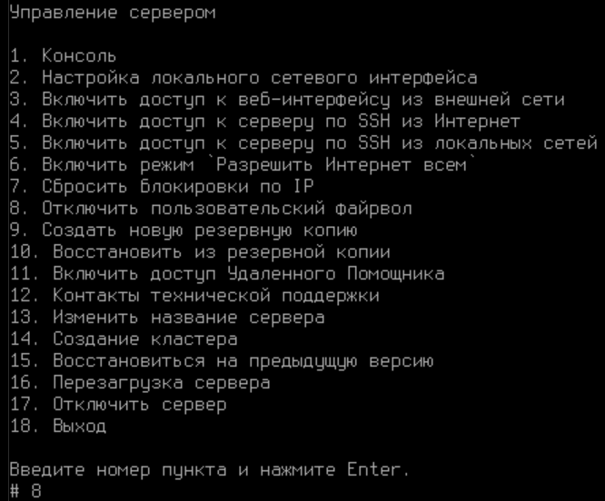
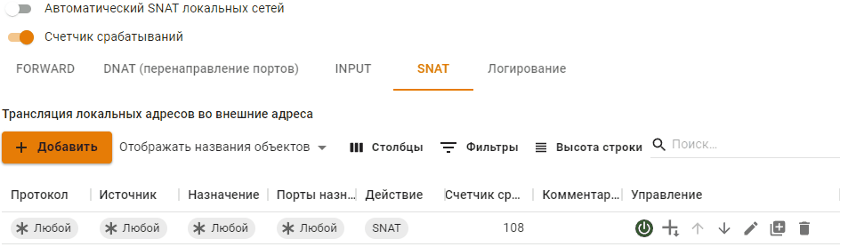
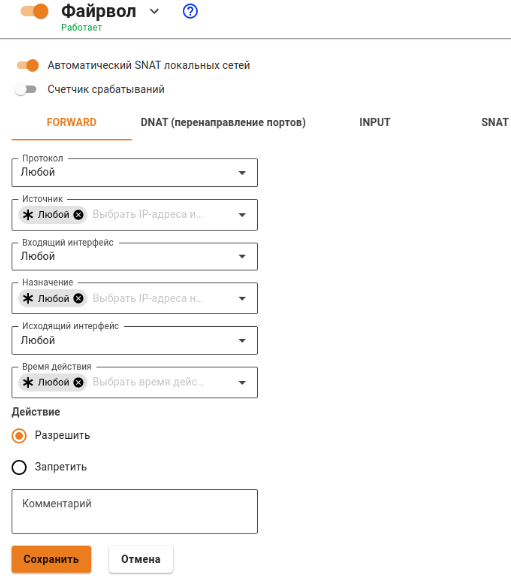

# Файрвол

## Принцип работы

Одним из основных средств управления трафиком на сервере является файрвол (межсетевой экран). С его помощью можно по различным критериям ограничивать пользовательский трафик, проходящий:

* из локальных сетей во внешние через сервер;
* между разными локальными сетями сервера;
* на сам сервер Ideco UTM.

Принцип работы файрвола заключается в проведении анализа заголовков пакетов, проходящих через интерфейсы сервера. Эта низкоуровневая задача решается шлюзом на основе стека протоколов TCP/IP. Поэтому файрвол хорошо подходит для определения глобальных правил управления трафиком по сетевым протоколам, портам, принадлежности к определенным IP-сетям и другим критериям, основанным на значениях полей в заголовках сетевых пакетов.


Сетевой экран не предназначен для решения задач, связанных с контролем доступа к ресурсам сети Интернет, исходя из адреса URL, доменного имени или типа контента на веб-сайтах. Эти задачи более высокого уровня, как правило, касающиеся веб-трафика, решаются с помощью модуля [Контент фильтр](content-filter/).


Настройка файрвола производится в разделе веб-интерфейса **Правила трафика -> Фаервол**.


В Ideco UTM имеются преднастроенные и автоматически включаемые системные правила. Они обеспечивают защиту служб почтового сервера, прокси и обратного прокси-сервера, и других. Как правило, нет необходимости дополнительно настраивать защиту сервера Ideco UTM с помощью пользовательских правил. Используйте их для фильтрации трафика локальной сети и публикации ресурсов. Даже при отключении пользовательского файрвола в веб-интерфейсе системные правила продолжают работу.


В случае создания некорректных правил (например, запрет доступа в веб-интерфейс Ideco UTM), вы можете отключить пользовательский файрвол из локального меню сервера. Для этого выберите пункт **Отключить пользовательский файрвол**, введя цифру 8 и нажмите **Enter.**

Автоматический SNAT локальных сетей

**NAT (от англ. Network Address Translation — «преобразование сетевых адресов»)** — это механизм в сетях TCP/IP, позволяющий преобразовывать IP-адреса транзитных пакетов. [Читать подробнее](https://ru.wikipedia.org/wiki/NAT).

Параметр **Автоматический SNAT локальных сетей** включает в файрволе автоматическое преобразование адреса для трафика уходящего во внешний интерфейс, если источник равен 10.0.0.0/8, 172.16.0.0/12 192.168.0.0/16 и адресов, которые прописаны во вкладке **SNAT**, если выбрано Действие **SNAT**. Таким образом вам не нужно создавать такие правила вручную и изменять их при добавлении или изменении локальных сетей.

Отключите данную настройку, если есть необходимость доступа с внешних сетей (например ведомственных, либо DMZ) до локальной сети Ideco UTM без NAT.

Вы можете создать правила SNAT вручную для тех, кому он необходим и отключить (правилом «не SNAT») для тех, кого необходимо допустить в сеть без сетевой трансляции адресов.

Таблицы файрвола

1. Правила в таблицах имеют приоритет сверху вниз (т.е. верхнее правило приоритетнее нижнего).
2. Перед созданием правил для сетей, IP-адресов или диапазонов IP-адресов, предварительно создайте их в разделе [Объекты](aliases.md).

Для удобства управления правилами в интерфейсе они разбиты на четыре таблицы:

* **FORWARD** - правила в данной таблице действуют на трафик, проходящий между интерфейсами сервера, т.е. сетью Интернет и локальной сетью, а также между локальными сетями. Это основная таблица, в которую могут быть добавлены правила, ограничивающие трафик пользователей.

Настоятельно не рекомендуем создавать FORWARD-правило, которое запрещает весь трафик.

* **DNAT (перенаправление портов)** - правила этой таблицы используются для прямого перенаправления портов с внешнего интерфейса на определенные ресурсы в локальной сети. Такие правила часто называются правилами проброса портов (port forwarding, portmapper).
* **INPUT** - таблица для правил входящего трафика на интерфейсы сервера. Как правило, это трафик для служб сервера (например, почтового сервера).
* **SNAT** - таблица правил для управления трансляцией сетевых адресов.

Протоколы

При создании правила необходимо выбрать протокол передачи данных, на который будет действовать создаваемое вами правило. Если вы выбираете из списка параметр **Любой**, то правило будет действовать на весь трафик.

В таблице ниже находится описание каждого протокола из списка.

Правила файрвола

По-умолчанию используется политика **РАЗРЕШИТЬ**. Если вы не создадите запрещающих правил, все порты и протоколы для пользователей будут разрешены.

Параметры правил файрвола описаны в таблице ниже:

Действие

Значения этого параметра описаны в следующей таблице:

Создание правил

Для того чтобы создать правила в нужной таблице, нажмите кнопку добавления (**+**) в левом верхнем углу экрана.

Укажите необходимые параметры и действия правила и нажмите кнопку **Сохранить**. Правило будет добавлено в конец списка. Если необходимо, измените его приоритет кнопками .

При создании правил для фильтрации веб-трафика из локальных сетей (80, 443 TCP порты), для полноценной работы правила, в поле **Входящий интерфейс** должен указываться объект **Любой**. Если будет указан иной входящий интерфейс, то правило не будет обрабатывать веб-трафик.

Примеры правил и техник

#### Портмаппинг, DNAT, публикация сервера в локальной сети

Примеры данных настроек подробно описаны в соответствующих статьях в разделе [Публикация ресурсов.](../publishing-resources/)

#### Блокировка различных ресурсов средствами файрвола

Вопросы блокировки различных ресурсов: программ удаленного управления (AmmyAdmin и TeamViewer), мессенджеров и другого ПО описаны в разделе [Блокировка популярных ресурсов](../../recipes/popular-recipes/blocking-popular-resources.md).

#### Массовая блокировка IP-адресов и сетей

1\. Нужно сформировать список для блокировки в текстовом файле:

* Наименование файла обязательно должно быть manual\_blocklist.txt.
* В одной строке следует указывать только один IP-адрес или одну сеть.
* Формат написания IP-адреса: 1.2.3.4
* Формат написания сети: 1.2.3.0/24

2\. Переместить файл manual\_blocklist.txt в каталог /var/opt/ideco/firewall-backend/

3\. В терминале Ideco UTM выполнить команду ideco-apply-manual-blocklist

После перезагрузки Ideco UTM IP-адреса и сети из файла будут автоматически блокироваться (дополнительно выполнять команду ideco-apply-manual-blocklist не нужно). При обновлении Ideco UTM, список блокировок сохранится.

Если требуется добавление адресов в список заблокированных, следует добавить адреса в файл /var/opt/ideco/firewall-backend/manual\_blocklist.txt и повторно выполнить команду ideco-apply-manual-blocklist.

Для удаления адресов из списка заблокированных, следует удалить необходимые адреса из файла /var/opt/ideco/firewall-backend/manual\_blocklist.txt и выполнить команду ideco-apply-manual-blocklist

