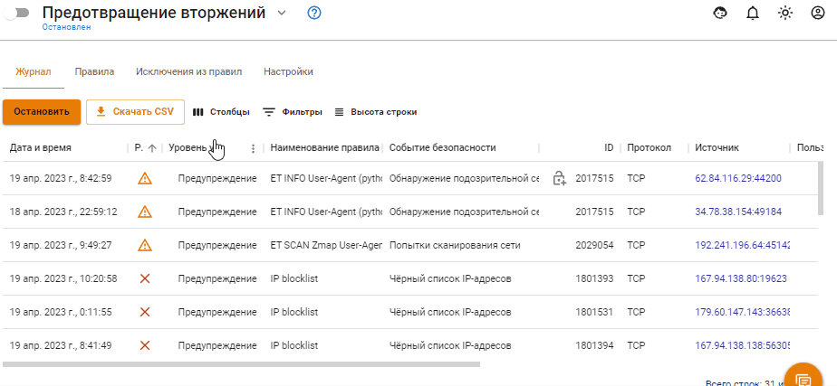
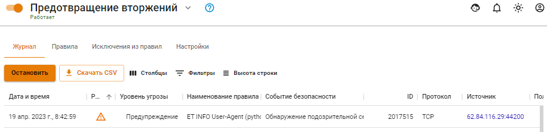

# Предотвращение вторжений


Название службы раздела *Предотвращение вторжений*: `ideco-suricata-backend`; `ideco-suricata`; `ideco-suricata-event-syncer`; `ideco-suricata-event-to-syslog`. \
Список имен служб для других разделов, доступен по [ссылке](../../server-management/terminal.md).



Система предотвращения вторжений доступна только в **Enterprise версии Ideco UTM** для пользователей с активной подпиской на обновления.

Правила **Предотвращения вторжений**, [Контроля приложений](application-control.md) и [Ограничение скорости](shaper.md) не обрабатывают трафик между локальными сетями и сетями филиалов.

Для исключения пользователя или групп пользователей из обработки правил **Предотвращения вторжений**, [Контроля приложений](application-control.md) и [Ограничения скорости](../shaper.md), добавьте соответствующее правило в **Правила трафика -> Исключения**.


**Система предотвращения вторжений** (IDS/IPS, Intrusion detection system / Intrusion prevention system) предназначена для обнаружения, журналирования и предотвращения атак злоумышленников на сервер, интегрированные службы (почта, веб-сайт и др.) и, защищаемую интернет-шлюзом, локальную сеть.

Правила блокировки трафика включают в себя блокирование активности троянских программ, spyware, бот-сетей, клиентов p2p и **торрент-трекеров**, вирусов, сети **TOR** (используемой для обхода правил фильтрации), анонимайзеров и т.д.

Настроить службу можно на вкладке **Правила доступа -> Предотвращение вторжений.**

Передвинув выключатель (слева от названия раздела) вправо или влево можно соответственно включить/выключить службу предотвращения вторжений.

Для добавления правила нажмите кнопку **Добавить** и в поле **Подсеть** добавьте локальные сети, обслуживаемые UTM. Как правило, это сети локальных интерфейсов UTM, а также маршрутизируемые на них сети удаленных сегментов локальной сети вашего предприятия.


Ни в коем случае не указывайте сети, принадлежащие внешним сетевым интерфейсам UTM и внешним сетям. Указанные здесь сети участвуют в правилах службы предотвращения вторжения как локальные, характеризуя трафик в/из локальных сетей. Локальный межсегментный трафик не исключается из проверок системы.


При использовании системы предотвращения вторжений **не рекомендуется** использовать внутренние DNS-серверы для компьютеров сети, т.к. система анализирует проходящие через нее DNS-запросы и определяет по ним зараженные устройства. В случае использования внутреннего домена AD, рекомендуется на компьютерах указывать DNS-сервер Ideco UTM в качестве единственного DNS-сервера, а в настройках DNS-сервера на UTM указать Forward-зону для локального домена.

## Примеры использования

Пример анализа логов

Предупреждение системы предотвращения вторжений:

Таким образом, на вкладке **Правила** можно открыть найденную группу по **Событию безопасности**, нажать на  и в ней найти сработавшее правило по его ID:

`alert http $EXTERNAL_NET any -> any any (msg:"ET SCAN Zmap User-Agent (Inbound)"; flow:established,to_server; http.user_agent; content:"Mozilla/5.0 zgrab/0.x"; depth:21; endswith; classtype:network-scan; sid:2029054; rev:2; metadata:created_at 2019_11_26, former_category SCAN, updated_at 2020_10_23;)`

Можно проанализировать IP-адрес, с которым была попытка подозрительного соединения, через [whois](https://www.nic.ru/whois/).

Как исключить узел из обработки системой IDS/IPS через терминал

Можно исключить узел из обработки в веб-интерфейсе в разделе **Правила трафика -> Исключения**.

**Задача:** Необходимо исключить из обработки узел `192.168.154.7`.

**Решение:**

1. В файл `/var/opt/ideco/suricata-backend/custom.rules` необходимо добавить следующую строку: `pass ip 192.168.154.7 any <> any any (sid:1;)`. Для редактирования этого файла перейдите в раздел **Терминал** и введите команду `nano /var/opt/ideco/suricata-backend/custom.rules`.
2. Затем в разделе **Терминал** выполнить команду `systemctl restart ideco-suricata-backend.service`.

При создании нескольких ручных правил **обязательно** изменяйте ID-правила (sid:2;), иначе система предотвращения вторжений прекратит работу из-за наличия нескольких правил с одним sid.

Технические требования

Для работы системы предотвращения вторжений требуются значительные вычислительные ресурсы. Предпочтительным являются многоядерные (4 и более ядер) процессоры. Минимальное количество оперативной памяти для использования системы: 8 Гб.

После включения системы желательно проконтролировать, что мощности вашего процессора достаточно для проверки следующего через шлюз трафика.

В разделе **Мониторинг -> Графики загруженности**. Параметр средняя загрузка (за 1, 5 и 15 минут). Подробнее о [Load Average](https://habr.com/ru/company/vk/blog/335326/).

