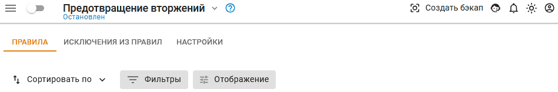
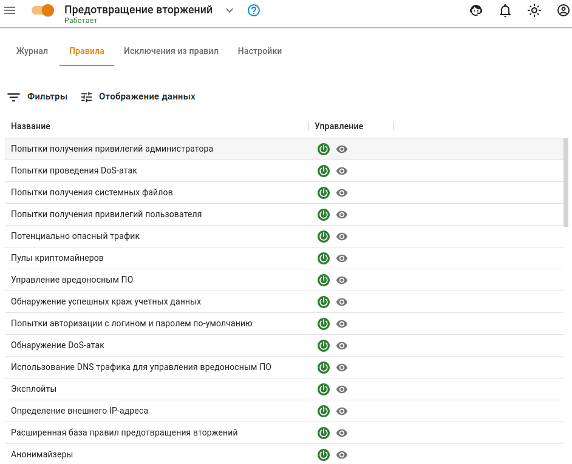

# Предотвращение вторжений


Название службы раздела *Предотвращение вторжений*: `ideco-suricata-backend`; `ideco-suricata`; `ideco-suricata-event-syncer`; `ideco-suricata-event-to-syslog`. \
Список имен служб для других разделов, доступен по [ссылке](../../server-management/terminal.md).




Служба предотвращения вторжений доступна только в **Enterprise версии Ideco NGFW** для пользователей с активной подпиской на обновления.

Правила **Предотвращения вторжений**, [Контроля приложений](application-control.md) и [Ограничения скорости](shaper.md) не обрабатывают трафик между локальными сетями и сетями филиалов.

Для исключения пользователя или групп пользователей из обработки служб **Предотвращения вторжений** , добавьте соответствующее правило в **Правила трафика -> Исключения из правил**.


**Служба предотвращения вторжений** (IDS/IPS, Intrusion detection system / Intrusion prevention system) предназначена для: 
* [x] Обнаружения;
* [x] Журналирования;
* [x] Предотвращения атак злоумышленников на сервер, интегрированные службы и локальную сеть. 

Правила блокировки трафика включают в себя блокирование активности троянских программ, spyware, бот-сетей, клиентов p2p и **торрент-трекеров**, вирусов, сети **TOR** (используемой для обхода правил фильтрации), анонимайзеров и т.д.

Для настройки службы перейдите на вкладку **Правила трафика -> Предотвращение вторжений**. Для включения или выключения службы переведите выключатель в соответствующее положение.

Для добавления правила перейдите на вкладку **Настройки**, нажмите **Добавить** и в поле **Подсеть** укажите локальные сети, обслуживаемые NGFW (сети локальных интерфейсов NGFW, маршрутизируемые на них сети удаленных сегментов локальной сети предприятия).


**Не указывайте** сети, принадлежащие внешним сетевым интерфейсам NGFW и внешним сетям. Указанные здесь сети участвуют в правилах службы предотвращения вторжения как локальные. Локальный межсегментный трафик не исключается из проверок системы.

При работе службы предотвращения вторжений **не используйте** сторонние DNS-серверы для компьютеров , т.к. служба определяет зараженные устройства по DNS-запросам, проходящим через нее. \
При использовании внутреннего домена AD рекомендуется:
* В компьютерах указать DNS-сервер Ideco NGFW в качестве единственного DNS-сервера;
* В настройках DNS-сервера на NGFW указать Forward-зону для локального домена.


## Примеры использования

Пример анализа логов

Предупреждение службы предотвращения вторжений:

На вкладке **Правила** можно открыть найденную группу по **Событию безопасности**, нажать на  и в ней найти сработавшее правило по его ID:

`alert http $EXTERNAL_NET any -> any any (msg:"ET SCAN Zmap User-Agent (Inbound)"; flow:established,to_server; http.user_agent; content:"Mozilla/5.0 zgrab/0.x"; depth:21; endswith; classtype:network-scan; sid:2029054; rev:2; metadata:created_at 2019_11_26, former_category SCAN, updated_at 2020_10_23;)`

Можно проанализировать IP-адрес, с которым была попытка подозрительного соединения, через [whois](https://www.nic.ru/whois/).

Как исключить узел из обработки системой IDS/IPS через терминал

Можно исключить узел из обработки в веб-интерфейсе в разделе \
 **Правила трафика -> Исключения из правил**.

**Задача:** Необходимо исключить из обработки узел `192.168.154.7`.

**Решение:**

1. В файл `/var/opt/ideco/suricata-backend/custom.rules` добавьте следующую строку: `pass ip 192.168.154.7 any <> any any (sid:1;)`.
2. Затем в разделе **Терминал** выполните команду `systemctl restart ideco-suricata-backend.service`.


При создании нескольких ручных правил **обязательно** изменяйте ID-правила (sid:2;), иначе служба предотвращения вторжений прекратит работу из-за наличия нескольких правил с одним sid.


Технические требования

Для работы службы предотвращения вторжений требуются значительные вычислительные ресурсы. Предпочтительным являются многоядерные (4 и более ядер) процессоры. Минимальное количество оперативной памяти для использования системы: 16 Гб.

После включения системы проконтролируйте, что мощности вашего процессора достаточно для проверки трафика, следующего через шлюз. \
В разделе **Мониторинг -> Графики загруженности** выберите параметр средняя загрузка (за 1, 5 и 15 минут).

Подробнее о [Load Average](https://habr.com/ru/company/vk/blog/335326/).

