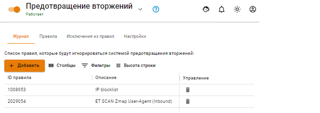

# Исключения из правил

Содержит список отключенных правил системы предотвращения вторжений в случае их ложных срабатываний или по другим причинам.

Отключить правила можно по кнопке **Добавить**, указав в соответствующем поле ID правила, или на вкладке **Журнал** нажав **Добавить в исключения**. 

**Внимание!** Со временем при обновлении баз ID правил могут меняться.
