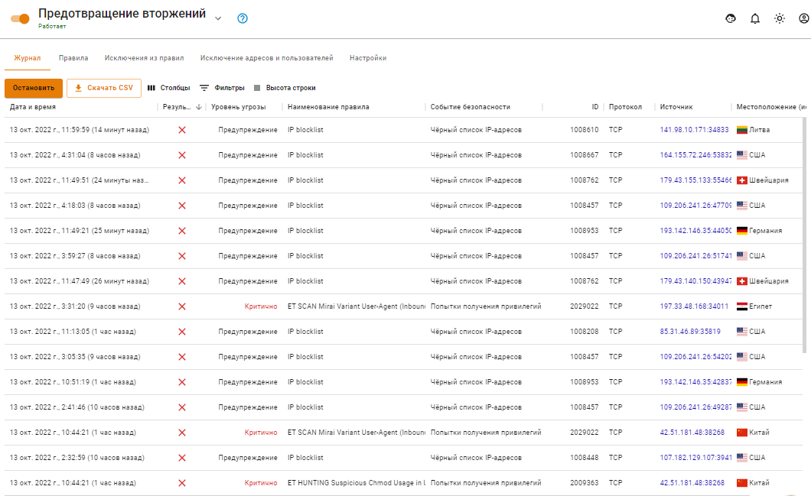
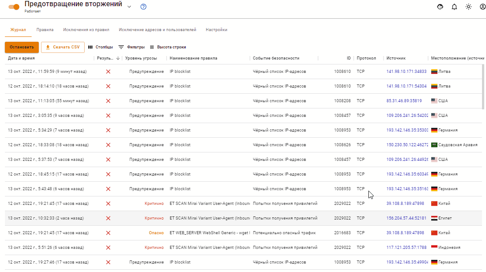

# Журнал

В подразделе **Журнал** можно просмотреть логи предупреждения системы предотвращения вторжений.

* Поле **Результат анализа** отображает действие системы, `Blocked` — пакет блокирован, любая другая информация в этом поле означает `Allowed`, информирование.
* В поле **Уровень угрозы** могут отображаться следующие значения:
  * <mark style="color:red;">Критично</mark>,
  * <mark style="color:orange;">Опасно</mark>,
  * Предупреждение,
  * <mark style="color:blue;">Не распознано</mark>,
  * Не классифицировано

При наведении на колонку **ID** в строке с правилом, появится кнопка **Добавить в исключения** (), при нажатии на которую сигнатура будет добавлена в  исключения из правил: 

