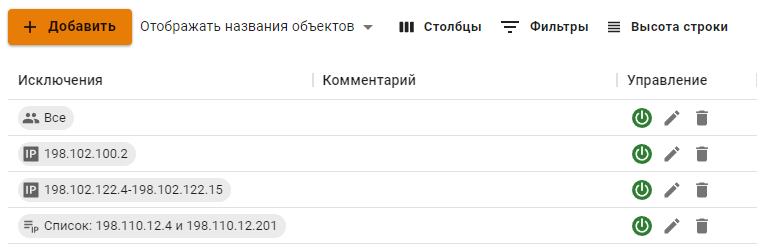

# Исключения адресов и пользователей

Правила во вкладке **Исключения адресов и пользователей** отключают от обработки системы Предотвращения вторжений, [Контроля приложений](application-control.md) и [Ограничение скорости](shaper.md) определенных пользователей, IP-адреса и домены.

Созданные исключения удалят объект из обработки **всех** правил на вкладке **Правила**.
