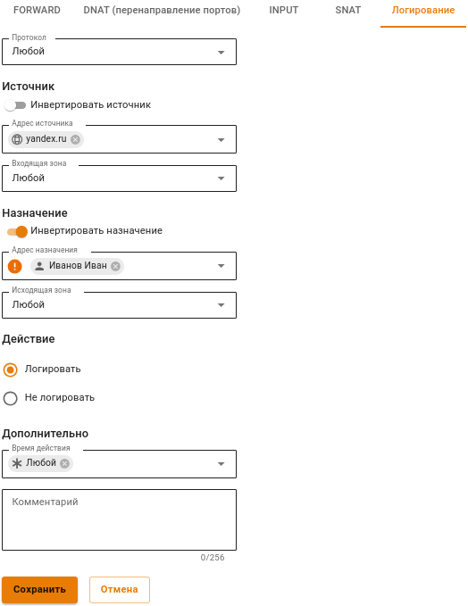
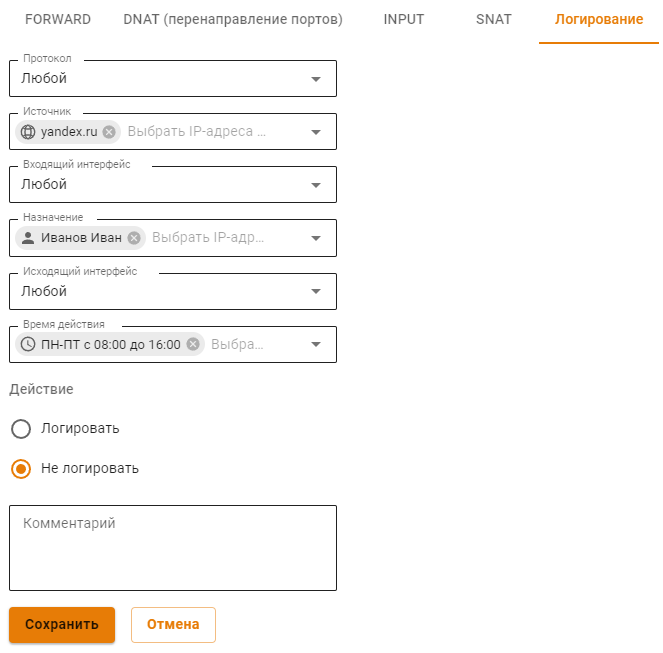

# Логирование

Принцип работы:\
Весь поступающий трафик, в первую очередь, проходит через правила вкладки **Логирование**. Если трафик соответствует критериям таблицы **Трафик для логирования**, то на пакете выставляется виртуальная метка о необходимости логирования. По умолчанию метки нет.

Также необходимо, чтобы действие в сработавшем правиле файрвола было среди **Действий для логирования** во вкладке **Логирование**. Иначе срабатывание логироваться не будет.

Далее трафик проходит через правила в [таблицах файрвола](firewall-tables.md). Если, при срабатывании правила, на трафике стояла метка логирования и действие соответствовало выборке **Действий для логирования**, то в логи попадет:
* стандартные поля логирования;
* атрибуты пакета, с которым произошло событие (протокол, порты и IP-адреса);
* название таблицы файрвола;
* идентификатор правила файрвола;
* действие, которое произошло.

Логи записываются в системный журнал. В том числе эти сообщения могут отправляться через [syslog](../monitor/syslog.md). 


Включите опцию **Логировать срабатывания правил** для начала логирования.


Такая система ограничений нужна для исключения неподходящего правила файрвола. Логирование всех срабатываний правил файрвола требует дополнительных ресурсов на сервере и затрудняет отладку правил. Если для нормальной работы логирование не требуется - рекомендуем его отключить.

## Действия для логирования

Выберите действия правил **Файрвола**, которые требуется логировать, нажав\
на .


Если ни одно действие во вкладке **Логирование** не выбрано, срабатывания правил логироваться не будут.


## Трафик для логирования

Создайте в таблице правила для трафика, срабатывания которого требуется логировать.


Если ни одно правило в таблице не задано, срабатывания правил логироваться не будут.


Применение правил для отметки трафика, подлежащего логированию, проходит всегда по всем правила до конца этой таблицы. Правила не являются конечными, в отличие от таблиц в других вкладках Файрвола.


Правила пометки трафика могут снять пометку с помощью действия **Не логировать** для трафика, помеченного ранее действием  **Логировать**.&#x20;


Таким образом, предоставляется возможность гибкой выборки трафика, который подлежит логированю срабатывания правил файрвола.

**Пример**: требуется настроить логирование всего трафика на yandex.ru, кроме трафика от пользователя Иванова Ивана:

1\. В поле **Источник** выберите `yandex.ru`.

2\. В поле **Назначение** выберите _Иванова Ивана_ и переведите опцию **Инвертировать назначение** в положение **Включен**.

3\. Выберите действие **Логировать**:

2\. Создайте правило, запрещающее логировать трафик от Иванова Ивана:

