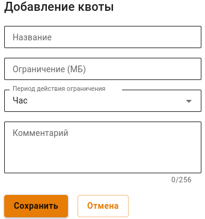
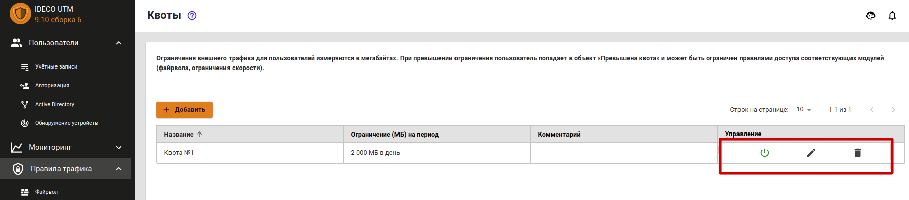
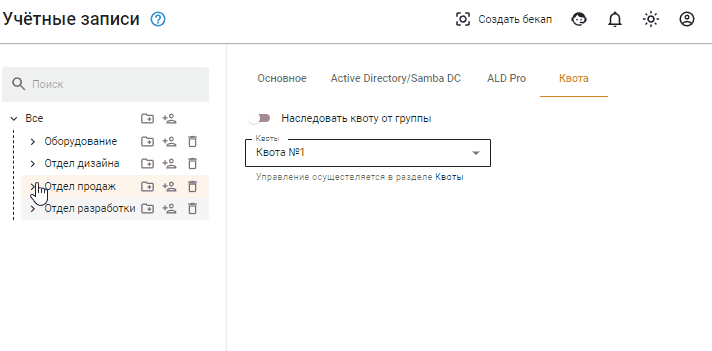
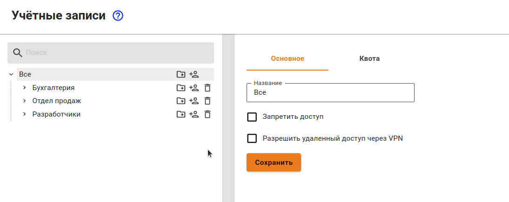
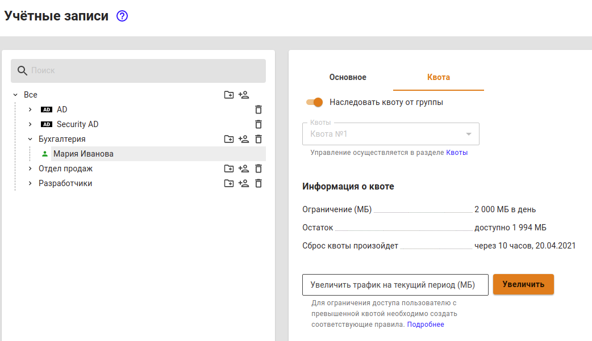
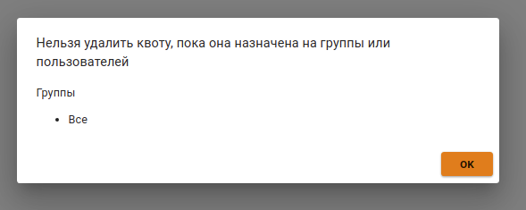

# Пользовательские квоты

Для каждой квоты можно определить ее период действия (час, день, неделя, месяц, квартал). Она может быть назначена пользователям или группам в дереве пользователей на отдельной вкладке **Квота**. Также на этой вкладке можно увеличить и посмотреть доступный трафик на текущий период времени и узнать, когда произойдет сброс квоты.

Если квота назначена на группу, то по умолчанию она назначается на всех пользователей данной группы, а также на вложенные группы. Наследуемую от группы квоту можно изменить в свойствах вложенного пользователя или группы.


При превышении квоты пользователи попадают в объект **Превышена квота**. **Но по умолчанию для таких пользователей никакие ограничения не действуют.**  Поэтому вам необходимо создать ограничивающее правило для объекта **Превышена квота** в одном или нескольких модулях Ideco UTM (фаервол, контент-фильтр, контроль приложений, ограничение скорости).


## Настройка квоты

Для настройки квоты выполните следующие действия:

1. Перейдите в раздел **Правила трафика -> Квоты** и нажмите на кнопку **Добавить**.
2. В форме добавления квоты заполните обязательные поля:
3. **Название** - введите произвольное название для квоты;
4. **Ограничение (МБ)** - задайте ограничение по количеству мегабайт трафика за выбранный период;
5. **Период действия ограничения** - выберите период действия, на который будет выделена квота.
6. Проверьте правильность введенных данных и нажмите на кнопку **Добавить**.

Управление квотами осуществляется с помощью кнопок в столбце **Управление**. Можно отключить или включить квоту, отредактировать или удалить.

## Настройка пользователя и группы

### Настройка группы

Созданные квоты можно применить для групп пользователей на вкладке **Квота**.

Вы можете наследовать квоту от вышестоящей группы, или выбрать другую квоту, для этого потребуется деактивировать переключатель **Наследовать квоту от группы** и выбрать нужную вам квоту.

У группы **Все** имеется отдельный переключатель **Использовать квоты**. Данный параметр позволяет распространить использование квот для всех пользователей.

### Настройка пользователей

Созданные квоты можно применять для пользователей. Управление квотами происходит на вкладке **Квота** у выбранного пользователя.

На этой вкладке вы можете настроить наследование квоты у группы, в которой состоит пользователь, или назначить ему персональную квоту.

Если квота назначена на пользователя, то можно посмотреть информацию о ней - период действия, доступный трафик и дату сброса квоты. Здесь же можно её увеличить, указав нужное количество мегабайт и нажав на кнопку **Увеличить**.


Чтобы удалить квоту, необходимо снять ее со всех пользователей и групп. Иначе, при попытке удаления квоты появится окно, запрещающее данное действие. Данное окно представлено на скриншоте ниже:


## Пример настройки действий при превышении квоты

В приведённом ниже примере будет рассмотрен случай, когда пользователям, превысившим квоту (попавшим в объект «Превышена квота»), будет запрещен доступ ко всем социальным сетям и видеохостингам, а также ограничена скорость до 4 Мбит/с. Но одному пользователю доступ будет разрешен даже в случае превышения квоты, так как этот сотрудник является маркетологом.

1. Для начала необходимо создать квоту с ограничением равным 2000 МБ в день.
2. Во всех группах и у всех пользователей на вкладке **Квота** поставить переключатель **Наследовать квоту от группы** в положение включен. Это нужно сделать только в том случае, если его положение менялось вами, так как по умолчанию все группы и пользователи создаются с включенным переключателем.
3. На группу **Все** назначить созданную квоту (все остальные группы и пользователи унаследуют назначение этой квоты).
4. Создать правило в контент-фильтре для ограничения доступа к социальным сетям и видеохостингам для пользователей, превысивших квоту.
5. Создать правило, которое разрешает одному из пользователей социальные сети, даже если он превысил квоту.
6. Создать правило, ограничивающее скорость всем пользователям, которые попали в объект **Превышена квота** до 4 Мбит/с.
