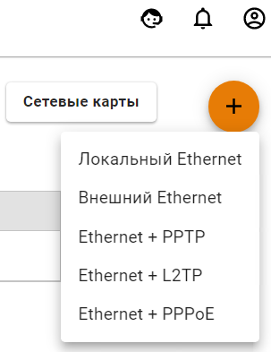
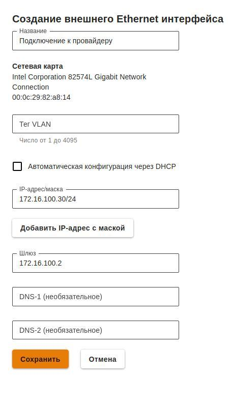
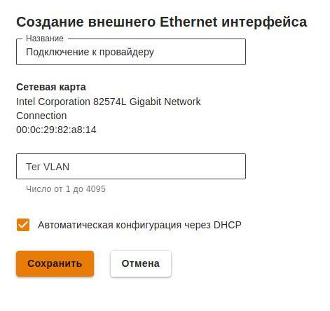

# Настройка подключения по Ethernet

Как правило, вся необходимая информация для настройки содержится в договоре с вашим интернет-провайдером.

## Ручная настройка

Для настройки подключения в веб-интерфейсе необходимо выполнить следующие действия:

1. Перейдите в меню **Сервисы** -&gt; **Сетевые интерфейсы**. 
2. Нажмите на иконку  в правом верхнем углу окна и выберите пункт **Внешний Ethernet**.   
3. Выберите сетевую карту. 
4. Заполните поля, указанные в таблице ниже:

| Параметр | Описание |
| :--- | :--- |
| Название интерфейса | Имя, с помощью которого вы будете в дальнейшем идентифицировать интерфейс. Максимальное количество символов - 42 |
| Сетевая карта | Сетевой адаптер, который будет использоваться для подключения к интернет-провайдеру |
| Тег VLAN | VLAN ID. Такой сетевой интерфейс считается VLAN-интерфейсом. Также может быть создан один Ethernet-интерфейс без указания VLAN принадлежащий этому сегменту сети, который будет принимать нетегированный трафик. Обычные Ethernet-интерфейсы, без указания VLAN ID, создаются на физическом интерфейсе только в единичном экземпляре. Поле заполняется только в том случае если сетевая карта уже используется |
| Автоматическая конфигурация через DHCP | Используется, если ваш интернет-провайдер поддерживает возможность автоматической настройки Ethernet-интерфейса с помощью протокола DHCP |
| IP-адрес/маска | Вы можете назначить на интерфейс несколько IP-адресов. Как минимум, должен быть указан хотя бы один IP-адрес |
| Шлюз | IP-адрес шлюза |
| DNS | Доступно два поля для указания DNS сервера \(необязательно\) |

**Пример настройки:** 

## Автоматическая настройка

Используется, если ваш интернет-провайдер поддерживает возможность автоматической настройки Ethernet-интерфейса с помощью протокола DHCP. 

1. Перейдите в меню **Сервисы** -&gt; **Сетевые интерфейсы**. 
2. Нажмите на иконку  в правом верхнем углу окна и выберите пункт **Внешний Ethernet**.
3. Выберите сетевую карту. 
4. Заполните поле **Название**. Поле **Тег VLAN** заполняется только в том случае если сетевая карта уже используется. 
5. Включите настройку **Автоматическая конфигурация через DHCP**.
6. Убедитесь в корректности введённых значений и нажмите на кнопку **Сохранить**.

**Пример настройки:** 

