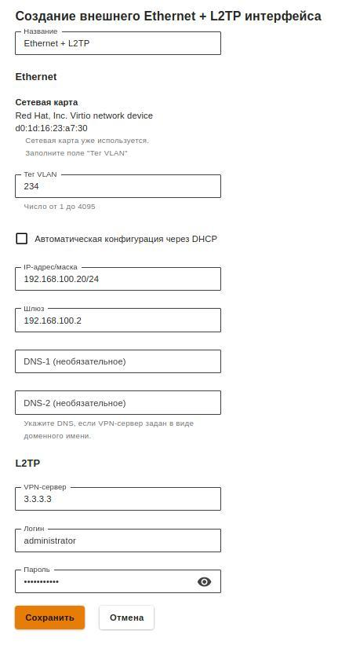

# Настройка подключения по L2TP

Для настройки такого подключения в веб-интерфейсе необходимо выполнить следующие действия: 

1. Перейдите в меню **Сервисы -&gt; Сетевые интерфейсы**. 
2. Нажмите на иконку  в правом верхнем углу окна и выберите пункт **Ethernet + L2TP** 
3. Выберите сетевую карту. 
4. Заполните поля, указанные в таблице ниже:

| Параметр | Описание |
| :--- | :--- |
| Название | Имя, с помощью которого вы будете в дальнейшем идентифицировать интерфейс. Максимальное количество символов - 42 |
| Сетевая карта | Стевой адаптер, который будет использоваться для подключения к интернет-провайдеру |
| Тег VLAN | VLAN ID, в котором будет присутствовать UTM. Такой сетевой интерфейс считается VLAN-интерфейсом. Заполняется только в том случае если сетевая карта уже используется |
| Автоматическая конфигурация через DHCP | Используется если ваш интернет-провайдер поддерживает возможность автоматической настройки Ethernet-интерфейса с помощью протокола DHCP |
| IP-адрес/маска | Вы можете назначить на интерфейс несколько IP-адресов. Должен быть указан хотя бы один IP-адрес |
| Шлюз | IP-адрес шлюза |
| DNS | Доступно два поля для указания DNS сервера \(необязательно\) |
| VPN-сервер | IP-адрес или доменное имя L2TP-сервера |
| Логин | Имя пользователя для подключения по L2TP |
| Пароль | Пароль для подключения по L2TP |

5. Убедитесь в корректности введённых значений и нажмите на кнопку **Сохранить**.

**Пример настройки:**

