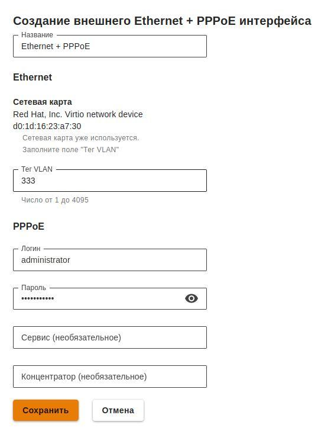

# Настройка подключения по PPPoE

Для настройки подключения в веб-интерфейсе необходимо выполнить следующие действия:

1\. Перейдите в меню **Сервисы -> Сетевые интерфейсы**.&#x20;

2\. Нажмите на иконку  в правом верхнем углу окна и выберите пункт **Ethernet + PPPoE**.

3\. Выберите сетевую карту.&#x20;

4\. Заполните поля, указанные в таблице ниже:

| Параметр      | Описание                                                                                                                                                             |
| ------------- | -------------------------------------------------------------------------------------------------------------------------------------------------------------------- |
| Название      | Имя, с помощью которого вы будете в дальнейшем идентифицировать интерфейс. Максимальное количество символов - 42                                                     |
| Сетевая карта | Сетевой адаптер, который будет использоваться для подключения к интернет-провайдеру                                                                                  |
| Тег VLAN      | VLAN ID, в котором будет присутствовать UTM. Такой сетевой интерфейс считается VLAN-интерфейсом. Заполняется только в том случае если сетевая карта уже используется |
| Логин         | Имя пользователя для подключения по PPPoE                                                                                                                            |
| Пароль        | Пароль для подключения по PPPoE                                                                                                                                      |
| Сервис        | Идентификатор сервиса. Если вы не знаете, что указывать, оставьте поле пустым                                                                                        |
| Концентратор  | Идентификатор концентратора. Если вы не знаете, что указывать, оставьте поле пустым                                                                                  |

5\. Убедитесь в корректности введённых значений и нажмите на кнопку **Сохранить**.

**Пример настройки:**

